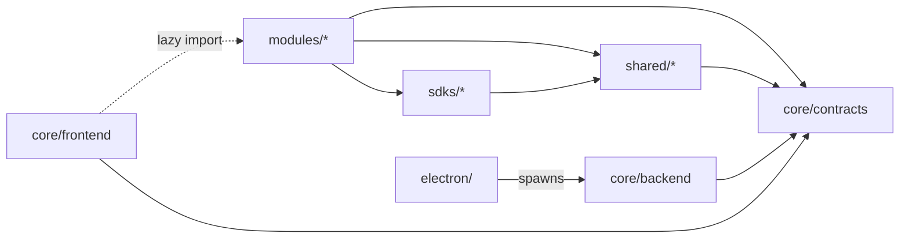

# OpenPCB — Current State Report

Read-only audit. Source of truth is code under `src/`, not docs.

## 1. TL;DR

- **Schematic + PCB editors work.** Designer module has full ECS-based command pipeline, undo/redo, ratsnest, manual trace routing, live DRC, vias.
- **Library module works.** KiCad `.kicad_sym` / `.kicad_mod` import, drawn symbol+footprint editor, IPC-7351B preset generator, built-in seeding, CRUD API.
- **Architecture is mostly aligned** with `core → shared → sdks → modules`. Modules import only `core/contracts` (allowed). No back-edges from core/shared to modules.
- **Locked stack matches reality:** Bun + React 19 + Vite 7 + Tailwind 4 + Drizzle/SQLite + Electron 41.
- **No `.openpcb` file format.** No packer, no zip, no embedding. State lives only in shared SQLite (`dev-data/openpcb.sqlite`).
- **No AI integration.** No Anthropic/OpenAI/BYOK code, no prompts, no command-generation pipeline.
- **No cloud / sync code.** No API client, no auth, no project dashboard beyond local design list.
- **Biggest drift:** `docs/COMMAND_PATTERN.md` and `docs/DATA_MODEL.md` still cite paths under `core/backend/designer/...` — that code lives in `src/modules/designer/backend/...`. `scripts/README.md` describes Rust/bridge codegen that no longer exists.

## 2. Verified tech stack

| Layer            | Documented          | Actual (package.json)                                                | Match? |
| ---------------- | ------------------- | -------------------------------------------------------------------- | ------ |
| Backend runtime  | Bun                 | Bun (`bun --watch main.ts`), `bun-types ^1.3.5`                      | ✅     |
| Root pkg manager | npm workspaces      | npm@10.9.2; `bun.lock` exists but stale                              | ✅     |
| Bundler          | Vite 7              | `vite ^7.0.4`                                                        | ✅     |
| UI framework     | React 19            | `react ^19.1.0`, `react-dom ^19.1.0`                                 | ✅     |
| Styling          | Tailwind 4          | `tailwindcss ^4.0.0`, `@tailwindcss/vite ^4`                         | ✅     |
| ORM              | Drizzle             | `drizzle-orm ^0.45.1`, `drizzle-kit ^0.31.8`                         | ✅     |
| DB               | SQLite (Bun native) | `drizzle-orm/bun-sqlite`                                             | ✅     |
| Electron         | —                   | `electron ^41.0.0`, `electron-builder ^26`                           | ✅     |
| 3D / canvas      | R3F (skill docs)    | `@react-three/fiber ^9.5`, `three ^0.183`, `@react-three/drei ^10.7` | ✅     |
| State            | Zustand             | `zustand ^5.0.9`                                                     | ✅     |
| Validation       | Zod                 | `zod ^4.1.13`                                                        | ✅     |
| Test (backend)   | Bun test            | `bun test`                                                           | ✅     |
| Test (frontend)  | Vitest              | `vitest ^4.0.18`                                                     | ✅     |
| E2E              | Playwright          | `@playwright/test ^1.0.0`                                            | ✅     |
| Lint             | (none)              | **No ESLint, no Prettier wired.** `npm run lint` = `tsc --noEmit`    | 🔴     |
| AI SDK           | (locked: BYOK)      | **none**                                                             | 🔴     |

## 3. Repo map

```
src/
├── core/                                 ✅ infra only
│   ├── backend/                          ✅ Bun HTTP runtime, module loader, DB, tests
│   │   ├── http/  router/  modules/  db/  middleware/  diagnostics/
│   │   ├── migrations/ module-migrator.ts
│   │   ├── controllers/ (health, diagnostics)
│   │   └── tests/ (21 .test.ts files)
│   ├── frontend/                         ✅ React 19 + Vite 7 shell
│   │   └── src/ (App, AppShell, AppRouter, providers, screens, stores, settings)
│   └── contracts/                        ✅ app/, modules/ (manifest, backend-module, errors)
├── contracts/                            🟡 LEGACY shim — only `modules/sdk.ts`, `sdk-map.ts`
│   └── modules/                          (re-exports from src/sdks; backwards compat facade)
├── shared/                               ✅ ECS + commands + canvas engine
│   ├── domain/
│   │   ├── ecs/        (entity, component, world, query, system)
│   │   ├── commands/   (command, envelope, result, patch, apply, invert, history)
│   │   ├── events/     (invalidation-event ONLY — no event-bus)
│   │   └── revision/   (revision.ts)
│   ├── frontend/canvas/  (camera, interaction, primitives, scene, selection, theme, tools)
│   └── rendering/        (footprint/symbol preview builders, IPC-7351B)
├── sdks/                                 ✅ pure inter-module contracts
│   ├── library/  designer/  index.ts (MODULE_SDK_TOKENS)
└── modules/                              ✅ vertical slices
    ├── library/                          (backend, frontend, contracts, manifest, migrations)
    │   ├── backend/builtins/  import/  infrastructure/parsers/kicad/
    │   └── frontend/import-wizard/  (symbol-editor, footprint-editor, steps)
    └── designer/                         (backend, frontend, manifest, 8 SQL migrations)
        ├── backend/  pcb/  commands/
        └── frontend/  pcb/{drc,layers,tools}/
electron/                                 ✅ thin shell (main, preload, sidecar)
scripts/                                  🟡 module-cli + sidecar compile; README claims Rust/bridge codegen that does not exist
docs/                                     🟡 stale paths under core/backend/designer
tests/e2e/                                ✅ Playwright (3 specs)
data/footprints/                          ✅ KiCad fixtures (built-in seeds)
```

Empty placeholders: none meaningful (only `src/core/*/node_modules/.vite-temp`).

## 4. Architecture reality check

- One-way deps: **Yes, with one nuance.** Modules import `src/core/contracts/*` (types only) — this matches `PROPOSED_ARCHITECTURE.md` which puts contracts under `core/`. AGENTS.md explicitly permits this.
- Back-edges: **None found.** No imports from `src/core/backend/*` or `src/core/frontend/*` inside `modules/`, `shared/`, `sdks/`.
- Cross-module imports: **None.** `designer` consumes `library` only via SDK token (`MODULE_SDK_TOKENS.LIBRARY`).
- ESLint boundary enforcement: **not wired** (TODO.md backlog).



Frontend lazy-loads modules via `import.meta.glob` (`src/core/frontend/src/components/ModuleSpaceHost.tsx`). This is a _runtime_ edge, not a static one.

## 5. Module-by-module status

### Core backend

| Path                                             | Purpose                                              | Status | Notes                               |
| ------------------------------------------------ | ---------------------------------------------------- | ------ | ----------------------------------- |
| `src/core/backend/main.ts`                       | Boot ModuleRuntime → Bun.serve                       | ✅     |                                     |
| `src/core/backend/http/`                         | HTTP server, CORS, problem-details, request-context  | ✅     | RFC 7807 errors                     |
| `src/core/backend/router/`                       | HttpRouter, ModuleRouter, route matcher, registry    | ✅     | `/api/modules/{id}/{subpath}`       |
| `src/core/backend/modules/module-loader.ts`      | Discover manifests → migrate → activate → register   | ✅     |                                     |
| `src/core/backend/db/`                           | sqlite-client, module-db-factory, transaction-runner | ✅     | Single shared sqlite, prefix tables |
| `src/core/backend/migrations/module-migrator.ts` | Apply per-module SQL on boot                         | ✅     | tracked in `openpcb_migrations`     |
| `src/core/backend/diagnostics/`                  | Error ring buffer + store                            | ✅     |                                     |
| `src/core/backend/logging/logger.ts`             | JSON structured logger                               | ✅     |                                     |

### Core frontend

| Path                                                   | Purpose                                                | Status | Notes                                   |
| ------------------------------------------------------ | ------------------------------------------------------ | ------ | --------------------------------------- |
| `src/core/frontend/src/App.tsx`                        | Provider stack                                         | ✅     | Runtime → Bootstrap → Theme → AppShell  |
| `src/core/frontend/src/AppRouter.tsx`                  | home/module switch                                     | ✅     | Zustand only, no react-router           |
| `src/core/frontend/src/screens/HomeScreen.tsx`         | Designs list (create/open/delete)                      | ✅     | Local DB only                           |
| `src/core/frontend/src/screens/ModuleScreen.tsx`       | Hosts a module Space                                   | ✅     |                                         |
| `src/core/frontend/src/components/ModuleSpaceHost.tsx` | Lazy-loads `module.frontend.ts` via `import.meta.glob` | ✅     |                                         |
| `src/core/frontend/src/components/LeftSidebar.tsx`     | Sidebar from module registry                           | ✅     |                                         |
| `src/core/frontend/src/settings/`                      | Settings dialog (general, about)                       | 🟡     | Minimal; no per-module settings         |
| `src/core/frontend/src/components/ui/`                 | dialog + scroll-area only                              | 🟡     | tabs.tsx deleted (git status shows `D`) |
| `src/core/frontend/src/generated/sdk/`                 | Codegen TS clients for module SDKs                     | ✅     | `gen:check` enforces clean              |

### Shared

| Path                                                                              | Purpose                                                                                  | Status | Notes                                                                        |
| --------------------------------------------------------------------------------- | ---------------------------------------------------------------------------------------- | ------ | ---------------------------------------------------------------------------- |
| `src/shared/domain/ecs/`                                                          | Entity, component, world, query, system                                                  | ✅     |                                                                              |
| `src/shared/domain/commands/command.ts`                                           | `DomainCommand`, `CommandHandler` interface                                              | ✅     |                                                                              |
| `src/shared/domain/commands/command-envelope.ts`                                  | `CommandEnvelope { commandId, sessionId, aggregateId, baseRevision, issuedAt, command }` | ✅     |                                                                              |
| `src/shared/domain/commands/command-result.ts`                                    | Ok / `REVISION_CONFLICT` union                                                           | ✅     |                                                                              |
| `src/shared/domain/commands/patch.ts` + `apply.ts` + `invert.ts`                  | ECS patch algebra                                                                        | ✅     |                                                                              |
| `src/shared/domain/commands/history.ts`                                           | `CommandHistory` undo/redo stacks (max 200)                                              | ✅     | snapshot/restore for persistence                                             |
| `src/shared/domain/events/invalidation-event.ts`                                  | Invalidation event types                                                                 | 🟡     | No event-bus / publish-subscribe; events not wired between modules           |
| `src/shared/domain/revision/revision.ts`                                          | `Revision`, `RevisionConflict`                                                           | ✅     |                                                                              |
| `src/shared/frontend/canvas/`                                                     | R3F camera, hit-test, marquee, theme, primitives                                         | ✅     | Used by both editors                                                         |
| `src/shared/rendering/ipc7351b/`                                                  | Family presets + pad calculator + footprint generator                                    | ✅     |                                                                              |
| `src/shared/rendering/footprint-preview-builder.ts` / `symbol-preview-builder.ts` | Build preview models                                                                     | ✅     |                                                                              |
| `src/shared/domain/persistence/` (PROPOSED)                                       | repository / transaction / migration ports                                               | 🔴     | **Does not exist.** Persistence is direct Drizzle in modules.                |
| `src/shared/types/` (PROPOSED)                                                    | geometry, ids, units, result, errors                                                     | 🔴     | **Does not exist** as separate folder; types scattered in sdks/ and modules/ |
| `src/shared/backend/` (PROPOSED)                                                  | db helpers, services, testing                                                            | 🔴     | **Does not exist.**                                                          |

### SDKs

| Path                                        | Purpose                                                                                        | Status |
| ------------------------------------------- | ---------------------------------------------------------------------------------------------- | ------ |
| `src/sdks/index.ts`                         | `MODULE_SDK_TOKENS = { LIBRARY, DESIGNER }`                                                    | ✅     |
| `src/sdks/library/{types,index}.ts`         | `LibrarySDK` interface, `LibraryComponent`, `LibrarySymbol`, `LibraryFootprint`, search params | ✅     |
| `src/sdks/designer/{types,events,index}.ts` | `DesignerSDK`, all command types, PCB types, projections, ratsnest segment                     | ✅     |

### Module: library

| Path                                                                             | Purpose                                                                                       | Status |
| -------------------------------------------------------------------------------- | --------------------------------------------------------------------------------------------- | ------ |
| `src/modules/library/manifest.json`                                              | id=library, kind=space, namespace=space.library                                               | ✅     |
| `src/modules/library/backend/index.ts`                                           | `ModuleDefinition` (onActivate, registerSdk, registerRoutes)                                  | ✅     |
| `src/modules/library/backend/schema.ts`                                          | `library_symbols`, `library_footprints`, `library_components`, `library_component_footprints` | ✅     |
| `src/modules/library/backend/migrations/`                                        | 0000_init, 0001_builtin_flag, 0002_component_footprints                                       | ✅     |
| `src/modules/library/backend/queries.ts`                                         | CRUD + search + clone                                                                         | ✅     |
| `src/modules/library/backend/routes.ts`                                          | HTTP routes: search, detail, clone, delete, import                                            | ✅     |
| `src/modules/library/backend/builtins/`                                          | seed + render-models + placeholder + KiCad fixtures                                           | ✅     |
| `src/modules/library/backend/import/`                                            | KiCad `.kicad_sym` / `.kicad_mod` / zip; commit-generated; commit-drawn                       | ✅     |
| `src/modules/library/backend/infrastructure/parsers/kicad/`                      | s-expr parser + symbol/footprint parser + heuristics + model linker                           | ✅     |
| `src/modules/library/frontend/Space.tsx` + `LibraryCard` + `ComponentDetailPage` | Library browser UI                                                                            | ✅     |
| `src/modules/library/frontend/import-wizard/`                                    | Multi-step wizard with symbol editor + footprint editor                                       | ✅     |

### Module: designer

| Path                                                                                   | Purpose                                                                           | Status |
| -------------------------------------------------------------------------------------- | --------------------------------------------------------------------------------- | ------ |
| `src/modules/designer/manifest.json`                                                   | id=designer, dependsOn library>=0.1.0                                             | ✅     |
| `src/modules/designer/backend/store.ts`                                                | Designer store façade — wraps `executeDesignerCommand`, history, projection       | ✅     |
| `src/modules/designer/backend/command-executor.ts`                                     | Command dispatch → patch planning → apply → persist                               | ✅     |
| `src/modules/designer/backend/commands/{create-wire,place-part}.ts`                    | Payload builders                                                                  | ✅     |
| `src/modules/designer/backend/projection-{read,world}.ts`                              | Projection ↔ ECS world conversion                                                 | ✅     |
| `src/modules/designer/backend/wire-geometry.ts`                                        | Manhattan wire path math                                                          | ✅     |
| `src/modules/designer/backend/history-{state,persistence}.ts`                          | Per-session undo/redo persistence                                                 | ✅     |
| `src/modules/designer/backend/primitive-store.ts`                                      | GND/PWR/net portal primitives                                                     | ✅     |
| `src/modules/designer/backend/pcb/pcb-store.ts` + `pcb-projection.ts`                  | PCB entities CRUD + projection                                                    | ✅     |
| `src/modules/designer/backend/pcb/ratsnest.ts`                                         | Prim's MST per net                                                                | ✅     |
| `src/modules/designer/backend/pcb/pcb-trace-geometry.ts`                               | Validate/sanitize trace path                                                      | ✅     |
| `src/modules/designer/backend/pcb/net-class-resolver.ts` + `net-pad-correlation.ts`    | Net→class lookup + pin↔pad                                                        | ✅     |
| `src/modules/designer/backend/migrations/`                                             | 8 SQL files (0000…0007) — schematic, primitives, sessions, PCB foundation, traces | ✅     |
| `src/modules/designer/backend/sdk.ts`                                                  | Designer SDK implementation                                                       | ✅     |
| `src/modules/designer/backend/routes.ts`                                               | All command endpoints + projections                                               | ✅     |
| `src/modules/designer/frontend/Space.tsx` + hooks/useDesignerWorkspace                 | Schematic+PCB tabs                                                                | ✅     |
| `src/modules/designer/frontend/components/SchematicCanvas.tsx`                         | R3F schematic                                                                     | ✅     |
| `src/modules/designer/frontend/pcb/PcbCanvas.tsx` + `PcbScene.tsx`                     | R3F PCB                                                                           | ✅     |
| `src/modules/designer/frontend/pcb/drc/live-drc.ts`                                    | Trace-trace + trace-pad clearance                                                 | ✅     |
| `src/modules/designer/frontend/pcb/tools/{route-preview-geometry,route-tool-state}.ts` | Routing tool state                                                                | ✅     |
| `src/modules/designer/frontend/pcb/layers/{TraceLayer,TracePreviewLayer,ViaLayer}.tsx` | Render layers                                                                     | ✅     |
| Marquee multi-select / trace edit / layer-visibility panel                             | TODO.md Phase 4 backlog                                                           | 🔴     |
| Gerber / drill / BOM export                                                            | TODO.md backlog                                                                   | 🔴     |

### Electron

| Path                               | Purpose                                                                   | Status               |
| ---------------------------------- | ------------------------------------------------------------------------- | -------------------- |
| `electron/src/main/index.ts`       | Window mgmt, dev = load Vite, prod = sidecar + frontend-dist              | ✅                   |
| `electron/src/main/sidecar.ts`     | Spawn compiled Bun binary `bun-backend-{triple}`, parse `serverPort` JSON | ✅                   |
| `electron/src/preload/index.ts`    | `electronAPI.onBackendReady` / `getBackendUrl` via contextBridge          | ✅                   |
| Native menus (PROPOSED `menus.ts`) | —                                                                         | 🔴 not present       |
| Auto-update                        | `electron-updater` declared in deps                                       | 🟡 not wired in main |
| File dialogs / IPC for file ops    | —                                                                         | 🔴 not present       |

### AI

Nothing. No `anthropic`, `openai`, `llm` references in `src/`. No prompts, no providers, no BYOK key storage, no command-generation pipeline. **Locked decision (BYOK desktop) is unimplemented.**

### Cloud

Nothing. No API client, no auth flow, no sync engine, no project-dashboard UI beyond local design list. **Locked decision (cloud paid + dashboard) is unimplemented.**

## 6. Command pattern implementation

- `CommandBus`: **No central class.** Pattern is implemented as direct dispatch in `src/modules/designer/backend/command-executor.ts` switching on `command.type`. The shared `CommandHandler` interface (`src/shared/domain/commands/command.ts`) exists but is not used by a registry.
- `CommandEnvelope` shape (`src/shared/domain/commands/command-envelope.ts`): `commandId, sessionId, aggregateId, baseRevision, issuedAt, command` — **matches doc**.
- `CommandResult`: Ok with revision OR `REVISION_CONFLICT` with conflict — **matches doc**.
- Patches/inverse: `src/shared/domain/commands/{patch.ts,apply.ts,invert.ts}` — ✅ working.
- `CommandHistory` (max 200 depth, snapshot/restore) — ✅ persisted per session in `designer_session_histories`.
- Idempotency: `designer_command_log` table (`schema.ts`) keyed by `command_id` — ✅ wired in `executeDesignerCommand`.
- Undo / redo: ✅ both backend + frontend controls.
- Topology change → net rebuild: ✅ in `projection-world.ts`.
- Invalidation event publication: 🟡 type defined (`shared/domain/events/invalidation-event.ts`); **no event-bus, no subscribers wired**.

**Drift vs `docs/COMMAND_PATTERN.md`:** doc cites paths under `core/backend/designer/...`. Real paths are `src/modules/designer/backend/...` and `src/shared/domain/commands/...`. Doc lists a `command-bus.ts` and `command-registry.ts` — these **do not exist**; dispatch is a switch in `command-executor.ts`.

## 7. Data model status

Drizzle schemas:

| File                                     | Tables                                                                                                                                                                                                                                                  |
| ---------------------------------------- | ------------------------------------------------------------------------------------------------------------------------------------------------------------------------------------------------------------------------------------------------------- |
| `src/modules/library/backend/schema.ts`  | `library_symbols`, `library_footprints`, `library_components`, `library_component_footprints`                                                                                                                                                           |
| `src/modules/designer/backend/schema.ts` | `designer_design_heads`, `designer_schematic_parts`, `designer_schematic_pins`, `designer_schematic_wires`, `designer_schematic_labels`, `designer_schematic_primitives`, `designer_pcb_entities`, `designer_command_log`, `designer_session_histories` |

Migrations:

- library: 3 SQL files (0000_init, 0001_builtin_flag, 0002_component_footprints)
- designer: 8 SQL files (0000_init … 0007_part_properties); note 0001 missing — sequence is 0000, 0002, 0003, 0004, 0005, 0006, 0007.

**Drift vs `docs/DATA_MODEL.md`:** doc describes `DesignWorld { head, entities Map, netMembers }` and persistence records `design-head.record.ts`, `design-entity.record.ts`, `design-net-member.record.ts`, `design-command-log.record.ts` under `core/backend/designer/persistence/records/`. Reality: world is rebuilt from normalized tables (`schematic_parts`, `pins`, `wires`, `labels`, `primitives`, `pcb_entities` JSON-blob) inside `projection-world.ts`. Persistence records as separate files **do not exist**. Net members are not a stored table; nets are derived on read.

## 8. `.openpcb` file format

**Not implemented.**

- No packer / unpacker code in `src/`.
- No zip handling for project export. (Library has `extract-zip.ts` but only for KiCad imports.)
- No project-file abstraction: state lives in shared SQLite (`OPENPCB_DB_PATH`).
- No symbol/footprint hash embedding, no provenance bundle, no file-format version field.

This is the largest gap vs the locked decision row.

## 9. AI integration

**Not implemented.** None of: providers, BYOK key store, prompt templates, command-generation pipeline, schema-aware schematic generation. No npm dep for any AI SDK.

## 10. Cloud / sync

**Not implemented.** No API client, no auth, no sync engine, no project dashboard UI for cloud. Local design list (`HomeScreen.tsx`) talks only to local Bun backend.

## 11. UI surface

Routes (`AppRouter.tsx`): `home`, `module`.

| Screen                          | Renders                                                          | Status     |
| ------------------------------- | ---------------------------------------------------------------- | ---------- |
| `HomeScreen`                    | Local design list, create/open/delete, navigate to designer      | ✅ working |
| `ModuleScreen` → designer Space | Schematic + PCB tabs, sidebar, floating toolbar, command palette | ✅ working |
| `ModuleScreen` → library Space  | Component cards, detail page, import wizard                      | ✅ working |
| `SettingsDialog`                | General + About panels                                           | 🟡 minimal |
| Project dashboard (cloud)       | —                                                                | 🔴 absent  |
| BOM / DFM viewer                | —                                                                | 🔴 absent  |

## 12. Build, scripts, tooling

| Script                                               | Action                                               | Status                              |
| ---------------------------------------------------- | ---------------------------------------------------- | ----------------------------------- |
| `dev`                                                | concurrent backend + frontend                        | ✅                                  |
| `dev:electron`                                       | + electron build watch + start                       | ✅                                  |
| `dev:browser`                                        | backend + Playwright UI                              | ✅                                  |
| `dev:backend`                                        | `cd src/core/backend && bun --watch main.ts`         | ✅                                  |
| `dev:frontend`                                       | Vite at :1420                                        | ✅                                  |
| `build`                                              | bun:compile + frontend build + electron build + dist | ✅ (untested in this audit)         |
| `bun:compile`                                        | `scripts/compile-bun-sidecar.ts`                     | ✅                                  |
| `typecheck`                                          | `tsc -b` over composite project                      | ✅                                  |
| `typecheck:frontend` / `lint`                        | `tsc --noEmit` (NOT ESLint)                          | 🟡 misnomer                         |
| `module*`                                            | module CLI (`scripts/module-cli.ts`)                 | ✅                                  |
| `gen` / `modules:generate` / `sdk:generate`          | codegen for `src/core/frontend/src/generated/`       | ✅                                  |
| `gen:check`                                          | fails if generated files dirty                       | ✅                                  |
| `db:generate` / `db:push` / `db:studio` / `db:check` | drizzle-kit                                          | ✅                                  |
| `db:migrate`                                         | **no-op** echo                                       | 🟡 by design (auto-migrate on boot) |
| `test:backend` / `test:react` / `test:e2e`           | bun test / vitest / Playwright                       | ✅                                  |
| Lint / format                                        | **none**                                             | 🔴                                  |

`scripts/README.md` describes Rust types codegen, bridge introspection, Cargo workspace registration. **None of that exists** — no Rust crates, no `gen-types.ts`, no `gen-bridge.ts`. README is stale.

`scripts/generate-openapi.ts` deleted (git status `D`).

## 13. Tests

- Backend: 21 `*.test.ts` under `src/core/backend/tests/` (Bun test). TODO.md claims 124 tests passing in 19 files.
- Frontend: 2 Vitest files (`designer-api.test.ts`, `designer-types.test.ts`) + 2 `.test.js` under `canvas/` (likely deprecated). TODO claims 11 passing.
- Module-internal: library KiCad parser has 7 `*.test.ts` (run under backend Bun runner because vitest scope is core/frontend only).
- E2E: 3 Playwright specs (`browser-smoke`, `pcb-routing`, `builtin-footprints`). Chromium only.
- No CI: **no `.github/workflows/`** directory.
- No coverage reporting wired.

## 14. Drift from locked decisions

| Locked decision                                                         | Reality                                                        | Severity              | Suggested fix                                                                             |
| ----------------------------------------------------------------------- | -------------------------------------------------------------- | --------------------- | ----------------------------------------------------------------------------------------- |
| Single `.openpcb` zip package                                           | DB-only, no package format                                     | **High**              | Define schema; add packer that exports SQL rows + asset hashes into zip; loader to import |
| Stack: Electron + Bun + React 19 + Vite 7 + Tailwind 4 + SQLite/Drizzle | Matches                                                        | None                  | —                                                                                         |
| One-way deps `core → shared → sdks → modules`                           | Matches                                                        | None                  | Add ESLint boundaries                                                                     |
| Command pattern + revisioned envelopes + undo/redo + patches            | Implemented; no central CommandBus class, dispatch is switch   | Low                   | Optional: extract registry to keep handlers pluggable                                     |
| Cloud sync paid only                                                    | No cloud code at all                                           | **High** (vs roadmap) | Long term — out of MVP                                                                    |
| AI desktop BYOK                                                         | No AI code                                                     | **High** (vs roadmap) | Long term                                                                                 |
| First AI feature: schematic gen via commands                            | None                                                           | High                  | Future — ensure AI path uses `executeDesignerCommand`, not direct ECS writes              |
| First cloud UI: project dashboard                                       | Absent                                                         | High                  | Future                                                                                    |
| Manufacturer priority JLCPCB → PCBWay                                   | Trace presets in `eda-standards` skill; no Gerber/drill export | Med                   | Phase 4 backlog                                                                           |
| Competitors: KiCad + Flux.ai                                            | KiCad import works; Flux parity tracked informally             | Low                   | —                                                                                         |

## 15. Doc-vs-code contradictions

- `docs/COMMAND_PATTERN.md` §4 lists files under `core/backend/designer/contracts/commands/...`, `core/backend/designer/domain/commands/...`. **Reality:** envelopes/results live in `src/shared/domain/commands/`; handlers/dispatch live in `src/modules/designer/backend/command-executor.ts` and `src/modules/designer/backend/commands/`. **No `command-bus.ts` or `command-registry.ts`.**
- `docs/DATA_MODEL.md` §3.1–3.2 cites `core/backend/designer/domain/design-world.ts`, `core/backend/designer/persistence/records/*`. **Reality:** these files don't exist; world is reconstructed from normalized Drizzle tables in `src/modules/designer/backend/projection-world.ts`. Net members are derived, not stored.
- `docs/PROPOSED_ARCHITECTURE.md` lists `shared/types/`, `shared/backend/db/`, `shared/backend/services/`, `shared/backend/testing/`, `shared/domain/persistence/`. **None of those folders exist.** Persistence is direct Drizzle in modules; no shared DB helper layer.
- `docs/PROPOSED_ARCHITECTURE.md` §1 says "ESLint boundaries enforcement" via `eslint-plugin-boundaries`. **No ESLint configured anywhere.**
- `CLAUDE.md` lists path `src/core/backend/migrations/module-migrator.ts` ✅ accurate. But CLAUDE.md mentions `db:migrate` as no-op — accurate.
- `scripts/README.md` describes Rust types/bridge/Cargo codegen. **No Rust code exists in this repo.** Whole README is stale.
- `scripts/README.md` mentions `scripts/generate-openapi.ts`. File **deleted** (git status).
- `bunfig.toml` is minimal (test timeout, dev reload, NODE_ENV define) — matches AGENTS.md note that some content may be stale; in this case it's fine.
- `bun.lock` flagged in AGENTS.md as stale relative to `package.json`. ✅ confirmed — npm is authoritative.
- `CLAUDE.md` references `src/core/frontend/src/components/ui/tabs.tsx`. **Deleted** (git status `D`).

## 16. Top open TODOs / FIXMEs

In-source TODOs are sparse — most planning lives in `TODO.md`. Top items:

1. `src/modules/library/backend/queries.ts:272` — Tighten footprint preview invariants when PCB editor consumes placement snapshots.
2. `TODO.md` Phase 4 — Marquee / multi-select / group move on PCB.
3. `TODO.md` Phase 4 — Trace editing (drag segment, break + reconnect, rip-up & retry).
4. `TODO.md` Phase 4 — Layer-visibility panel UI.
5. `TODO.md` Phase 4 — Ratsnest visibility toggle UI.
6. `TODO.md` Phase 4 — Explicit `pinmap` field in `LibraryComponent`.
7. `TODO.md` Backlog — ESLint + `eslint-plugin-boundaries` for compile-time layer enforcement.
8. `TODO.md` Backlog — Manufacturing export (Gerber, drill, BOM).
9. `TODO.md` Backlog — Library variants / families / presets / provenance.
10. `TODO.md` Backlog — Differential pair rules + length tuning; copper pours / zones / keepouts.

`docs/DATA_MODEL.md` §1: "PCB data model is not implemented here yet." — outdated; PCB foundation done in modules/designer.

## 17. Notable dependencies

- `@react-three/fiber ^9.5`, `@react-three/drei ^10.7`, `three ^0.183` — sole rendering engine for both editors. Skill files mandate R3F-only, no Canvas2D.
- `drizzle-orm/bun-sqlite` — Bun-native SQLite driver, single shared DB.
- `zustand ^5` — all client-side state (navigation, designer, library, editor stores).
- `electron-updater ^6.3.9` — declared but not wired.
- `@inquirer/prompts` + `ajv` — module CLI.
- `wait-on`, `concurrently` — dev orchestration.
- `tsup` — electron bundle.
- `@radix-ui/react-{dialog,scroll-area,tabs}` — minimal UI primitives.
- `lucide-react` — icons referenced by manifest `sidebar.icon` strings.
- **No KiCad library** (parser is hand-written: `src/modules/library/backend/infrastructure/parsers/kicad/sexpr-parser.ts`).
- **No geometry lib** (clipper, JSTS, etc.) — all geometry math is in-house in `shared/rendering/geometry.ts` and per-tool helpers.

## 18. Open questions for the founder

- `.openpcb` file format: must MVP ship export/import, or is local DB sufficient until cloud exists?
- AI BYOK: which providers first, and where does the key live (OS keychain via Electron, or DB)?
- Cloud project dashboard: is "list designs server-side" the MVP, or also live collaboration?
- Should `command-bus` registry be reintroduced, or is the per-module switch in `command-executor.ts` the canonical pattern going forward?
- Net members: keep derived, or persist for faster reads / cross-module access?
- Settings: do per-module settings panels need to be added now, or is global + about enough until manufacturer integrations land?
- ESLint boundaries: block on this before next module is added?
- CI: any GitHub Actions plans, or is local-only CI acceptable for now?
- `bun.lock` removal: drop it, or keep for tooling that still expects it?

_Last audited: 2026-05-08_
