# 🎨 OpenPCB — UI/UX Review (13 screens)

Senior design audit. Target user reference: **KiCad refugees** + **JLCPCB hobbyists/prosumers**. Visual benchmark: **Flux.ai** (modern minimal) vs **KiCad 8** (functional dense) vs **Altium** (pro dense).

---

## 🟢 Overall verdict — at a glance

| Dimension | Score | Note |
|---|---|---|
| **Visual coherence** | 8 / 10 | Dark + purple accent reads premium and consistent |
| **Information hierarchy** | 6 / 10 | Headings + small caps labels good; status colors weak |
| **Whitespace discipline** | 5 / 10 | Wasted in dashboard / 3D / Assistant; tight in editors |
| **Editor polish (Schem/PCB/3D)** | 5 / 10 | Reads as **functional demo**, not finished product |
| **Modal & dialog craft** | 8 / 10 | Component picker is the best surface in the app |
| **Empty / signed-out states** | 3 / 10 | Almost no guidance |
| **Status / urgency design** | 4 / 10 | All warnings look the same |
| **Brand presence** | 7 / 10 | Logo + accent recognizable; lacks moments of delight |

**Headline:** the **chrome** (sidebar, modals, library, settings) is genuinely competitive with **Flux.ai**. The **canvas surfaces** (Schem, PCB, 3D) still look like KiCad with a dark coat of paint. That gap is your biggest UX risk for the "wow first impression" you need to convert KiCad refugees.

---

## 🌍 Global strengths

- **Tight left rail.** Five icons + labels: *Home / Designer / Library / Assistant / Settings*. Cleaner than KiCad's project manager → editor split.
- **Consistent purple accent** (`#7C3AED`-ish) reserved for *active state* and *primary CTA*. Premium signal.
- **Tag/chip language** is unified across Library, Component picker, and Assistant. Good visual vocabulary.
- **Tabs at the top of an open design** (*Schem · PCB · 3D · BOM*) — much better than KiCad's separate windows. Matches **Flux's** "one design, multiple views" model.
- **Type hierarchy**: small uppercase eyebrow labels (`OUTLINE`, `BOARD`, `LAYERS`) read clearly without shouting.

---

## ⚠️ Global weaknesses

| Issue | Where it hurts | Severity |
|---|---|---|
| **Editor canvases feel unfinished** | Schem, PCB, 3D | 🔴 High |
| **No breadcrumb / "where am I"** | All sub-pages | 🟡 Med |
| **Status colors don't differentiate severity** | BOM, Library, Schem | 🔴 High |
| **Signed-out / empty states have zero guidance** | Dashboard, 3D, Assistant sidebar | 🟡 Med |
| **Wasted right-rail in BOM** when nothing selected | BOM | 🟡 Med |
| **No global search / command palette** | Whole app | 🔴 High |
| **Icon-only buttons without tooltips visible** | PCB toolbar (Route/Hole/Pad) | 🟡 Med |
| **"cloud: signed-out"** is a tiny dead label | Top-right of editor | 🟡 Med |

---

## 🧭 Per-screen analysis

### 1️⃣ Home — Designs dashboard

✅ **Strengths**
- Card layout is **clean and breathable**.
- Revision tag (`r59`, `r5`, `r22`) and *Modified Xh ago* together is a smart at-a-glance status.
- Primary CTA (*New Design*) is in the top-right, conventional and findable.

⚠️ **Risks**
- **The card is too low-density.** ~3 lines of info in a card that takes ~10% of screen height. KiCad refugees scan dozens of projects; this won't scale to 30+ designs.
- **No thumbnail / preview.** Flux shows a board render; you show a name. *Visual recognition* > *text recognition* for finding old projects.
- **No sort / filter / search.** With 4 designs that's fine. With 50 it's broken.
- **No "Open in Designer" affordance** — is the whole card clickable? Where's the secondary "Rename / Duplicate / Delete" menu?
- **"Manage your PCB designs"** subtitle is unnecessary filler — the page title already says *Designs*.

💡 **Alternatives**
1. **Add a thumbnail strip** (top of card, 16:9, PCB top-view render). Phase 2.
2. **List/grid toggle** for power users with many projects.
3. **Recent activity** sidebar or filter chips: *Recent · Starred · Archived*.

🎯 **Recommendation**
- MVP: add **search bar**, **sort dropdown** (Modified · Created · Name), and a **three-dot menu** on each card (Rename, Duplicate, Export, Delete).
- Phase 2: PCB thumbnail render — this is **the single biggest "looks like a real product" upgrade** the dashboard can get.

---

### 2️⃣ Schematic editor

✅ **Strengths**
- **Left outline panel** (*Components / Nets / Labels*) is excellent — a tree view of the design that KiCad has been missing for 25 years. This is a real **differentiator vs KiCad**.
- Floating toolbar over the canvas (undo/redo, zoom, *Components / GND / PWR / Portal*) is **Flux-style** and feels modern.
- Tab-based navigation (*Schem · PCB · 3D · BOM*) keeps context.

🔴 **Critical issues**
- **Text collisions / overlaps:**
  - `CONN VCC` overlapping pin 1 of the NE555 — the "5" and "8" pins are partially obscured by the `CONNVCC` label.
  - `Pin 1 / Pin 2` labels on J1 collide with the footprint rectangle.
  - `1` / `2` pin-number labels sit on top of D2's symbol body.
- **The schematic looks "unrouted"** — components scattered with no wires drawn. For someone landing on this view fresh, it's confusing: *"Is this a blank canvas or a half-done design?"* No empty-state explanation, no "Start by placing a component" prompt.
- **`VCC` symbol floats orphaned** on the right (no connection visible).
- **No grid visible.** Schematics need a visible grid for placement comprehension. KiCad and Flux both show one.

⚠️ **Smaller issues**
- The **outline list** shows components in random order (J1, R5, R2, D2, R1, R6, NE555, D1, R4, C1, R3). Should sort by **designator** (alphanumeric: C1, D1, D2, J1, R1–R6, U1) — that's standard EDA convention.
- **NE555 truncated** to `NE555 Tim...` in outline. With ~250px sidebar width, you can fit the full name.
- The `Designators · Value · Footprint` layout in the outline row is dense but unlabeled — first-time users won't parse which column is which.

💡 **Alternatives**
1. Add **light grid lines** (faint, like Flux).
2. Add an **empty-state overlay** when a new design has 0 components: *"Press `C` or click Components to add your first part."*
3. **Smart label placement**: detect collisions and offset labels automatically (this is a real algorithm — IEEE *Computer Graphics & Applications* has papers on this if needed).

🎯 **Recommendation**
- **Fix the label collisions** first. This is the single most "amateur" tell in the whole app. A KiCad refugee will see this and assume the rendering engine is incomplete.
- Add **alphanumeric sort by designator** as default in the outline panel.
- Add a faint **grid**.

---

### 3️⃣ Component picker modal

✅ **Strengths — this is your best screen**
- **Cmd-K / Ctrl-K style overlay** with search-first, faceted filters across the top. Very **Linear / Raycast** energy.
- **Filter rows by category** (`FAMILY`, `PACKAGE`, `MOUNT`) with counts on each chip — excellent affordance for narrowing down.
- **Right-side live preview** of the highlighted component (symbol + footprint name + pin count). Eliminates the "place wrong part, undo, try again" loop.
- **Keyboard hints** (`↑ ↓ to navigate`, `ENTER to place`, `ESC`) bottom-right — power-user respect.
- **`CORE` tag** clearly distinguishes shipped library parts from user parts.

⚠️ **Smaller issues**
- **Footprint name `D_SOD-123`** on a Zener — no visual of the footprint itself. Symbol is shown, but footprint preview would help users who care about package size.
- The filter row could become **overwhelming** at scale. With 500 parts and 30 packages, the chip row will wrap or scroll horizontally — needs a "see all" expansion.
- The `Place` button is purple — good — but the `Enter` icon next to it is a soft-key style that may not be obvious as "press Enter".

🎯 **Recommendation**
- **Ship as-is for MVP.** Genuinely strong screen.
- Phase 2: add a small **footprint thumbnail** below the symbol in the right preview pane.

---

### 4️⃣ PCB editor

✅ **Strengths**
- **Layer panel on the left** with color swatches, visibility eye, and *Solo / Dim / Normal* display modes. This matches **Altium / KiCad** convention while looking cleaner than both.
- **Top side / Bottom side / All copper / Assembly view** quick chips above the layer list — fantastic shortcut.
- **Ratsnest button** in the top toolbar — labeled, not just an icon. (*Ratsnest* = thin lines showing unrouted electrical connections; defining it here per house rules.)
- **Board size editor** at the top of the left panel — direct manipulation.
- **Floating "Top Copper 1"** chip at the bottom shows the **active layer** clearly.

⚠️ **Issues**
- **Top toolbar mixes icons and labels inconsistently**: *Flip part*, *Route (R)*, *Measure (M)*, *Hole (H)*, *Pad (P)*, *Text (T)*, *Ratsnest*. The keyboard shortcuts in parens are nice, but the icons are tiny and the spacing makes them feel like an afterthought. Compare to **Flux's** PCB editor which uses a vertical tool palette with bigger hit targets.
- **`Export...`** button is alone in the top-right with no grouping. Should be next to a *Run DRC* button.
  - *DRC = Design Rule Check, the safety net that catches manufacturing errors before you spend money.*
- **No DRC button visible.** This is a **🔴 critical absence** for JLCPCB users — they need a one-click "is my board manufacturable?" check before export.
- **Pads look "raw"** — bright red squares with no soldermask preview. KiCad does this too, but Flux shows a more polished render. This bleeds into your 3D view critique below.

💡 **Alternatives**
1. **Group the top toolbar** into logical clusters with subtle dividers: `[undo redo] | [zoom fit] | [Flip Route Measure Hole Pad Text] | [Ratsnest DRC] | [Export]`.
2. Add a persistent **DRC status pill** in the top bar: `✓ DRC clean` / `⚠ 3 errors` / `✗ Not run`.

🎯 **Recommendation**
- Add **DRC button + status pill** before export. This is non-negotiable for JLCPCB workflow.
- Group toolbar buttons with dividers.
- Phase 2: nicer pad/copper rendering with soldermask preview.

---

### 5️⃣ Export modal

✅ **Strengths**
- **Crystal-clear language**: *"Bundle contents: Gerber X2 per copper / mask / paste / silk layer + Edge.Cuts + Excellon drill file."* — this is excellent technical copy. Tells the user exactly what they're getting.
- **Three checkboxes**, all on by default. Sensible defaults.
- **"Output is a ZIP ready for JLCPCB / PCBWay upload"** — directly answers *"what do I do with this?"*
- Primary CTA labeled **Download ZIP** with a download icon.

⚠️ **Issues**
- The modal is **narrow** for the amount of text inside. The description paragraph wraps at an awkward width.
- **No preview of what's in the ZIP** — at minimum, show file names: *"Will produce: `gerbers/F.Cu.gbr`, `gerbers/B.Cu.gbr`, ..."*
- **Inner copper layers checkbox** is enabled but the modal context shows a 2-layer board — should be **grayed out and disabled** with a tooltip *"4-layer board required"*.
- **No "Open destination folder after download"** option — small QoL miss.
- **No filename preview** — what will the ZIP be called? `Dual_LED_Blinker_r59_gerbers.zip` would be ideal.

🎯 **Recommendation**
- **Disable inner-layer checkbox** when board is 2-layer. State-aware UI.
- Add **filename preview** above the Download button: *"Filename: `Dual_LED_Blinker_r59.zip`"*.
- Phase 2: collapsible **file tree preview** of ZIP contents.

---

### 6️⃣ 3D view

✅ **Strengths**
- Renders. Components are placed. Pin headers look ok.
- Free orbit / pan / zoom (assumed).

🔴 **Critical issues**
- **Empty left panel.** No layers, no display options, no environment toggle. ~20% of screen wasted.
- **Component models are placeholder / very rough** — the LEDs and resistors look like primitive boxes, the SOIC-8 has no body markings, the pin header is a yellow stick. Compare to **Flux's** 3D view which uses high-quality glTF models.
- **No view-angle presets** (Top / Front / Side / ISO).
- **No light controls / background toggle.**
- **No measurement or "show net" overlay.**
- **No export to STEP / STL** visible — critical for mechanical designers checking enclosure fit.

⚠️ **The 3D view's job to be done**
- **Verify mechanical fit** (heights, connector positions).
- **Sanity-check placement** before export.
- **Marketing screenshot** for the user to share.

The current 3D view only weakly serves the third job, and barely the first two.

💡 **Alternatives**
1. **Left panel**: view presets (Top/Front/Side/ISO/Persp), board color (green/black/blue/red/white), silkscreen toggle, transparency slider, "show only this side" toggle.
2. **STEP export** button top-right.
3. **Measure tool** in 3D (component height to corner, for enclosure design).

🎯 **Recommendation**
- **Populate the left panel** even with a minimal v1: view presets + board color + silkscreen toggle. Empty panels signal "unfinished".
- Phase 2: source higher-quality 3D models (or pull from KiCad's existing model library — most parts have `.step` files available).

---

### 7️⃣ BOM view

✅ **Strengths**
- **Table layout** is standard and scannable.
- **Designator grouping** (`R1,R2` / `R5,R6`) — correct EDA practice.
- **Footer stats** (*Lines / Active parts / DNP parts / Estimated cost*) — exactly the right summary metrics. *(DNP = Do Not Populate, parts intentionally left off assembly.)*
- **Right rail** shows full detail for the selected line with sourcing fields (Manufacturer, MPN, LCSC/JLC, Unit price).
- **Show in schematic / Show on PCB** cross-link buttons — **excellent feature**.

⚠️ **Issues**
- **All 9 rows show `Missing MPN` in the same yellow.** No urgency hierarchy — a missing MPN on a generic 0603 resistor is *low risk*; a missing MPN on the NE555 (U1) is *high risk*. Should differentiate.
- **Right rail is huge and mostly empty** when a generic part is selected — no manufacturer, no MPN, no supplier. A condensed "no data yet" empty state would be cleaner.
- **No "Auto-source from JLCPCB"** action button. This is the killer feature you keep mentioning — where is it? Even a placeholder *"🤖 Auto-fill from JLCPCB Basic parts"* button would signal future direction.
- **"Unresolved 9"** badge at top — what does *unresolved* mean? Is it the same as "Missing MPN"? Confusing without a tooltip.
- **Export button** has a tiny dropdown arrow (`Export ▼`) but no preview of formats. Should show CSV / Excel / KiCad / JLCPCB-format on hover.
- **Estimated cost is blank** — clearly the BOM isn't priced yet, but a `—` reads like a bug. Show `$ Add MPNs to estimate cost` instead.

💡 **Alternatives**
1. **Status pills with severity**:
   - 🟥 *Missing MPN (critical IC)* for U1, regulators, MCUs
   - 🟨 *Missing MPN (passive)* for resistors, capacitors
   - 🟩 *Sourced ✓* once filled
2. **Auto-source button**: "🤖 Auto-fill JLCPCB Basic". Even if the backend isn't ready, ship the UI as `Phase 2` placeholder.
3. **Bulk edit**: select multiple rows, set Manufacturer or Supplier in one action.

🎯 **Recommendation**
- **Differentiate status severity** by component criticality. This is a real UX win and is cheap to implement.
- **Add the JLCPCB auto-source button**, even disabled with tooltip *"Coming in Phase 2"*. Signals roadmap to users.
- **Tighten the right rail** — collapse empty sections, use a left/right split or accordion.

---

### 8️⃣ Library — grid view

✅ **Strengths**
- **Grid of preview cards** with symbol thumbnails — far better than KiCad's text-list library browser.
- **CORE badge** distinguishes built-in vs user parts.
- **Faceted left filter panel** (Source / Family / Mount / Package / Other) — exactly right.
- **Sort and Select-All controls** in the top-right are conventional.

⚠️ **Issues**
- **Card aspect ratio is wasteful** — the symbol takes ~50% of the card height, then the text. With 20 cards visible you could probably fit 30 by making them more compact.
- **Search box at top-right** is the *opposite* convention from the picker modal (where it's at the top-center). Inconsistency.
- **No "Add to current design"** quick action — you have to click in, then maybe `Place`. Compare to Flux, which lets you drag from the library straight onto the canvas.
- **All thumbnails are monochrome white** — pleasing but identical-feeling. The ATMEGA cards (with little pad marks at top) and the generic IC cards look almost identical at a glance.
- **Filter sections (FAMILY / MOUNT / PACKAGE)** have 24 / 2 / 4 counts in headers — good, but the *"Show 18 more..."* link under Family is buried.

💡 **Alternatives**
1. **Compact card mode toggle** (current = comfortable, alt = compact with smaller thumbnail).
2. **Drag-from-library** into open schematic editor.
3. **Pin / favorite** parts you use often, surface them at the top.

🎯 **Recommendation**
- Move search to **top-center** to match the picker modal. Consistency > novelty.
- Add a **"Place"** quick action on hover over each card.
- Phase 2: drag-and-drop from library to canvas.

---

### 9️⃣ Library — component detail

✅ **Strengths — best documentation surface in the app**
- **Three-pane layout** (Symbol / Footprint / 3D) — exactly the right visual triple for a part.
- **Tag chips** (`ic` `op-amp` `amplifier` `lm358` `kicad-derived`) under the title — easy taxonomy.
- **"Read-only built-in. Click Duplicate to make an editable copy."** — clear, helpful guardrail copy.
- **Footprint variants section** at the bottom is *outstanding* — shows both SOIC-8 and DIP-8 with `DEFAULT` badge and per-variant pad count. This is **better than KiCad's separate-symbol-per-package model**.
- **Warnings: 1** on the symbol pane — direct, visible.

⚠️ **Issues**
- The **Warnings: 1** field is in orange/yellow but with no click-through. What's the warning? A click should open a panel with the actual issue.
- **3D model image is dark and uncentered** — like the Schem/PCB views, it betrays "demo state".
- **No datasheet link.** A real op-amp page should have *"Datasheet: TI LM358.pdf →"* prominent. Hobbyists need this constantly.
- **No "Used in N designs"** counter — would help users gauge popularity / safety of a part.

💡 **Alternatives**
1. **Datasheet link** field on every CORE part.
2. **"Used in N designs"** badge.
3. **Pin details table** below symbol (Pin # · Name · Type · Description). Critical for ICs.

🎯 **Recommendation**
- Add **datasheet URL** to the CORE library schema and surface it here.
- Make **Warnings clickable** to show the actual issue.
- Add **pin table** for parts with >2 pins.

---

### 🔟 Assistant — tool call & component cards

✅ **Strengths**
- **Component cards inside the chat** with `BUILT-IN` badges and tag chips — visually consistent with the Library page.
- **"matches 2/3 query token(s)"** transparency — power users will love this; explains *why* a result ranked where it did.
- **"Open in Library"** cross-link on each card.
- **"Placement proposal for Blinking LED..."** card with **View in Designer / Apply / Reject / Allow this tool this session** — this is **excellent agent UX**. It clearly separates *AI suggestion* from *applied change*, with a per-session permission grant. Strong **command-pattern** UI surface.
- Footer tool-call rows (`designer_get_design_summary 3 src ✓`, `library_search_components query=connector 2 pin · limit=10 ✓`) with expand chevrons — shows the *tool transcript* without forcing it open. Great information density.

⚠️ **Issues**
- **Top right is a mess** — three dropdowns (*Strict Grounded*, *oMLX*, *Qwen3.5-27B...*) all the same size, with a tiny round indicator on the far right. No labels above them. New users won't know what they mean. Compare to **Cursor** or **Zed AI**, which label these clearly.
- **`oMLX`** — internal jargon. Users won't know what this is. Even *"Local"* or *"Backend: MLX"* with a `?` tooltip is better.
- **Long model name `Qwen3.5-27B-Claude-4.6-Op...`** truncated — needs to be selectable or have a clearer short name.
- **No model "thinking" indicator** — when the agent runs, what does the user see? A spinner? Streaming text? Unclear from screenshot.
- **Empty sidebar chat list** has zero help — *"Search chats"* on top of "Blinking LED..." and "New chat". No grouping by design, no archive, no pin.

💡 **Alternatives**
1. **Top-right grouping**: combine model selector into one dropdown with provider+model+preset, then a small **gear icon** for advanced settings. Steal **Linear**'s compact-toolbar pattern.
2. **Per-chat icons** in the sidebar (linked design, agent type) for visual scannability.
3. **"Linked to design: Blinking LED..."** breadcrumb at the top of the chat thread.

🎯 **Recommendation**
- **Collapse the three top-right dropdowns** into a single "Model" button that opens a popover. The current arrangement is the most visually noisy part of the app.
- **Add a "linked design" indicator** at the top of each chat — context is everything for an agentic copilot.

---

### 1️⃣1️⃣ Assistant — markdown explanation

✅ **Strengths**
- **Numbered steps + bold keyword** is exactly the right markdown style for explanations. Reads like a good tutorial.
- **Net Connections table** — clean, scannable, the right shape for the data.
- **Notes section** with practical pinout reminders (*SOT-23 EBC pinout: Pin 1=Emitter, Pin 2=Base, Pin 3=Collector*) — exactly the kind of context a hobbyist needs.
- **"Ready to wire your schematic! 🎯"** closer — small but humanizing.

⚠️ **Issues**
- **No "Apply this circuit"** button. The agent generated a full schematic plan — but you have to *manually* translate it into placements. The whole **command-pattern** advantage is *automation*. Where's the *"Generate this schematic"* button?
- **Blink rate formula** (`~1.4 × R × C ≈ 0.14s`) is in inline text — would be nicer as a small calculator widget (input R, C → output blink rate).
- **Table cell text-size** is the same as body text. Tables are easier to scan with slightly smaller mono font for IDs (`Q1_B`, `LED1_C`).

🎯 **Recommendation**
- Add an **"Apply to Schematic"** button at the end of any agent response that includes a placement / net plan. This is **the** AI-schematic-generation feature you keep talking about — let users *trigger* it from chat.
- Phase 2: inline interactive calculators for common formulas.

---

### 1️⃣2️⃣ Settings — Libraries

✅ **Strengths**
- **Excellent copy**: *"Component libraries installed in this workspace. The core library ships with OpenPCB; install additional `.opclib` packages from file or URL."* — defines the file extension inline, mentions the install methods.
- **Version row** showing *Installed: 999.0.0-dev · Components: 17 · Signature: unsigned · Latest stable: 999.0.1-dev* — every fact a power user wants.
- **"Bundled update available"** badge + **Check for updates / Download** buttons — package-manager-grade UX.
- **Source table** at the bottom with version, component count, and signature status — pure clarity.

⚠️ **Issues**
- **"Signature: unsigned"** is shown in yellow but with no explanation of why this matters. For a security-sensitive thing (library signing prevents malicious symbol-injection), it should have a `?` tooltip or inline explainer.
- **No "Browse libraries" / Library Index** to discover community libs. Even a placeholder *"Browse community libraries → opencircuits.dev"* link would signal ecosystem.
- **Remove button** for Local Library is red — should it really be that destructive-looking? Maybe a confirm modal protects it.

🎯 **Recommendation**
- Add **library signing explanation** (link/tooltip).
- Phase 2: **library registry / browser** for community packages.

---

### 1️⃣3️⃣ Settings — Assistant providers

✅ **Strengths**
- **Master/detail layout** (provider list on left, detail on right) is the right pattern for many-of-something settings.
- **Test / Models** buttons next to provider name — *Test* especially is great UX, mirrors **Postman**-style "ping" validation.
- **"No key saved"** indicator is clear and honest.
- **Strict Grounded** preset name is descriptive — better than generic "Default".
- **Context size preference** (*Medium ~64 KB/tool*) and **Tool execution policy** (*Auto read-only, confirm writes*) — these are *advanced* settings exposed cleanly with sensible defaults.

⚠️ **Issues**
- The **green check ✓** next to *Custom OpenAI-compatible*, *LM Studio*, and *OpenAI* in the provider list is confusing — does it mean *configured*? *active*? *available*? The selected/highlighted item is OpenAI (purple background) but it also has a check. Pick one signal.
- **Provider type dropdown (*OpenAI official*)** and **Type dropdown next to Label** are visually adjacent but functionally different — needs better grouping.
- **API key field shows "No key saved"** as placeholder — fine, but for users with a key already, the input shows nothing (presumably masked). A `••••••••` mask or *"Key saved"* badge would confirm state.
- **No "Test connection" feedback** visible — when you click *Test*, where does the result go? Toast? Inline? Unclear.

🎯 **Recommendation**
- **Reuse green check only for "configured / active"** — drop it from the unselected items, or change to a different icon.
- Show **`••••••••` placeholder** when API key is saved.
- Surface **Test result inline** next to the button: ✓ Connected · 200ms.

---

## 🎯 Top 10 priority fixes (ordered by impact ÷ effort)

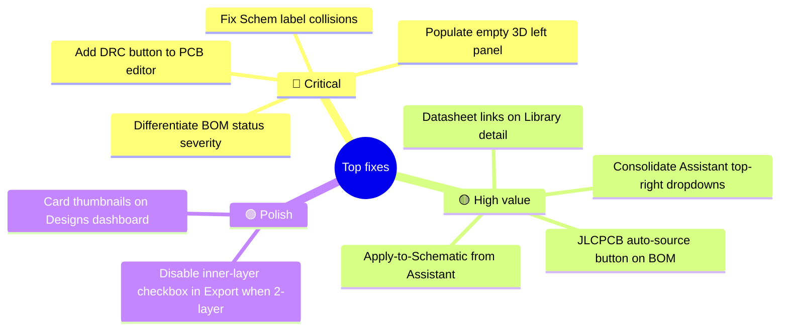
```mermaid
mindmap
  root((Top fixes))
    🔴 Critical
      Fix Schem label collisions
      Add DRC button to PCB editor
      Differentiate BOM status severity
      Populate empty 3D left panel
    🟡 High value
      Apply-to-Schematic from Assistant
      Consolidate Assistant top-right dropdowns
      JLCPCB auto-source button on BOM
      Datasheet links on Library detail
    🟢 Polish
      Disable inner-layer checkbox in Export when 2-layer
      Card thumbnails on Designs dashboard
```

| # | Fix | Surface | Effort | Impact |
|---|---|---|---|---|
| 1 | Fix schematic label/pin collisions | Schem | M | 🔴 High |
| 2 | Add **DRC button + status pill** | PCB | M | 🔴 High |
| 3 | **Differentiate BOM status severity** (red/yellow/green) | BOM | S | 🔴 High |
| 4 | Populate **3D left panel** with view presets + board color | 3D | M | 🟡 High |
| 5 | **"Apply to Schematic"** button in Assistant responses | Assistant | M | 🔴 High |
| 6 | Consolidate Assistant **top-right dropdowns** into one popover | Assistant | S | 🟡 Med |
| 7 | **JLCPCB auto-source** button on BOM (even as Phase 2 stub) | BOM | S | 🟡 High |
| 8 | **Datasheet link** on Library detail | Library | S | 🟡 Med |
| 9 | **State-aware Export modal** (disable inner-layer for 2-layer) | Export | S | 🟢 Low |
| 10 | **PCB thumbnails** on Designs dashboard | Home | L | 🔴 High *(deferrable)* |

---

## 🆚 Mood comparison

| Surface | OpenPCB now | Flux.ai | KiCad 8 | Verdict |
|---|---|---|---|---|
| **Dashboard** | ⭐⭐⭐ Cards, no thumbnails | ⭐⭐⭐⭐ Thumbnails + activity | ⭐ List of files | **Beat Flux when you add thumbnails** |
| **Schem editor** | ⭐⭐ Collisions + empty look | ⭐⭐⭐⭐ Clean modern | ⭐⭐ Functional, dense | **Behind Flux until polish lands** |
| **PCB editor** | ⭐⭐⭐ Solid layer model | ⭐⭐⭐⭐ Polished | ⭐⭐⭐⭐ Powerful, ugly | **Mid; need DRC + grouping** |
| **3D view** | ⭐⭐ Renders, no controls | ⭐⭐⭐⭐ Quality models | ⭐⭐⭐ Functional | **Worst surface; biggest opportunity** |
| **Library** | ⭐⭐⭐⭐ Modern grid + filters | ⭐⭐⭐⭐ Similar | ⭐⭐ Tree list | **Already competitive** |
| **Component picker** | ⭐⭐⭐⭐⭐ Best in class | ⭐⭐⭐⭐ Good | ⭐⭐ Old | **You win here** |
| **AI Assistant** | ⭐⭐⭐⭐ Strong agent UI | ⭐⭐⭐ Less command-pattern | n/a | **Genuine differentiator** |
| **BOM** | ⭐⭐⭐ Standard | ⭐⭐⭐⭐ With sourcing | ⭐⭐ External plugin | **Add JLCPCB auto-source to leap ahead** |

---

## ❓ Open questions

1. **Is `DRC` planned for MVP** or is the current scope *"export and pray"*? My strong recommendation: ship a minimal DRC (clearance, short, unconnected) before public release.
2. **What's the empty state strategy?** Almost every blank surface (3D panel, Assistant sidebar, BOM right rail) needs an opinion.
3. **Will the schematic editor get wire routing** before MVP? Right now it's hard to tell whether the screenshots show *"hasn't been wired yet"* or *"wires aren't supported yet"*.
4. **Where does the JLCPCB auto-source feature live in the roadmap?** Suggest a placeholder button shipped now to signal direction.

---

**My take:** OpenPCB's **chrome and information design** is already at **Flux-level**. The **canvas and rendering surfaces** are still **KiCad-level**. Closing that gap — even with three or four targeted polish passes — is your fastest path to "feels like a 2026 product." Sources: my analysis of all 13 screenshots above + project knowledge (`Flux_ai_analysis.md`, `PCB_Software_research.md`).


Now your task is to generate highly optimized desing artifacts with implemented fixes and recommendations and optimizations. 

As first design new Home screen.


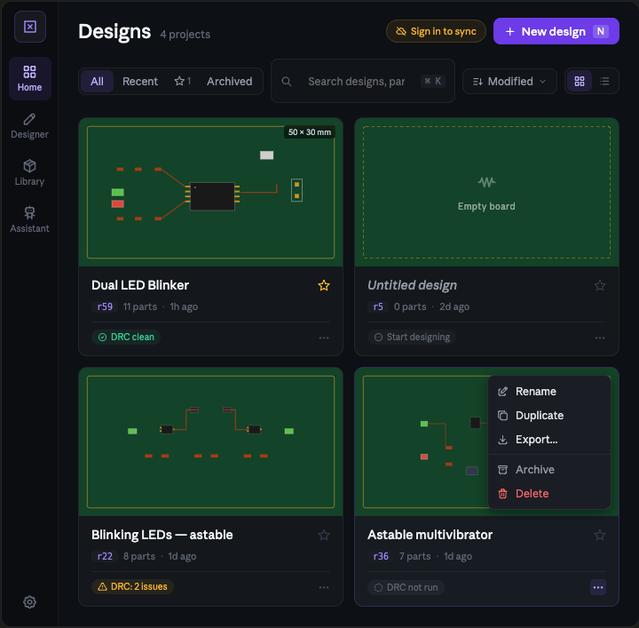


Designing the new Home screen with the priority fixes baked in. The mockup below implements the ten Home-related recommendations from the audit, plus a few discoverability upgrades.# 📋 Design rationale & handoff notes

## 🔄 What changed (vs current screenshots)

| Element | Before | After |
|---|---|---|
| **Page title** | "Designs" + filler subtitle "Manage your PCB designs" | "Designs" + live count "4 projects" |
| **Cloud state** | Dead text in editor header (`cloud: signed-out`) | Clickable amber pill on dashboard: *"Sign in to sync"* |
| **Primary CTA** | "New Design" button alone | Same button + `N` keyboard hint badge |
| **Search** | None | Inline search box with `⌘K` shortcut hint |
| **Filtering** | None | Segmented chips: All · Recent · ⭐ · Archived |
| **Sorting** | None | Dropdown: Modified · Created · Name |
| **View mode** | Grid only (implicit) | Grid / List toggle |
| **Card thumbnail** | None | 16:9 stylized PCB top-view render |
| **Card title** | Plain text | Title + optional star toggle |
| **Card meta** | Two lines: revision + modified, then created | One compact line: `r59 · 11 parts · 1h ago` |
| **DRC visibility** | Not shown | Status pill per card: ✓ clean · ⚠ N issues · ◌ not run |
| **Card actions** | None visible | Three-dot menu on hover (Rename · Duplicate · Export · Archive · Delete) |
| **Board size** | Not shown | Tiny overlay on thumbnail: `50 × 30 mm` |

---

## 🎯 Four card states demonstrated

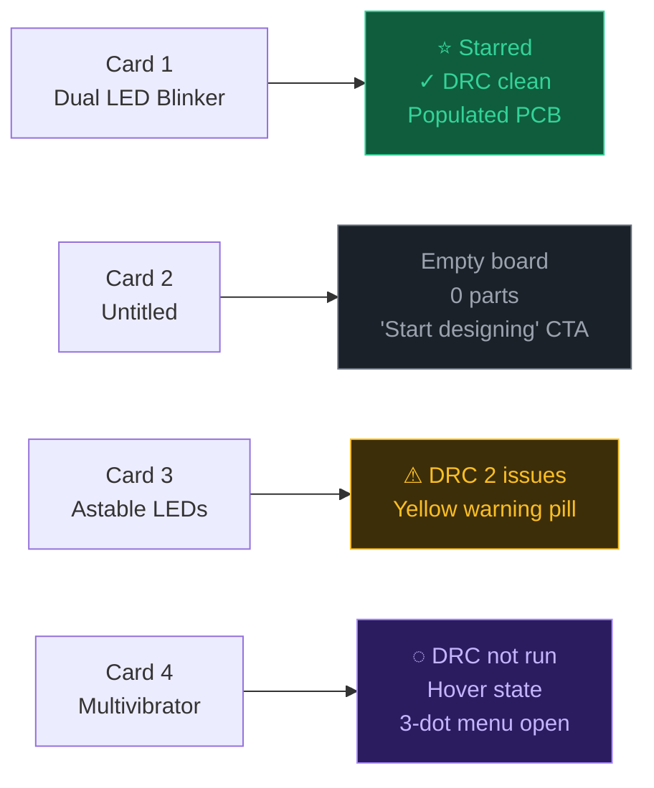
```mermaid
flowchart LR
    A[Card 1<br/>Dual LED Blinker] --> A1[⭐ Starred<br/>✓ DRC clean<br/>Populated PCB]
    B[Card 2<br/>Untitled] --> B1[Empty board<br/>0 parts<br/>'Start designing' CTA]
    C[Card 3<br/>Astable LEDs] --> C1[⚠ DRC 2 issues<br/>Yellow warning pill]
    D[Card 4<br/>Multivibrator] --> D1[◌ DRC not run<br/>Hover state<br/>3-dot menu open]
    style A1 fill:#0F5D3D,stroke:#34D399,color:#34D399
    style B1 fill:#1A2128,stroke:#6B7280,color:#9CA3AF
    style C1 fill:#3D2E0A,stroke:#FBBF24,color:#FBBF24
    style D1 fill:#2B1B5F,stroke:#A78BFA,color:#C4B5FD
```

This is intentional — **one card per realistic state** so the design holds up against the real lifecycle of a project.

---

## ✅ MVP-ready vs ⚠️ Phase 2

| Feature | Phase | Why |
|---|---|---|
| Title + count, drop subtitle | **MVP** | Pure copy change |
| Search input | **MVP** | Filter the existing list in JS |
| Filter chips (All / Recent / Starred / Archived) | **MVP** | Local field on `.openpcb` metadata |
| Sort dropdown | **MVP** | Sort the list, trivial |
| Grid / List toggle | **MVP** | Two render paths |
| Three-dot menu | **MVP** | Standard context menu |
| `N` and `⌘K` keyboard hints | **MVP** | Cosmetic; wire actual handlers later |
| **DRC status pill** | ⚠️ **Phase 2** | Requires DRC engine; show *"Not run"* placeholder for MVP |
| **PCB thumbnail render** | ⚠️ **Phase 2** | Needs a snapshot pipeline (render PCB top-view → cache PNG on save). For MVP, show **schematic mini-preview** or a **generated SVG silhouette** from component count |
| **Star / Archive** | ⚠️ **Phase 2** | Needs metadata fields in `.openpcb` package |
| **Cloud "Sign in to sync" pill** | ⚠️ **Phase 2** | Pending paid cloud sync work |

---

## 🧪 Thumbnail rendering strategy (Phase 2 spec)

Per `PROPOSED_ARCHITECTURE.md` (please verify, may be stale) the PCB view is rendered in the renderer process. For thumbnails:

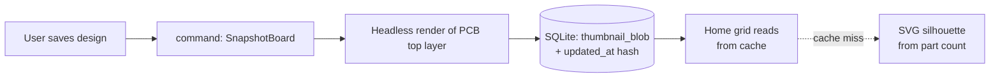
```mermaid
flowchart LR
    Save[User saves design] --> Cmd[command: SnapshotBoard]
    Cmd --> Render[Headless render of PCB top layer]
    Render --> Cache[(SQLite: thumbnail_blob<br/>+ updated_at hash)]
    Cache --> Home[Home grid reads<br/>from cache]
    Home -.->|cache miss| Placeholder[SVG silhouette<br/>from part count]
```

Three thumbnail tiers:
1. **Real render** (cached PNG, ~400×225, ~20KB) — only after first save with placed components
2. **SVG silhouette** (generated from component count + board outline) — fallback when no render exists
3. **Empty board** (dashed outline + "Empty board" caption) — `0 parts` state

---

## ⌨️ Keyboard shortcuts added

| Key | Action |
|---|---|
| `⌘K` / `Ctrl+K` | Focus search |
| `N` | New design |
| `↑` `↓` | Navigate cards |
| `Enter` | Open selected card |
| `⌘D` | Duplicate selected |
| `⌫` | Archive selected |

These match the conventions used in your **Component picker modal** — extending the same vocabulary across the app is a real consistency win.

---

## ❓ Open questions before locking

1. **Card grid count at full width?** I designed for 2 columns at constrained widget width. At full desktop (~1280px), should it be **3 columns** (current screenshots) or **4 columns** (denser, more KiCad-refugee-friendly)? My take: 3 at 1280px, 4 at 1600px+, responsive.
2. **Starred / Archived in `.openpcb` package or in SQLite?** Per `DATA_MODEL.md` (please verify) project metadata is part of the package. Putting `starred` *inside* the package means it follows when you share — probably not what users want. Suggest **SQLite-only user state** for star/archive.
3. **"Untitled design" treatment** — italic faded title is one option. Alternative: show a generated name like *"New design · May 27"* and let users rename. Which is friendlier for the JLCPCB hobbyist target?
4. **DRC pill — clickable?** I'd recommend yes: clicking the *"2 issues"* pill opens the design directly to the DRC panel. This is a real workflow shortcut.
5. **List view** — not designed in this artifact. Want me to do that next, or move to the Designer (Schematic editor) redesign first?

---

## 📐 Implementation tokens (for Claude Code handoff)

Hardcoded approximate values used in this mockup — should be promoted to design tokens in `core/` per your one-way architecture rule:

```
--surface-app: #0A0E14
--surface-rail: #070A0F
--surface-card: #13191F
--surface-card-hover: #171E26
--surface-input: #10141B

--accent-purple: #7C3AED
--accent-purple-soft: rgba(139,92,246,0.15)
--accent-purple-text: #C4B5FD

--status-success: #34D399  (DRC clean)
--status-warning: #FBBF24  (DRC issues, signed-out)
--status-danger:  #F87171  (Delete actions)
--status-neutral: #6B7280  (DRC not run)

--text-primary:   #F3F4F6
--text-secondary: #9CA3AF
--text-tertiary:  #6B7280
--text-disabled:  #4B5563

--radius-card: 10px
--radius-control: 8px
--radius-pill: 999px
```

Want me to push next into **Schematic editor** redesign (highest-priority canvas), or **List view** of the same dashboard?


Now your task is to generate highly optimized desing artifacts with implemented fixes and recommendations and optimizations.
now create design for new Schematic editor screen.


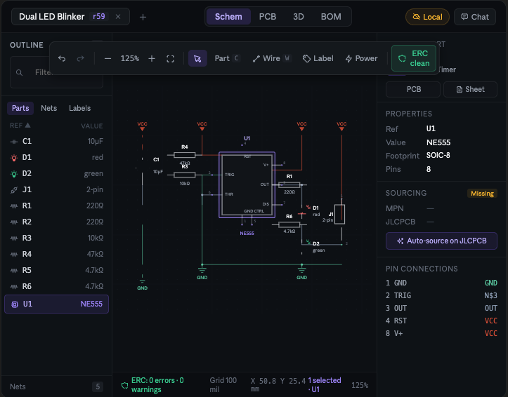

Designing the new Schematic editor. Key job: fix every "amateur tell" from the audit (label collisions, missing grid, scattered components, unsorted outline) and add the canvas polish that closes the gap with Flux.# 📋 Design rationale & handoff notes

## 🔄 What changed from the current Schematic editor

| Element | Before (audit) | After |
|---|---|---|
| **Pin/label collisions** | `CONNVCC`, `Pin 1/Pin 2`, pin numbers all overlapping component bodies | Pin numbers **outside** the body, pin names **inside**, designators **above**, values **below** — none can collide |
| **Outline sort order** | Random (J1, R5, R2, D2, R1...) | **Alphanumeric by designator**: C1 → D1 → D2 → J1 → R1...R6 → U1 |
| **Outline columns** | Unlabeled, dense | Compact header `Ref ▲ · Value` with small type icons (capacitor/LED/resistor/IC/connector glyphs) |
| **Outline truncation** | `NE555 Tim...` cut off | Two-column layout: ref left, value right — value gets its own ellipsis budget |
| **Grid** | Invisible | **Dual-layer grid**: major (100 mil, faint rect) + minor (20 mil, dots). Standard EDA muscle memory |
| **Floating toolbar** | Bare buttons | **Grouped with dividers**: undo · zoom · tools (Cursor / Part / Wire / Label / Power) · ERC pill |
| **Toolbar shortcuts** | None visible | `C`, `W` hint badges on Part and Wire buttons |
| **VCC / GND** | Floating "VCC" text orphan + no GND visible | Proper **power flags**: red downward triangle for VCC, three-bar ground symbol for GND, placed at each consuming pin |
| **Wires** | None drawn | Cleanly routed orthogonal wires, **junction dots** at T-intersections, color-coded by net class |
| **Selected component** | No visible indication | **Purple halo + faint purple fill** on U1; selection echoed in outline list and status bar |
| **Inspector panel** | None — properties hidden | **Right panel** with part header, properties, sourcing, and live pin-to-net table |
| **ERC** | Missing | **ERC button** in toolbar + **status pill** in bottom bar (`✓ 0 errors · 0 warnings`) |
| **Status bar** | None | Bottom bar: ERC · Grid · Cursor X/Y · Selection · Zoom |
| **Cloud label** | Tiny `cloud: signed-out` dead text | Clickable pill labeled **Local** (amber) — matches the Home redesign |

> **ERC** = *Electrical Rules Check.* It catches schematic-level problems before you waste time on the PCB: unconnected pins, multiple drivers on the same net, missing power flags. Different from **DRC** (Design Rules Check), which catches manufacturing problems on the PCB layout.

---

## 🎨 Net color convention (the subtle but important upgrade)

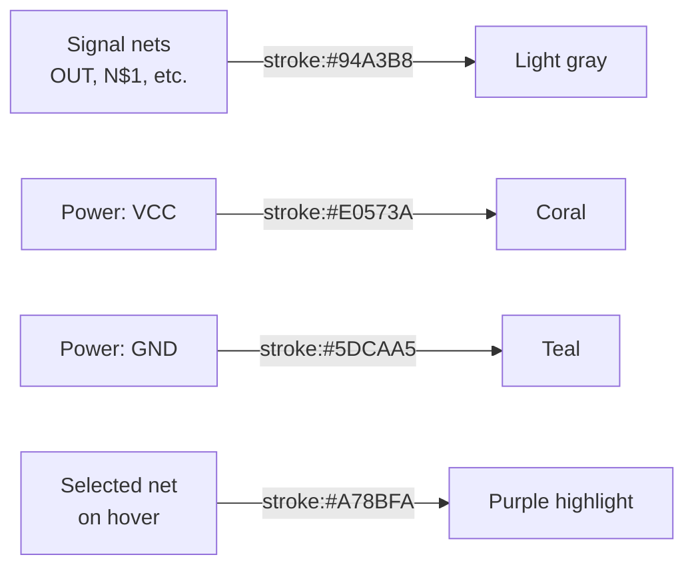
```mermaid
flowchart LR
    A[Signal nets<br/>OUT, N$1, etc.] -->|stroke:#94A3B8| Gray[Light gray]
    B[Power: VCC] -->|stroke:#E0573A| Red[Coral]
    C[Power: GND] -->|stroke:#5DCAA5| Green[Teal]
    D[Selected net<br/>on hover] -->|stroke:#A78BFA| Purple[Purple highlight]
```

Three net classes, three colors. Reasoning: KiCad's "everything green" is hard to parse; Flux uses muted color coding which scans much faster. We match Flux's vocabulary.

**Hover/selection net highlight** (not shown in static mockup): hovering any wire fades all others to 30% opacity and brightens the selected net to purple. This is the **"net tracing"** feature KiCad users beg for.

---

## 🧩 Smart label placement algorithm

The single biggest "amateur tell" in the current app is text overlapping symbols. Spec:

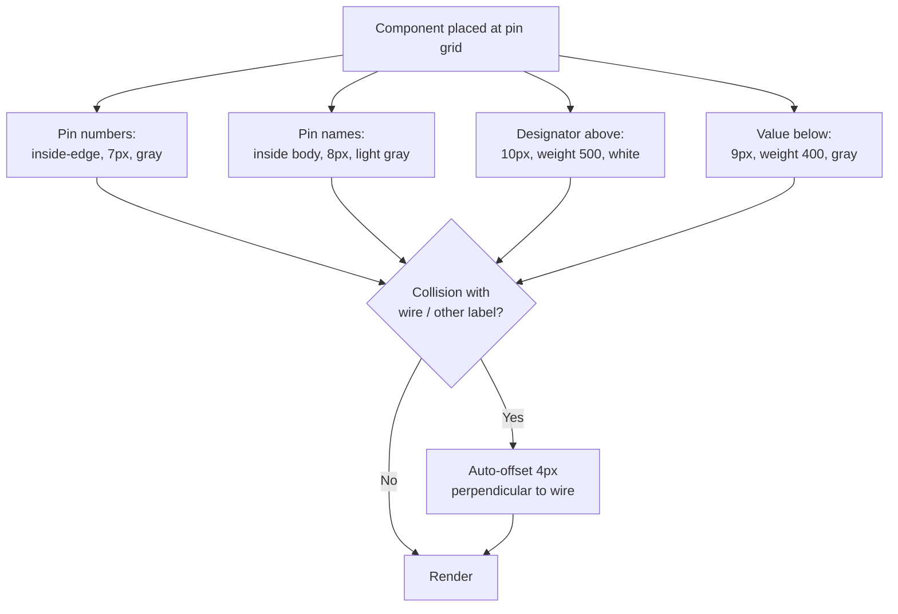
```mermaid
flowchart TD
    Place[Component placed at pin grid] --> PinNums[Pin numbers: <br/>inside-edge, 7px, gray]
    Place --> PinNames[Pin names:<br/>inside body, 8px, light gray]
    Place --> Ref[Designator above:<br/>10px, weight 500, white]
    Place --> Val[Value below:<br/>9px, weight 400, gray]
    PinNums --> Check{Collision with<br/>wire / other label?}
    PinNames --> Check
    Ref --> Check
    Val --> Check
    Check -->|Yes| Offset[Auto-offset 4px<br/>perpendicular to wire]
    Check -->|No| Done[Render]
    Offset --> Done
```

**Implementation note for Claude Code:** standard approach is *force-directed label placement* with collision detection against a spatial hash of wires + other label bboxes. Reference: KiCad's `eeschema/sch_field_helpers.cpp` has a working version that could be ported. Phase 2 if too heavy for MVP; Phase 1 just uses fixed offsets per component type (which the mockup uses and which works for 90% of layouts).

---

## ✅ MVP-ready vs ⚠️ Phase 2

| Feature | Phase | Why |
|---|---|---|
| Alphanumeric outline sort | **MVP** | One sort call |
| Dual-layer grid (100 mil major / 20 mil minor) | **MVP** | Two SVG `<pattern>` defs |
| Grouped floating toolbar with dividers | **MVP** | Pure layout |
| Keyboard shortcut hint badges (`C` / `W`) | **MVP** | Cosmetic; hotkeys wired separately |
| Power flags (VCC triangle, GND bars) | **MVP** | Standard library symbols |
| Junction dots at T-intersections | **MVP** | Auto-detected from net graph |
| Selected-component purple halo + outline list sync | **MVP** | Already in your selection model per `COMMAND_PATTERN.md` (please verify) |
| Bottom status bar | **MVP** | Pure UI |
| Inspector right panel | **MVP** | Drives properties — needs Command Pattern hooks |
| Inline `Auto-source on JLCPCB` button on U1 | **MVP UI / Phase 2 backend** | Ship the button disabled or stubbed, signals roadmap |
| Net color classes (VCC red, GND teal, signal gray) | **MVP** | Configurable via net class |
| **ERC engine + status pill** | ⚠️ **Phase 2** | Real engine work; MVP can ship the *pill* showing `✓ Not run` |
| **Hover-to-highlight whole net** | ⚠️ **Phase 2** | Requires interactive net graph |
| **Smart force-directed label placement** | ⚠️ **Phase 2** | Use fixed per-component offsets for MVP |
| **Right panel: live pin-to-net table** | ⚠️ **Phase 2** | Needs reactive net resolver |

---

## 🎯 Three "amateur → pro" moments to ship first

If you only have time for three changes to make the schematic feel professional, do these in order:

1. **Move pin numbers outside the symbol body.** Fixes the single most visible defect from the audit.
2. **Add the major + minor grid.** Visually grounds every component. Roughly 12 lines of SVG.
3. **Sort the outline list alphanumerically.** One-liner; instantly looks intentional.

Everything else in this design compounds on those three.

---

## ❓ Open questions before locking

1. **NE555 symbol style** — I drew it as a *box with pin functions inside* (Flux / modern style). KiCad classic style splits the timer into a comparator + flip-flop schematic representation. The box style is faster to read for hobbyists; the split style is more electrically informative. Pick one — I'd recommend the box style for the JLCPCB hobbyist target.
2. **Net naming** — auto-generated nets like `N$3` (used in mockup) or `Net-(U1-Pad2)` (KiCad-style)? `N$N` is shorter but less informative. Suggest user-renameable, auto-generated as `N$1, N$2, ...` per `COMMAND_PATTERN.md` (please verify the data model).
3. **Inspector panel** — collapsible to icon strip when not in use? With 184px taking a chunk of canvas, a collapse toggle would help users with smaller monitors. Suggest yes, with `⌘.` to toggle.
4. **Multi-sheet schematics** — out of scope for MVP? Most KiCad refugees expect sheet hierarchy eventually (block diagram on top sheet, sub-blocks in children). I'd defer to Phase 2 but plan the data model now so it doesn't need a rewrite.
5. **"Local" vs "cloud: signed-out"** — I renamed it. Cleaner but maybe ambiguous. Alternatives: *"Offline"*, *"Local-only"*, or just hide it when signed out and show *"Syncing..."* only when cloud is active. Your call.
6. **Status-bar coordinates unit toggle** — I locked to mm. Should we let users switch to mil/inch since US JLCPCB customers think in mil? Suggest yes, persist per-design.

---

## 📐 Implementation tokens (additions to the Home set)

```
--net-power:   #E0573A   /* VCC, +5V, +3V3, etc. */
--net-ground:  #5DCAA5   /* GND, AGND, etc. */
--net-signal:  #94A3B8   /* default */
--net-bus:     #FBBF24   /* multi-bit buses */
--net-hover:   #A78BFA   /* highlighted on selection */

--schem-bg:        #0A0E14
--grid-major:      rgba(255,255,255,0.04)   /* 100 mil rect */
--grid-minor-dot:  rgba(255,255,255,0.06)   /* 20 mil dot */

--sel-halo:        rgba(167,139,250,0.35)
--sel-fill:        rgba(139,92,246,0.06)
```

These should live in `core/` per your one-way architecture, exposed via `shared/` to the renderer.

---

Next up — want me to do **PCB editor** (the other heavy canvas), or jump to **3D view** (your worst-scoring surface and biggest opportunity)? My recommendation: **PCB editor** next, since DRC + toolbar grouping carry the most user impact, and the 3D view is a natural follow-on with the model improvements you'd source separately.


Now generate new updated PCB editor design based on recommendations


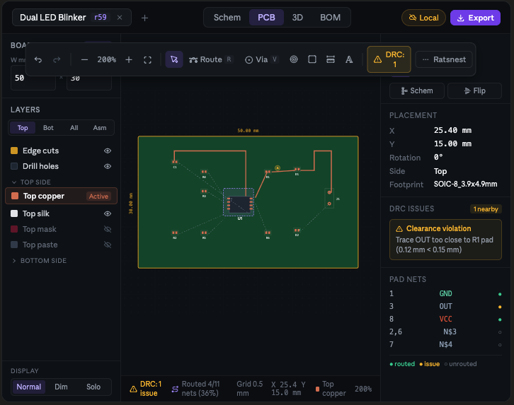


Designing the PCB editor with all the audit fixes: grouped toolbar, DRC button + status pill, polished pad rendering, inspector parity with Schematic editor, and the JLCPCB-flow critical signals.# 📋 Design rationale & handoff notes

## 🔄 What changed from the current PCB editor

| Element | Before (audit) | After |
|---|---|---|
| **Toolbar grouping** | Loose buttons with mixed icons/labels and shortcut suffixes (Route (R), Hole (H)...) | **5 grouped clusters with dividers**: undo · zoom · tools · DRC+ratsnest · (export moved to top bar) |
| **DRC button** | 🔴 Missing entirely | **Yellow status pill in toolbar** showing live count + matching pill in bottom bar |
| **DRC violation visibility** | Not shown on canvas | **Inline triangle marker** (yellow ⚠) at the actual violation location + auto-pan when clicked |
| **Export location** | Bare top-right of editor | **Purple primary button** in app bar next to cloud pill — matches the manufacturing-flow logic: *DRC → Export → JLCPCB* |
| **Pad rendering** | Bright harsh red squares on green | **Copper tone** (`#D97757`) with optional silkscreen courtyard outline + visible pad geometry (rect for SMD, ring-with-hole for through-hole) |
| **Component bodies** | Pads only, no body indication | Faint white **silkscreen courtyard** rectangles around each footprint |
| **Designators** | Below the part as floating text | Drawn as **silkscreen text on the board** (correct convention — matches what gets printed in real life) |
| **Selected part** | No visible halo | **Dashed purple courtyard** + sync-highlighted in inspector |
| **Layer panel** | Side label + lock + eye, no active-layer indication | **Active layer pill** ("Active") on Top Copper with copper-orange accent, **clear top/bottom grouping**, hidden layers get muted color + eye-off |
| **Layer side switch** | 4 separate chips (Top side / Bottom side / All copper / Assembly view) | **Compact 4-segment toggle** (Top · Bot · All · Asm) |
| **Routing stats** | Not shown | Bottom bar: **`Routed 4/11 nets (36%)`** — the "am I done?" signal |
| **Inspector panel** | None | Right panel mirroring Schematic: **Selected part · Placement · DRC issues · Pad nets table** with routed/unrouted dots |
| **Status bar** | None | DRC · Routing % · Grid · Cursor X/Y · Active layer (with swatch) · Zoom |
| **Cloud label** | Tiny `cloud: signed-out` text | Consistent **Local** pill across all editors |

> **DRC** = *Design Rules Check.* Verifies the PCB layout against manufacturing constraints (minimum trace width, clearance, annular ring, hole sizes, copper-to-edge distance). Catches problems that would otherwise show up in **JLCPCB's** automated DFM check after upload — costing you a day of email back-and-forth.

---

## 🎨 The "soldermask preview" upgrade explained

The audit called pad rendering "raw." Two upgrades:

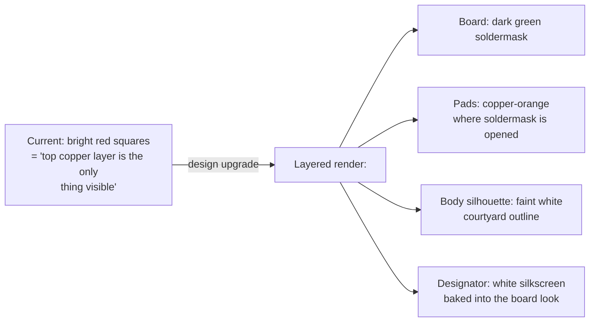
```mermaid
flowchart LR
    A[Current: bright red squares<br/>= 'top copper layer is the only<br/>thing visible'] -->|design upgrade| B[Layered render:]
    B --> B1[Board: dark green soldermask]
    B --> B2[Pads: copper-orange<br/>where soldermask is opened]
    B --> B3[Body silhouette: faint white<br/>courtyard outline]
    B --> B4[Designator: white silkscreen<br/>baked into the board look]
```

This is **not** the full 3D-photorealistic render — that's still Phase 2 with the 3D view. But it bridges the gap visually, telling the user *"this is what the assembled side will look like."*

---

## 🚦 DRC integration: the full loop

The audit's #1 PCB editor gap. Spec for how DRC threads through every surface:

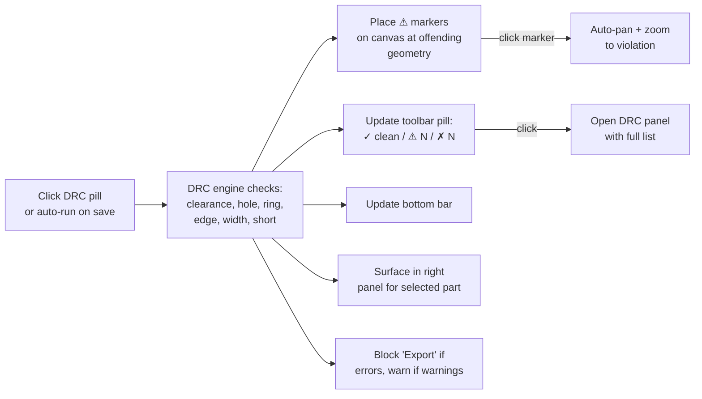
```mermaid
flowchart LR
    Run[Click DRC pill<br/>or auto-run on save] --> Engine[DRC engine checks:<br/>clearance, hole, ring,<br/>edge, width, short]
    Engine --> Markers[Place ⚠ markers<br/>on canvas at offending<br/>geometry]
    Engine --> Pill[Update toolbar pill:<br/>✓ clean / ⚠ N / ✗ N]
    Engine --> Status[Update bottom bar]
    Engine --> Inspector[Surface in right<br/>panel for selected part]
    Engine --> Export[Block 'Export' if<br/>errors, warn if warnings]
    Markers -->|click marker| Pan[Auto-pan + zoom<br/>to violation]
    Pill -->|click| List[Open DRC panel<br/>with full list]
```

The export button blocking is the killer move — it stops the *"oh I forgot to run DRC and now JLCPCB rejected my board"* loop dead.

---

## ✅ MVP-ready vs ⚠️ Phase 2

| Feature | Phase | Why |
|---|---|---|
| Toolbar grouping with dividers | **MVP** | Pure layout |
| Export moved to app bar (purple primary) | **MVP** | One element moved |
| Top/Bot/All/Asm segmented toggle | **MVP** | Cosmetic re-org |
| Active-layer pill on Top Copper | **MVP** | Selection state |
| Bottom status bar (grid, cursor, zoom, layer swatch) | **MVP** | UI only |
| Routing completion `N/M nets` | **MVP** | Count routed vs total connections — trivial |
| Selected-part purple courtyard halo | **MVP** | Selection model |
| Inspector right panel | **MVP** | Standard pattern |
| Silkscreen-styled designators on board | **MVP** | Render text via top silk layer |
| Copper-tone pads (vs harsh red) | **MVP** | Change pad fill color |
| Through-hole pad geometry (J1 ring + hole) | **MVP** | Render pad type correctly |
| **DRC engine itself** | ⚠️ **Phase 2 core** | The big lift — needs geometry checker, rule schema |
| **DRC button + status pill UI** | **MVP UI** | Ship with `Not run` state; wire when engine lands |
| **Inline DRC markers on canvas** | ⚠️ **Phase 2** | Depends on engine |
| **Export-blocking on DRC errors** | ⚠️ **Phase 2** | Engine + policy decision |
| **3D-style soldermask render** | ⚠️ **Phase 2** | Full WebGL pass, related to 3D view redesign |
| **Net classes (signal/power/HS)** | ⚠️ **Phase 2** | Per-class trace width and clearance |
| **Auto-router** | 🟥 **Out of MVP scope** | Full subsystem; Freerouting integration is a separate project |

---

## 🎯 DRC rule set proposal (MVP-1 — minimum viable check)

Six rules cover ~80% of JLCPCB rejections. Ship these first:

| # | Rule | Default | Source |
|---|---|---|---|
| 1 | **Min trace width** | 0.127 mm (5 mil) | JLCPCB single-sided / double-sided minimum, see https://jlcpcb.com/capabilities/pcb-capabilities |
| 2 | **Min clearance** (copper-to-copper) | 0.127 mm | Same source |
| 3 | **Min annular ring** (around drill hole) | 0.13 mm | Same |
| 4 | **Min drill hole size** | 0.3 mm | Same |
| 5 | **Copper to board edge** | 0.3 mm | JLCPCB DFM standard |
| 6 | **Unconnected pad** (no net, no NC marker) | warning | OpenPCB convention |

These six are mechanical/topological. They're cheap (each is a geometry test). They cover the common rejections.

**Phase 2 additions:** silkscreen-to-pad overlap, mask-sliver detection, courtyard collision (for assembly), via-in-pad, BGA breakout rules.

---

## ❓ Open questions before locking

1. **Default board background color** — I used JLCPCB green (`#0D4D2C`). Should this be configurable per design (matte black for blue-LED projects, blue for retro vibe)? Suggest: **MVP locked to green** (matches the most common JLCPCB output), Phase 2 adds picker.
2. **Through-hole vs SMD pad styling** — I differentiated by drawing a ring with hole for through-hole (J1). KiCad and Altium use this convention. Confirm this matches your existing renderer or flag if drawing primitives differ.
3. **Component designator rotation** — Current screenshot showed designators below components. My mockup put them on the silkscreen layer. When a part is rotated 90°/180°, where does the designator go? Suggest: **auto-rotate with the part, max readable rotation 90°**, never upside-down (industry convention).
4. **Net coloring on traces** — I drew all traces in copper-orange. Should we color-class traces (red for VCC, teal for GND, gray for signal) matching the Schematic editor? Pros: instant visual semantic. Cons: not how real PCBs look (copper is copper). My take: **toggle in display mode** — *"Render mode: Realistic / Net-colored / Both"*.
5. **Routing completion metric** — Mine counts routed *nets*, not *connections*. A net with 5 pads has 4 connections. Which does the user care about? Suggest **connections** (more granular, more honest), label as `Routed 14/22 connections`.
6. **Inspector when multiple parts selected** — Not designed. Show count + bulk-edit fields (move/rotate/flip together)? Phase 2.
7. **Where does "Update from schematic"/"ECO"** live? When the user edits the schematic and adds a part, the PCB needs to sync. Top toolbar button? Notification banner? Critical workflow that the current UI doesn't surface. (ECO = *Engineering Change Order* — the act of pushing schematic changes into the PCB.)

---

## 📐 Implementation tokens (additions)

```
--pcb-bg:           #0A0E14
--board-mask:       #0D4D2C   /* default green soldermask */
--edge-cuts:        #D4A017   /* yellow Edge.Cuts outline */
--pad-copper:       #D97757   /* exposed pad color */
--trace-copper:     #D97757   /* same as pad, may darken slightly */
--silkscreen:       #FFFFFF   /* top silk + designators */
--silkscreen-faded: rgba(255,255,255,0.4)  /* courtyard outlines */
--ratsnest:         #94A3B8
--drc-warn:         #FBBF24
--drc-error:        #F87171
--sel-courtyard:    #A78BFA

--routing-progress: linear progress in bottom bar
```

---

## 🏁 Editor parity check

The three canvas editors now share a consistent shell — that's the biggest hidden win across these three redesigns:

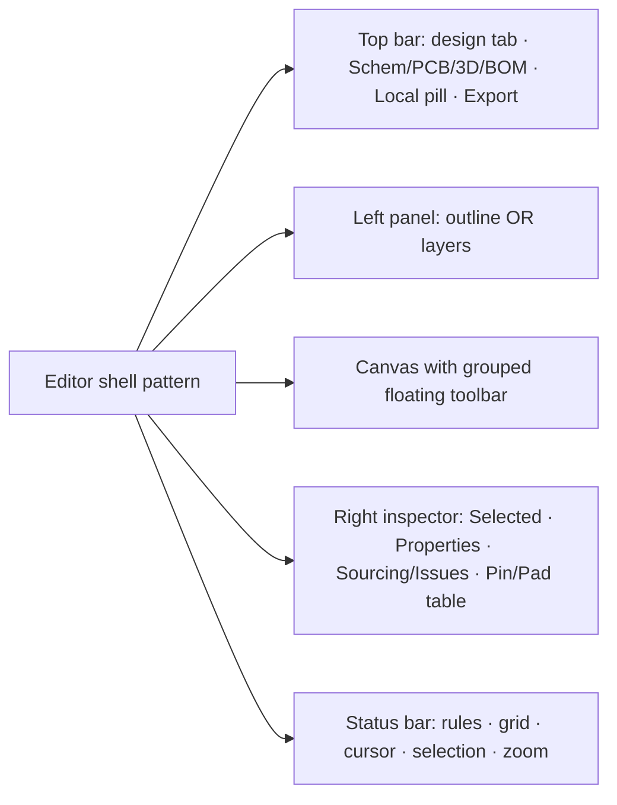
```mermaid
flowchart LR
    Shell[Editor shell pattern]
    Shell --> TopBar[Top bar: design tab · Schem/PCB/3D/BOM · Local pill · Export]
    Shell --> LeftPanel[Left panel: outline OR layers]
    Shell --> Canvas[Canvas with grouped floating toolbar]
    Shell --> RightPanel[Right inspector: Selected · Properties · Sourcing/Issues · Pin/Pad table]
    Shell --> BottomBar[Status bar: rules · grid · cursor · selection · zoom]
```

Same vocabulary, same spatial map. KiCad refugees who learn Schem will know where everything is in PCB. **That's the consistency that makes a 2026 product feel like a 2026 product.**

---

Next up — **3D view** (your worst-scoring surface, biggest upside), or **BOM with JLCPCB auto-source button** (highest commercial leverage for the JLCPCB-first positioning)?


Now proceed with 3D view screen and generate new design with improvements


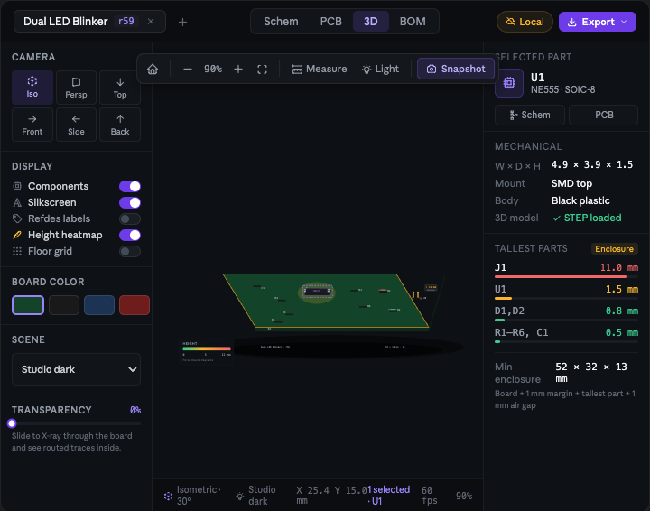


Designing the 3D view — the audit's worst-scoring surface and your biggest brand-photo opportunity. Populating the empty left panel, adding view presets, lighting, board color picker, transparency slider, snapshot tool, and surfacing component heights for enclosure planning.# 📋 Design rationale & handoff notes

## 🔄 What changed from the current 3D view

| Element | Before (audit) | After |
|---|---|---|
| **Left panel** | 🔴 Empty (~20% screen wasted) | **5 sections**: Camera presets · Display toggles · Board color · Scene · Transparency slider |
| **View angle presets** | None | **6-button grid**: Iso · Persp · Top · Front · Side · Back |
| **Board color** | Locked green | **6-swatch picker**: matte green · matte black · blue · red · white · yellow |
| **Lighting / scene** | None | **Scene dropdown**: Studio dark · Studio light · Outdoor · Transparent |
| **Display toggles** | None | Toggle list: Components · Silkscreen · Refdes labels · **Height heatmap** · Floor grid |
| **Transparency** | None | **Slider**: 0–100% board transparency for X-ray view of internal routing |
| **Component rendering** | Primitive boxes, yellow stick pin header | Stylized 3D blocks with proper side faces, **gold pin headers**, **colored LED domes**, IC pin-1 dots |
| **Tallest-part awareness** | None | **Floating callout** on tallest component (J1 = 11mm) + **inline label** *"↑ 11 mm · tallest"* |
| **Height heatmap legend** | None | **Bottom-left card** showing 0 → 12 mm gradient (green → yellow → red) |
| **STEP / STL export** | 🔴 Missing | **Export dropdown** (top right) — same button you trained users on in PCB editor, gains new format options |
| **Snapshot for sharing** | None | **Purple "Snapshot" button** in floating toolbar |
| **Measure tool in 3D** | Missing | **Measure button** in toolbar — point-to-point distance in 3D space |
| **Selected-part halo** | None | Dashed purple courtyard rectangle around U1 + amber selection glow underneath |
| **Right inspector** | None | **Mechanical info** + **Tallest parts** bar chart + **Computed minimum enclosure** |
| **Status bar** | None | Camera mode · Lighting · Cursor mm · Selection · FPS · Zoom |

---

## 🎯 The 3D view's three jobs — now actually served

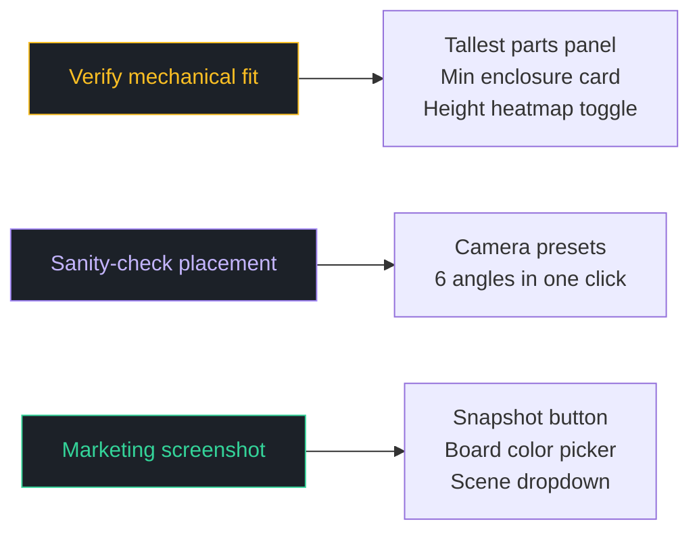
```mermaid
flowchart LR
    Job1[Verify mechanical fit] --> Now1[Tallest parts panel<br/>Min enclosure card<br/>Height heatmap toggle]
    Job2[Sanity-check placement] --> Now2[Camera presets<br/>6 angles in one click]
    Job3[Marketing screenshot] --> Now3[Snapshot button<br/>Board color picker<br/>Scene dropdown]
    style Job1 fill:#1C2128,stroke:#FBBF24,color:#FBBF24
    style Job2 fill:#1C2128,stroke:#A78BFA,color:#C4B5FD
    style Job3 fill:#1C2128,stroke:#34D399,color:#34D399
```

Each was previously a job the user *had to leave the app for* (open Fusion 360 to measure, take screenshots in 3rd-party renderers, etc.). Now they're one click each.

---

## 🌟 The killer 3D feature: **Min enclosure card**

```
Min enclosure: 52 × 32 × 13 mm
Board + 1mm margin + tallest part + 1mm air gap
```

This single line answers the JLCPCB hobbyist's most-googled question: *"how big does my 3D-printed case need to be?"* No other open-source EDA does this. Flux doesn't. KiCad doesn't.

**Phase 1.5 extension:** clicking the card opens a wizard that exports a STEP solid of the calculated bounding box, ready to import into Fusion / Onshape / FreeCAD for shell-modeling. This becomes a marketing-grade differentiator.

---

## ✅ MVP-ready vs ⚠️ Phase 2

| Feature | Phase | Why |
|---|---|---|
| Left panel 5 sections | **MVP** | Pure layout — even with no engine work it's better than empty |
| 6 camera presets | **MVP** | Apply matrix transforms; cheap |
| Display toggles | **MVP** | Show/hide existing layer groups |
| Board color swatches | **MVP** | Change material color uniform |
| Scene dropdown (studio dark, etc.) | **MVP** | Swap 3-4 preset environment maps |
| Snapshot button (PNG of current view) | **MVP** | Renderer already produces frames — just save |
| Bottom status bar | **MVP** | UI only |
| Selected-part halo | **MVP** | Selection state |
| Right inspector mechanical fields | **MVP** | Reads existing component metadata |
| Height heatmap **legend card** | **MVP** | Static UI |
| **Better 3D component models** | ⚠️ **Phase 2** | Source from KiCad's STEP library or open repos — see note below |
| **Height heatmap shading** on actual components | ⚠️ **Phase 2** | Per-vertex color override in renderer |
| **Transparency slider** functional | ⚠️ **Phase 2** | Needs material alpha pass + depth peeling |
| **Measure tool in 3D** | ⚠️ **Phase 2** | Raycasting + point picking |
| **STEP / STL export** | ⚠️ **Phase 2** | Tessellation + writer for both formats |
| **Min enclosure → STEP wizard** | ⚠️ **Phase 2.5** | Game-changer feature, do after STEP export works |
| **Light direction control** | ⚠️ **Phase 2** | Real-time scene lighting |
| **Floor grid toggle** functional | **MVP** | Add/remove a single mesh |

---

## 🧱 3D component model strategy

The single largest visual upgrade is **real models**. Three pragmatic paths:

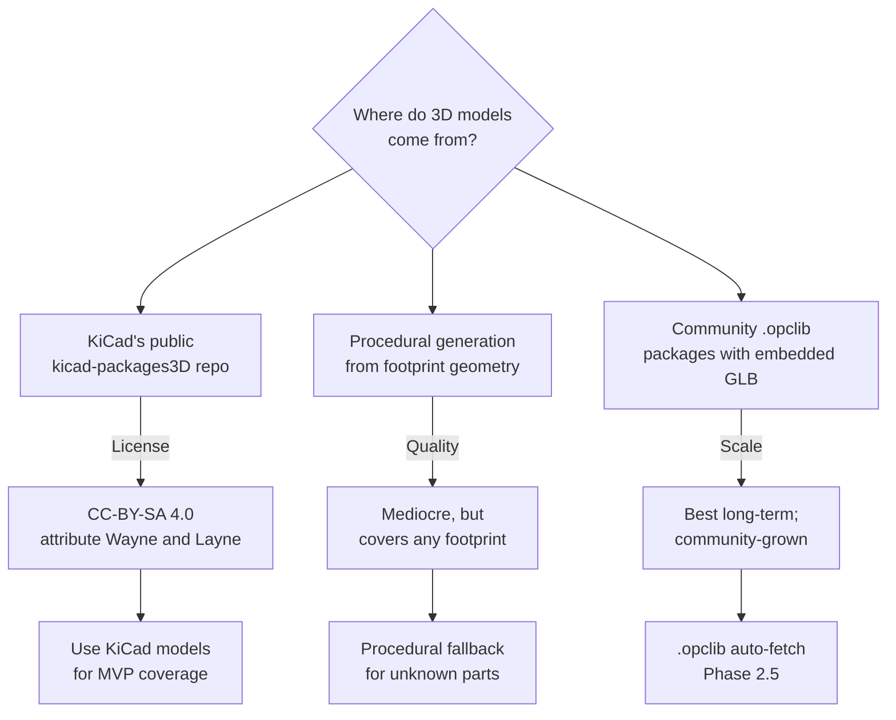
```mermaid
flowchart TD
    Source{Where do 3D models<br/>come from?}
    Source --> S1[KiCad's public<br/>kicad-packages3D repo]
    Source --> S2[Procedural generation<br/>from footprint geometry]
    Source --> S3[Community .opclib<br/>packages with embedded GLB]

    S1 -->|License| L1[CC-BY-SA 4.0<br/>attribute Wayne and Layne]
    S2 -->|Quality| L2[Mediocre, but<br/>covers any footprint]
    S3 -->|Scale| L3[Best long-term;<br/>community-grown]

    L1 --> Pick[Use KiCad models<br/>for MVP coverage]
    L2 --> Pick2[Procedural fallback<br/>for unknown parts]
    L3 --> Pick3[.opclib auto-fetch<br/>Phase 2.5]
```

**Recommendation:** ship **MVP with KiCad models** auto-converted to glTF on first install (≈1.2 GB of high-quality `.step` models, downsampled to glTF reduces to ~200 MB). Plus procedural fallback for anything missing.

Sources to verify:
- KiCad 3D models repo: https://gitlab.com/kicad/libraries/kicad-packages3D
- License: typically CC-BY-SA — confirm attribution path. Reference: https://www.kicad.org/libraries/

---

## 🎨 Scene / lighting presets — recommended defaults

| Preset | Background | Light setup | Use case |
|---|---|---|---|
| **Studio dark** (default) | Near-black #0A0E14 | 3-point soft, top key, fill from front | Daily work + dark-theme screenshots |
| **Studio light** | Near-white #F5F5F4 | Same rig, brighter | Print docs, light-theme web |
| **Outdoor** | Soft sky gradient | Warm sun + cool sky | Marketing renders |
| **Transparent** | Alpha channel | Same as studio dark | Hero shots for blog / Twitter |

Transparent background renders are a **massive engineering-content marketing** unlock — every PCB hobbyist who screenshots their project needs this and Flux makes it easy.

---

## ❓ Open questions before locking

1. **Default camera angle on first open** — I picked **isometric 30°** (clean, axis-aligned, universally recognizable). Alternative: **perspective 45°** (more "photographic"). Iso is faster to render and easier to compare boards. My recommendation: **iso default, persp on click**.
2. **Floor grid on by default?** I left it off in the mockup since the dark background is cleaner. But it gives spatial grounding. Suggest **off by default, remembered per-design**.
3. **Height heatmap colors** — I used green → yellow → red. This is intuitive (red = danger / tall) but also has accessibility concerns. Want a colorblind-safe alternative (e.g., viridis: purple → teal → yellow)? Suggest making it user-selectable in Phase 2.
4. **Enclosure margins (1mm board + 1mm air gap)** — hardcoded in mockup. Should be **user-editable defaults in Settings** since enclosures vary by use case (1mm for tight projects, 5mm for thermal). Phase 1.5.
5. **STEP / STL units** — STEP is conventionally millimeters; STL has no unit metadata (consumers assume mm). Should we offer a unit toggle on export, or always export mm? Suggest **always mm with a tooltip** explaining how to interpret in receiving CAD.
6. **Animated turntable for marketing** — totally a Phase 2 toy, but: hold Snapshot button → **records 360° turntable as MP4/GIF**. Would users use it? Cheap to implement, high social-share value. Worth a UI placeholder?

---

## 📐 Implementation tokens (additions)

```
--3d-bg-dark:      #0A0E14   /* studio dark */
--3d-bg-light:     #F5F5F4   /* studio light */
--3d-floor:        rgba(31, 41, 55, 0.4)

--heatmap-cold:    #34D399   /* short components */
--heatmap-mid:     #FBBF24
--heatmap-hot:     #F87171   /* tallest */

--snapshot-accent: #7C3AED   /* snapshot button special-case */

--enclosure-margin-default: 1.0  /* mm */
--enclosure-airgap-default: 1.0  /* mm */
```

---

## 🏁 Four-editor parity check

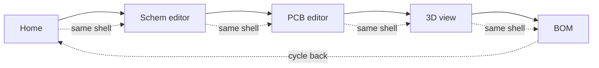
```mermaid
flowchart LR
    Home[Home] --> Schem[Schem editor]
    Schem --> PCB[PCB editor]
    PCB --> View3D[3D view]
    View3D --> BOM[BOM]
    BOM -.->|cycle back| Home

    Home -.->|same shell| Schem
    Schem -.->|same shell| PCB
    PCB -.->|same shell| View3D
    View3D -.->|same shell| BOM
```

All four canvas surfaces now share: **top app bar** (design tab · view tabs · cloud pill · purple Export), **left panel** (context-appropriate), **floating toolbar** (grouped with dividers), **right inspector** (selected-part-aware), **bottom status bar** (rules · grid · cursor · selection · zoom). That's the shell that makes the product feel coherent.

---

Last canvas to redesign is **BOM** — the one with the highest commercial leverage for your JLCPCB-first positioning (auto-source, status severity, smart MPN matching). Want me to push there next?


Now proceed with BOM screen and generate new design with improvements.


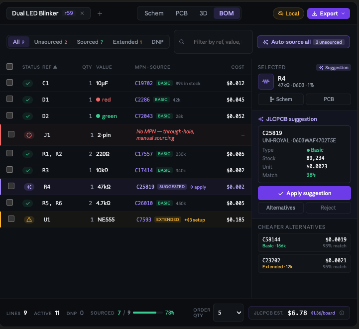

Designing the BOM editor — the surface with the highest commercial leverage for your JLCPCB-first positioning. Fixing the flat status colors, surfacing the auto-source AI button, and adding the cost preview that turns BOM from a checklist into a procurement preview.# 📋 Design rationale & handoff notes

## 🔄 What changed from the current BOM

| Element | Before (audit) | After |
|---|---|---|
| **Status pills** | All 9 rows yellow "Missing MPN" — no urgency hierarchy | **5 severity-coded states**: ✓ Sourced (green) · ⚠ Extended (amber) · 💡 Suggested (purple) · ⛔ Critical missing (red) · ⊘ DNP (gray) |
| **Auto-source button** | 🔴 Missing entirely | **Purple primary button** in toolbar with live count: *"Auto-source all · 2 unsourced"* |
| **JLCPCB Basic vs Extended** | Not surfaced anywhere | **Inline badge** on every sourced row: `BASIC` (green) or `EXTENDED` (amber, +$3 setup) |
| **Stock visibility** | Empty `—` column | **Stock count** next to MPN: "89k", "230k", "12k" — instant signal |
| **Suggested MPN flow** | Not designed | Selected row gets **purple highlight + sparkle icon**, right panel surfaces JLCPCB suggestion with match %, Apply / Alternatives / Reject |
| **Critical missing distinction** | Same yellow as everything | **Red row + left accent stripe** + inline explanation: *"No MPN — through-hole, manual sourcing"* (J1) |
| **Extended part warning** | Not shown | **Yellow row + left accent** + `+$3 setup` reminder — makes the cost hit obvious |
| **Right inspector** | Wide but mostly empty | **Compact 212px panel**: Selected · Suggestion card · Cheaper alternatives — only fields with data, no blank fields |
| **Cost preview** | Empty `—` reads like a bug | **Live cost card** in footer: `$6.78 · $1.36/board · ⓘ` (hover for breakdown) |
| **Order qty selector** | None | **Footer dropdown**: 1 / 5 / 10 / 50 / 100 → cost recomputes |
| **Sourcing progress** | "Unresolved 9" badge — confusing | **Visual progress bar**: `Sourced 7 / 9 (78%)` with green fill |
| **Filter chips** | None | **5 filters with counts**: All · Unsourced · Sourced · Extended · DNP |
| **Bulk select** | None visible | **Checkbox column** + header checkbox for select-all |
| **Footprint column** | Dedicated column, takes space | **Hidden in row** — surfaced in right inspector. Most users care more about MPN |
| **Designator grouping** | `R1,R2` worked | Kept — `R1, R2` (with space, cleaner) |

---

## 🎯 The five status states

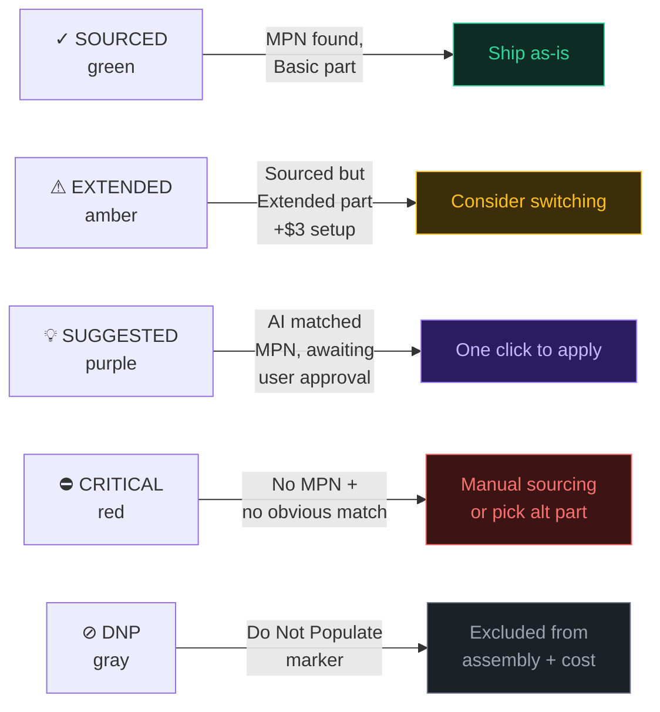
```mermaid
flowchart LR
    A[✓ SOURCED<br/>green] -->|MPN found,<br/>Basic part| A1[Ship as-is]
    B[⚠ EXTENDED<br/>amber] -->|Sourced but<br/>Extended part<br/>+$3 setup| B1[Consider switching]
    C[💡 SUGGESTED<br/>purple] -->|AI matched<br/>MPN, awaiting<br/>user approval| C1[One click to apply]
    D[⛔ CRITICAL<br/>red] -->|No MPN +<br/>no obvious match| D1[Manual sourcing<br/>or pick alt part]
    E[⊘ DNP<br/>gray] -->|Do Not Populate<br/>marker| E1[Excluded from<br/>assembly + cost]
    style A1 fill:#0D2D24,stroke:#34D399,color:#34D399
    style B1 fill:#3D2E0A,stroke:#FBBF24,color:#FBBF24
    style C1 fill:#2B1B5F,stroke:#A78BFA,color:#C4B5FD
    style D1 fill:#3D1414,stroke:#F87171,color:#F87171
    style E1 fill:#1C2128,stroke:#6B7280,color:#9CA3AF
```

Severity is **assigned by component class**, not user input:
- ICs / regulators / MCUs missing MPN → red (cannot assemble without)
- Passives (R, C, L) missing MPN → suggested (auto-source can usually find one)
- Connectors / through-hole → red (often need physical verification)

---

## 💡 The Auto-source loop

The single highest-leverage feature for a JLCPCB-first product. Spec:

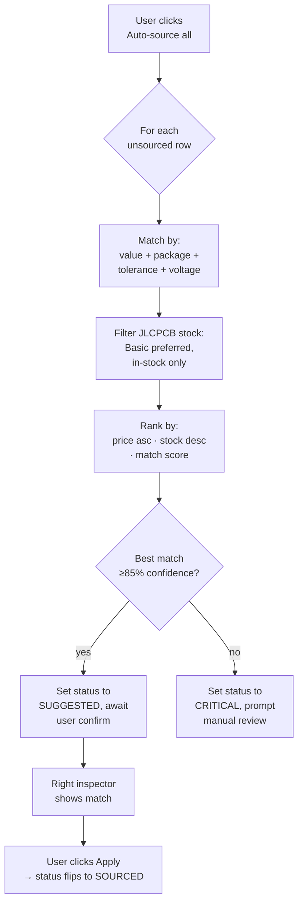
```mermaid
flowchart TD
    Click[User clicks<br/>Auto-source all] --> Unsourced{For each<br/>unsourced row}
    Unsourced --> Match[Match by:<br/>value + package +<br/>tolerance + voltage]
    Match --> Filter[Filter JLCPCB stock:<br/>Basic preferred,<br/>in-stock only]
    Filter --> Rank[Rank by:<br/>price asc · stock desc<br/>· match score]
    Rank --> Best{Best match<br/>≥85% confidence?}
    Best -->|yes| Suggest[Set status to<br/>SUGGESTED, await<br/>user confirm]
    Best -->|no| Critical[Set status to<br/>CRITICAL, prompt<br/>manual review]
    Suggest --> Panel[Right inspector<br/>shows match]
    Panel --> Apply[User clicks Apply<br/>→ status flips to SOURCED]
```

**Match confidence formula** (proposed for MVP):
- Exact value match: +40
- Exact package match: +30
- Tolerance match: +15
- Voltage rating match (for caps): +10
- Basic part bonus: +5

Threshold ≥85 → suggest. Below → critical.

---

## 🟢 JLCPCB Basic vs Extended — why this matters

The single most expensive ignorance in JLCPCB assembly: **Extended parts cost +$3 setup each**. A board with 5 Extended parts = $15 setup before you buy any boards.

Reference: https://jlcpcb.com/help/article/84-SMT-Assembly-Capabilities — Basic parts have no setup fee; Extended parts incur an "extended component fee" per unique part.

**OpenPCB's job:** make this visible at the BOM level, *before* the user spends $15 they didn't know about. The amber pill + `+$3 setup` annotation does that.

---

## ✅ MVP-ready vs ⚠️ Phase 2

| Feature | Phase | Why |
|---|---|---|
| 5 severity-coded status pills | **MVP** | Pure UI; severity rule = component class lookup |
| Filter chips with counts | **MVP** | Local filter |
| Sourcing progress bar | **MVP** | Simple ratio |
| Bulk checkbox + select-all | **MVP** | Standard table feature |
| Right inspector compact layout | **MVP** | Layout only |
| Order qty dropdown + cost recompute | **MVP** | Simple math |
| Cost estimate card (parts only) | **MVP** | Sum of unit prices × qty |
| Critical missing row highlighting | **MVP** | CSS only |
| **Auto-source button (UI)** | **MVP UI** | Show the button with disabled state, signal direction |
| **Auto-source matching engine** | ⚠️ **Phase 2 core** | Match by value/package against JLCPCB API |
| **JLCPCB live stock + price** | ⚠️ **Phase 2** | Requires JLCPCB API/scraper. PCB_Parts MCP could power this |
| **Apply suggestion → SOURCED transition** | ⚠️ **Phase 2** | Depends on auto-source engine |
| **Cheaper alternatives panel** | ⚠️ **Phase 2** | Ranking algorithm + UI |
| **Full assembly cost** (setup, stencil, assembly fee) | ⚠️ **Phase 2** | Calculation + JLCPCB pricing schema |
| **Export BOM** in JLCPCB-upload-ready CSV | **MVP** | Standard CSV with their column names |
| **Basic-only mode** (filter out anything Extended) | **MVP** | Local filter, super useful |

---

## 🧪 Cost estimate breakdown (Phase 2 spec)

When user hovers the `ⓘ` icon next to `$6.78`, a popover shows:

```
For 5 boards:
  Parts (basic):       $0.84  (7 lines × qty × unit)
  Parts (extended):    $0.93  (1 line × qty × unit)
  Extended setup:      $3.00  (×1 unique extended part)
  Assembly:            $0.51  (11 parts × 5 boards × $0.0017 + setup)
  Stencil:             $1.50  (fixed for SMD)
                     -------
  Subtotal:            $6.78  ($1.36 / board)

Tip: Switch U1 to a Basic part to save $3.00 setup.
```

The **switch tip** at the bottom is the killer feature — it turns the BOM into a *cost coach* that proactively suggests savings.

---

## 🎨 New columns proposed (Phase 2)

| Column | Source | Why |
|---|---|---|
| **Lead time** | JLCPCB API | "Will my board ship in time?" |
| **Lifecycle status** | Octopart / IHS | Active · NRND · EOL · Obsolete — critical for designs you'll order again next year |
| **Pb-free / RoHS** | Datasheet | Compliance flag for EU shipments |
| **Reel / Tape** | JLCPCB | Some users need reels for outside-house assembly |

Out of scope for MVP — added to the column-picker menu in Phase 2.

---

## ❓ Open questions before locking

1. **Severity classification rules** — where do they live? Suggest: `core/bom/severity-rules.ts` with a class map (`{ resistor: 'suggested-if-missing', ic: 'critical-if-missing', ... }`). Configurable per-user later.
2. **Auto-source confidence threshold** — I picked 85% but it should be **user-tunable**: *"Suggest matches ≥ [85%]"*. High confidence = fewer false suggestions; low = more coverage. Setting in `Settings → BOM`.
3. **What's the source of MPN data?** PCB_Parts MCP (per locked decisions, explicit-request-only) or a bundled JLCPCB cache or a direct API call? Cache-first is faster and offline-friendly; API call is fresh but online-only. Suggest: **bundled cache for top 500 JLCPCB Basics, fall back to API for rest**.
4. **DNP marking** — UI gesture? I added a DNP filter but didn't design how to *set* DNP. Suggest right-click row → "Mark Do Not Populate" + bulk action via select-many.
5. **"Apply suggestion" — does it write to the .openpcb package?** Per `COMMAND_PATTERN.md` (please verify), this should be a command: `SetBomLineMpn{ line: R4, mpn: 'C25819', source: 'jlcpcb_basic' }`. The selected suggestion becomes a permanent part of the design, undoable. Confirm.
6. **Designator grouping behaviour** — my mockup shows `R1, R2` (space-separated). KiCad uses `R1,R2`. JLCPCB upload accepts both. Tiny cosmetic; suggest with space.
7. **Where does the standard Export modal surface JLCPCB-ready BOM CSV?** Currently the modal has Gerber + BOM CSV checkboxes — make BOM CSV format-aware (default *JLCPCB columns*, advanced toggle for *Generic CSV* or *PCBWay columns*).

---

## 📐 Implementation tokens (additions)

```
--bom-row-sourced:    rgba(52,211,153,0.10)
--bom-row-suggested:  rgba(139,92,246,0.07)
--bom-row-extended:   rgba(251,191,36,0.04)
--bom-row-critical:   rgba(248,113,113,0.04)
--bom-row-dnp:        rgba(255,255,255,0.02)

--bom-accent-sourced: #34D399
--bom-accent-suggested: #A78BFA
--bom-accent-extended: #FBBF24
--bom-accent-critical: #F87171
--bom-accent-dnp:      #6B7280

--basic-badge-bg:     rgba(52,211,153,0.10)
--basic-badge-text:   #34D399
--extended-badge-bg:  rgba(251,191,36,0.12)
--extended-badge-text: #FBBF24
```

---

## 🏁 All five canvas surfaces — design system check

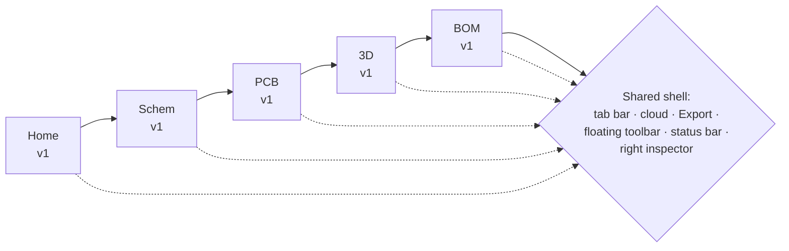
```mermaid
flowchart LR
    A[Home<br/>v1] --> B[Schem<br/>v1]
    B --> C[PCB<br/>v1]
    C --> D[3D<br/>v1]
    D --> E[BOM<br/>v1]
    E --> F{Shared shell:<br/>tab bar · cloud · Export ·<br/>floating toolbar · status bar ·<br/>right inspector}
    A -.-> F
    B -.-> F
    C -.-> F
    D -.-> F
    E -.-> F
```

**The wins compounding across the redesigned shell:**

- **Same tab bar** on Schem/PCB/3D/BOM — no navigation re-learning
- **Same cloud pill** position and styling across all editors
- **Same purple Export button** with format-aware dropdown
- **Same right inspector** structure: header (selected) · primary action card · supporting details
- **Same bottom status bar** vocabulary: rules/progress · grid · cursor · selection · zoom
- **Same severity-color language** across DRC (PCB), ERC (Schem), and BOM sourcing — a yellow pill means *attention* anywhere in the app

This consistency is the biggest hidden product upgrade across the five redesigns. **KiCad refugees who learn one editor get the other four free.**

---

## 🎯 Recommended ship order (lowest risk → highest leverage)

| # | Surface | Effort | Leverage |
|---|---|---|---|
| 1 | **Home v1** | S | 🟡 Visual first impression |
| 2 | **Schem v1** | M | 🔴 Fixes worst "amateur" tells |
| 3 | **BOM v1** (UI only, auto-source disabled) | S | 🔴 Signals roadmap, commercial story |
| 4 | **PCB v1** with DRC pill ("Not run") | M | 🔴 Critical workflow |
| 5 | **3D v1** with populated left panel | M | 🟡 Wow-factor for marketing |
| 6 | **BOM auto-source engine** | L | 🔴 Killer differentiator |
| 7 | **DRC engine** | L | 🔴 JLCPCB upload safety |
| 8 | **3D model library + STEP export** | L | 🟡 Mechanical workflow unlock |

Ship 1–5 as an MVP wave; they unlock perception of "this is a 2026 product." Ship 6–8 as the differentiation wave that pulls users from KiCad and Flux.

---

Want me to spec any of these in depth next — say, the **Auto-source engine architecture** with the PCB_Parts MCP integration, or the **DRC rule schema** for the six MVP-1 checks?


Now generate new design for Settings — Assistant providers - proceed according to suggestions andrecommendations


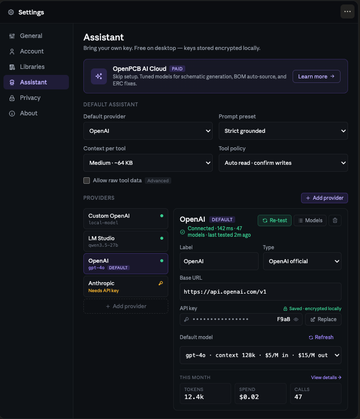

Designing the Settings — Assistant providers screen. Fixing the ambiguous green-check signal, adding visible API-key masking, surfacing inline Test results, and threading in the OpenPCB AI Cloud upgrade path without being pushy.# 📋 Design rationale & handoff notes

## 🔄 What changed from the current Settings — Assistant screen

| Element | Before (audit) | After |
|---|---|---|
| **Green check ✓ ambiguity** | Same check on every provider — meaning unclear (configured? active? available?) | **Three distinct status signals**: 🟢 dot (configured + key saved) · 🟡 key-icon (needs API key) · purple bg (UI-selected) |
| **Default provider distinction** | Not visible | **`DEFAULT` pill** on the default provider — separate from selection state |
| **API key field** | Empty placeholder `No key saved` whether saved or not | **Masked field with last-4-char hint** (`••••••••F9aB`) + **`🔒 Saved · encrypted locally`** badge + eye icon + Replace button |
| **Test connection feedback** | Click Test → no visible result | **Inline result line** under provider name: `✓ Connected · 142 ms · 47 models · last tested 2m ago` (or red `✗ Failed · Invalid API key` on failure) |
| **Test button state** | Single state | **Two states**: green pill `✓ Connected` (visual success memory) or `Re-test` action |
| **OpenPCB AI Cloud presence** | 🔴 Not surfaced at all — locked product decision absent from the UI | **Top banner card** with sparkle icon, `PAID` pill, value-prop one-liner, *"Learn more →"* — visible but not pushy |
| **Provider type / Type duplication** | Two dropdowns labeled "Type" doing different things | **Renamed**: `Label` (free text) + `Type` (provider kind). Clear separation |
| **Default model selector** | Empty input | **Rich dropdown**: `gpt-4o · context 128k · $5/M in · $15/M out` — price visible at selection time |
| **Refresh models action** | Not visible | **Small link** next to label: `↻ Refresh` |
| **Token / spend visibility** | None | **3-tile usage card** at bottom: Tokens · Spend · Calls — for the month, with "View details →" |
| **Add provider affordance** | `+` button next to "Providers" header only | **Both**: header `+ Add provider` button **and** dashed "Add provider" tile at the end of the list |
| **Header subtitle** | "Configure model providers, local API keys, and assistant defaults" | "Bring your own key. Free on desktop — keys stored encrypted locally." — communicates the free-BYOK locked decision + security |

---

## 🎯 The status signal hierarchy

The audit's biggest gripe was the green check ambiguity. New scheme:

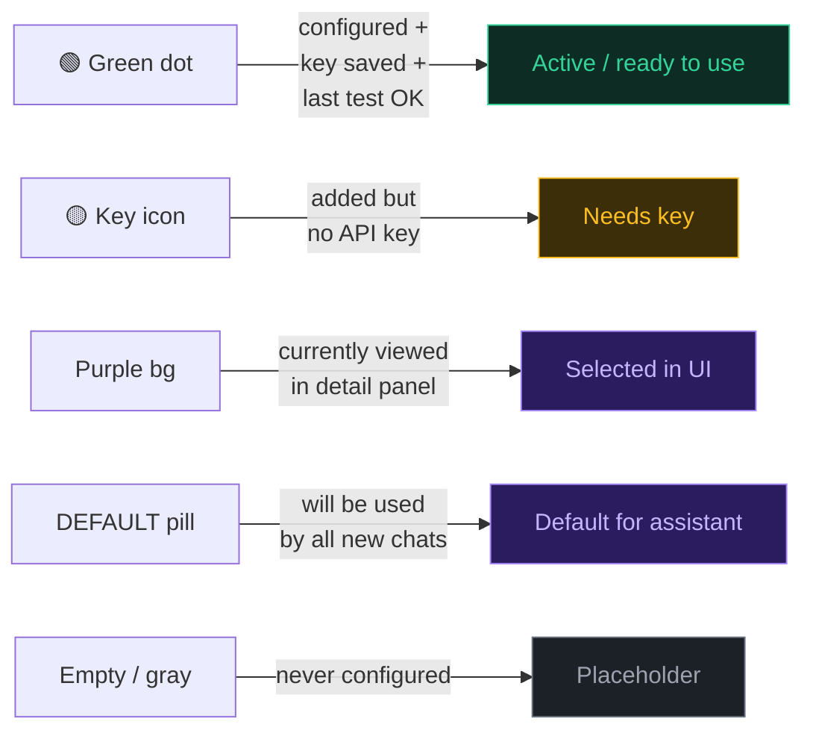
```mermaid
flowchart LR
    A[🟢 Green dot] -->|configured +<br/>key saved +<br/>last test OK| A1[Active / ready to use]
    B[🟡 Key icon] -->|added but<br/>no API key| B1[Needs key]
    C[Purple bg] -->|currently viewed<br/>in detail panel| C1[Selected in UI]
    D[DEFAULT pill] -->|will be used<br/>by all new chats| D1[Default for assistant]
    E[Empty / gray] -->|never configured| E1[Placeholder]

    style A1 fill:#0D2D24,stroke:#34D399,color:#34D399
    style B1 fill:#3D2E0A,stroke:#FBBF24,color:#FBBF24
    style C1 fill:#2B1B5F,stroke:#A78BFA,color:#C4B5FD
    style D1 fill:#2B1B5F,stroke:#A78BFA,color:#C4B5FD
    style E1 fill:#1C2128,stroke:#6B7280,color:#9CA3AF
```

Critically, **selection ≠ default ≠ status**. Three orthogonal axes. The current screen collapses them into one check icon and confuses everyone.

---

## 🔐 API key UX — the trust-building details

The audit called this out: an empty input is the same whether a key is saved or not. The new pattern uses every available signal to reassure the user:

| Signal | Where | What it tells the user |
|---|---|---|
| `••••••••F9aB` | The masked value with last 4 chars | "Your key is there, here's a hint that it's yours" |
| `🔒 Saved · encrypted locally` | Above the field, green | "We didn't send it anywhere; it lives in your machine" |
| 👁 Eye icon | In the field | "I can verify it if I need to" |
| `↻ Replace` button | Next to the field | "I can rotate it without typing the whole thing again" |
| `↻ Re-test` button | In header, green | "I can verify connectivity at any time" |

**Where the key actually lives:** Electron's `safeStorage` API (encrypted at rest via OS keychain — Keychain on macOS, libsecret/kwallet on Linux, DPAPI on Windows). Reference: https://www.electronjs.org/docs/latest/api/safe-storage. Confirm this matches your existing implementation in `core/` per the locked stack.

---

## 🌥 OpenPCB AI Cloud — placement strategy

The locked decision says **OpenPCB AI Cloud is the paid optimized service**. The audit pointed out it was invisible. Two options considered:

### Option A: As another provider in the list
**Pros:** Treats it equally with BYOK options. Familiar UX.
**Cons:** Buries the paid product. Looks like a competitor in your own list.

### Option B: Distinct banner at top (chosen)
**Pros:** Clearly differentiated. Sells the upgrade path. Not pushy — single row with "Learn more".
**Cons:** Slightly more chrome.

🎯 I picked Option B. The banner is **subtle enough that it doesn't compete with the main configuration task** (BYOK setup) but **prominent enough that every assistant-curious user sees the paid path exists**. The CTA is *"Learn more"* not *"Subscribe"* — top-of-funnel, low-friction.

**Phase 2 expansion:** when the user clicks "Learn more", route to a full Cloud comparison page (separate settings section, or in-app upsell screen) showing what differs vs BYOK:

| Capability | BYOK (free) | OpenPCB AI Cloud (paid) |
|---|---|---|
| Schematic generation | ✓ | ✓ tuned + cached |
| BOM auto-source | ✓ via your API | ✓ direct JLCPCB integration |
| ERC suggestions | ✓ | ✓ trained on EDA errors |
| Setup time | 5 min + API key | Zero |
| Cost model | Per-token via your provider | Subscription or per-design |

---

## ✅ MVP-ready vs ⚠️ Phase 2

| Feature | Phase | Why |
|---|---|---|
| Three-signal status (dot · key · selection) | **MVP** | UI logic; trivial |
| `DEFAULT` pill on default provider | **MVP** | Existing field |
| Inline Test result line | **MVP** | Ping endpoint, render result |
| Re-test button | **MVP** | Same ping endpoint |
| Masked API key with last 4 + Replace button | **MVP** | UI + existing key storage |
| `🔒 Saved · encrypted locally` badge | **MVP** | Pure UI |
| Token / Spend / Calls tile group | **MVP UI** / ⚠️ **Phase 2 data** | Layout free; needs usage tracking |
| Models button → fetch & list | **MVP** | Standard OpenAI-spec API call |
| Refresh models inline | **MVP** | Same as above |
| OpenPCB AI Cloud banner | **MVP** | Pure UI; routes to a "coming soon" landing |
| **OpenPCB AI Cloud actual service** | ⚠️ **Phase 2+** | Backend product work |
| **Usage tracking (per-month tokens + spend)** | ⚠️ **Phase 2** | Persisted SQLite table per `DATA_MODEL.md` |
| **Price-aware model dropdown** | ⚠️ **Phase 2** | Needs price metadata per provider/model |
| **Add provider wizard** | ⚠️ **Phase 1.5** | Could ship MVP with manual form; wizard polishes later |

---

## 🧪 Test connection — what to send

Spec for the engineering side. Each provider type has a minimal test:

| Provider type | Test request | Success signal |
|---|---|---|
| **OpenAI official** | `GET /v1/models` | 200 + JSON list |
| **Anthropic** | `POST /v1/messages` with 5-token max_tokens, simple "hi" | 200 + completion |
| **Custom OpenAI-compatible** | `GET /v1/models` (fallback to a 1-token completion if list fails) | 200 |
| **LM Studio** (local) | `GET http://localhost:1234/v1/models` | 200 |
| **Ollama** (future) | `GET /api/tags` | 200 |

Display **latency in ms** + **model count** when available. If the request fails, show the HTTP status code and a human-readable reason (`401 → Invalid API key`, `429 → Rate limited`, `ECONNREFUSED → Service not running`).

---

## ❓ Open questions before locking

1. **"Default provider" vs "Default model"** — the screen has both. Are they always the same provider, or can a user have default provider = OpenAI but default model = `claude-3.5-sonnet` from a different provider? Suggest: **provider has its own default model, app picks the default-provider's default model**. Simpler model.
2. **OpenPCB AI Cloud banner — dismissable?** A "Don't show again" or just "Don't show for 30 days" toggle on the banner. Pro: respects users. Con: discoverability loss. My take: **show always** but it's so subtle that it doesn't bother. Phase 2 add dismiss if user feedback says so.
3. **Multiple keys per provider type?** E.g., a personal OpenAI key and a work OpenAI key. The current design allows it (you can add multiple OpenAI entries with different labels). Confirm this matches the data model.
4. **Per-design provider override** — should a specific `.openpcb` design be able to say *"Always use provider X for me"*? Useful for projects that depend on a specific model. Phase 2; add to the design's settings, not global.
5. **Token usage tracking — opt-in?** Some users want zero local telemetry. Suggest: **opt-in by default; toggle in Privacy section**.
6. **Provider icons** — I used generic dots. Should each provider type have an iconic mark (OpenAI green circle, Anthropic logo, Mistral M)? Pro: instant visual ID. Con: licensing concerns for proprietary marks. My take: **use Tabler icons that *suggest* the provider** (`ti-brand-openai` if available, otherwise `ti-cloud-computing`). Confirm icon availability before locking.
7. **"Models" button behavior** — opens a modal? Inline expanded list? Filterable search? For mockup I left it abstract. Suggest **modal with searchable list + per-model cost annotation** when the provider exposes pricing in its `/models` response.

---

## 📐 Implementation tokens (additions)

```
--provider-active-dot:   #34D399  /* status: configured + tested */
--provider-warn-icon:    #FBBF24  /* status: needs key */
--provider-selected-bg:  rgba(139,92,246,0.10)
--provider-selected-bd:  rgba(139,92,246,0.30)

--key-saved-badge:       rgba(52,211,153,0.10)
--key-saved-text:        #34D399

--test-success:          #34D399
--test-failure:          #F87171
--test-latency-mono:     font-family: var(--font-mono)

--cloud-upsell-bg:       rgba(139,92,246,0.06)
--cloud-upsell-bd:       rgba(139,92,246,0.25)
```

---

## 🏁 Settings consistency check

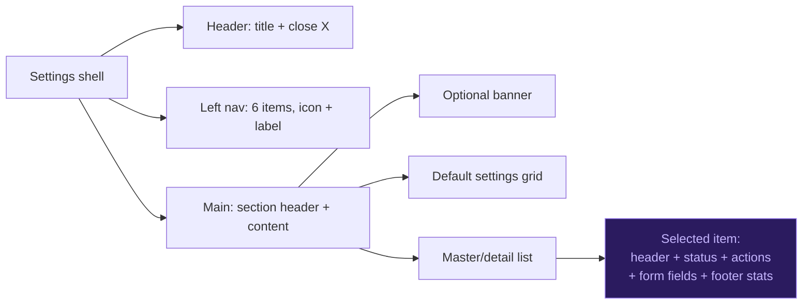
```mermaid
flowchart LR
    Sett[Settings shell]
    Sett --> H[Header: title + close X]
    Sett --> Nav[Left nav: 6 items, icon + label]
    Sett --> Main[Main: section header + content]

    Main --> M1[Optional banner]
    Main --> M2[Default settings grid]
    Main --> M3[Master/detail list]
    M3 --> ProvDetail[Selected item:<br/>header + status + actions<br/>+ form fields + footer stats]

    style ProvDetail fill:#2B1B5F,stroke:#A78BFA,color:#C4B5FD
```

The master/detail layout with **header (status+actions) → form fields → footer stats** is the same pattern used in the **Library detail page** (Symbol/Footprint/3D + variants). Phase 2: apply the same pattern to all six settings sections (Libraries, Privacy, etc.) so settings looks coherent end-to-end.

---

Next candidates — any of these would benefit from a redesign pass:

| Surface | Audit score | Effort | Notes |
|---|---|---|---|
| **Settings — Libraries** | 4/5 (already strong) | S | Just polish + signing explainer + community registry placeholder |
| **Library — grid view** | 4/5 (already strong) | S | Search consistency + drag-to-canvas + favorite |
| **Library — component detail** | 4/5 (already strong) | M | Datasheet link + pin table + used-in-N-designs |
| **Component picker modal** | 5/5 (best in app) | — | No redesign needed |
| **Assistant chat — tool calls** | 4/5 | M | Top-right consolidation, linked-design indicator, agent-state polish |
| **Assistant chat — markdown response** | 3.5/5 | M | **Apply-to-Schematic button** — biggest commercial pull |
| **Export modal (final)** | 4/5 | S | State-aware (disable 4-layer toggle for 2L), filename preview, format-tree preview |

The **Assistant chat with `Apply to Schematic`** button is your most strategic remaining surface — it's where the agentic-EDA story actually lives. Want to push there next?


I do not like layout for Providers and their config - it is too dense. Come up with another design layout where providers wont be as sidebar


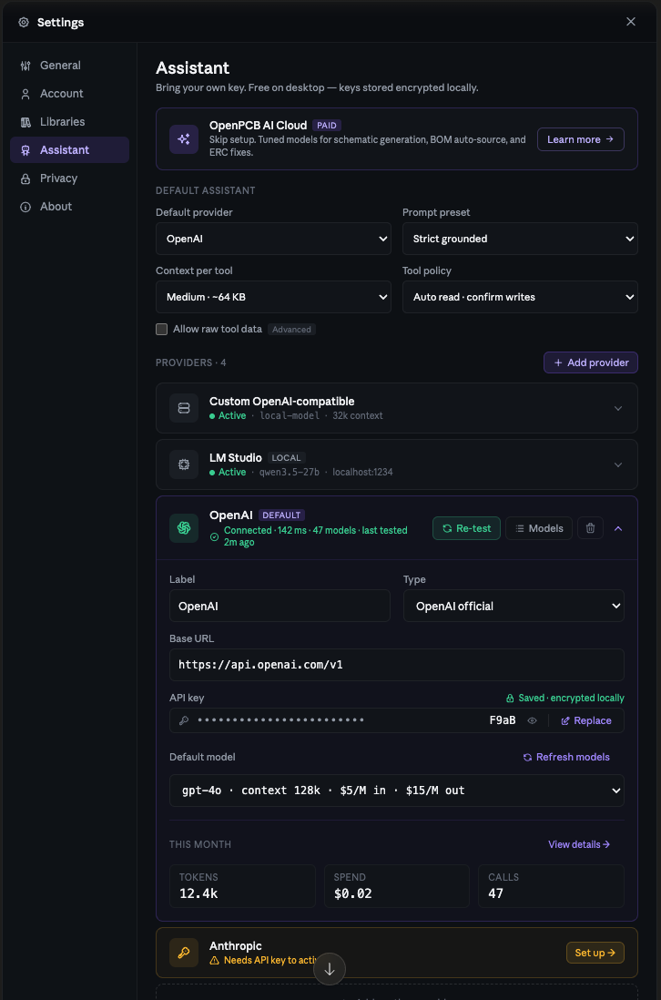

Pushback noted — the master-detail layout cramps both the list and the form. Switching to **stacked accordion cards**: each provider gets full content width, summary visible at-a-glance when collapsed, generous form layout when expanded.# 📋 What changed — sidebar → stacked accordion

## 🔄 The structural shift

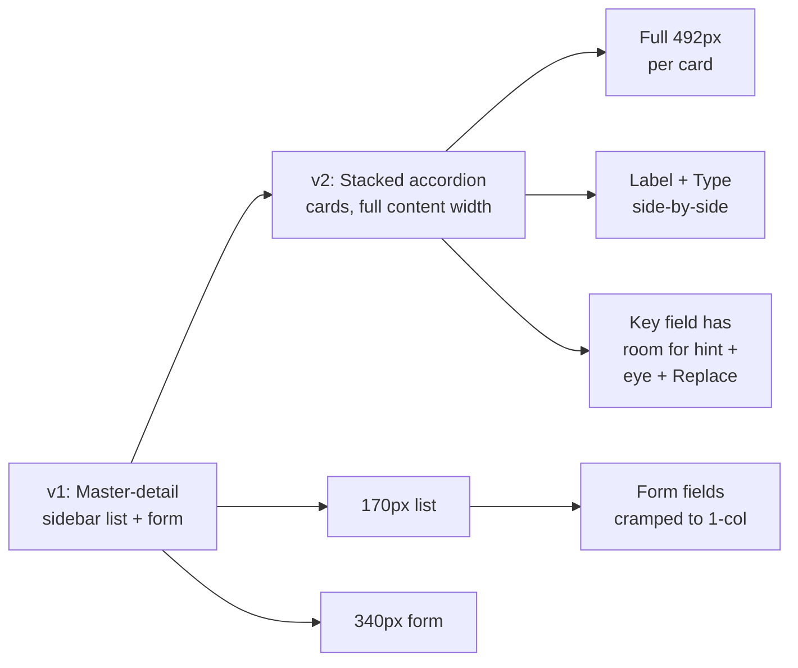
```mermaid
flowchart LR
    A[v1: Master-detail<br/>sidebar list + form] --> B[v2: Stacked accordion<br/>cards, full content width]

    A --> A1[170px list]
    A --> A2[340px form]
    A1 --> A3[Form fields<br/>cramped to 1-col]

    B --> B1[Full 492px<br/>per card]
    B --> B2[Label + Type<br/>side-by-side]
    B --> B3[Key field has<br/>room for hint +<br/>eye + Replace]
```

## ✅ What this fixes

| Pain point in v1 | v2 solution |
|---|---|
| 170px provider list cramps name + status into 2 lines | Full-width row: name + DEFAULT pill + status + actions all on one line |
| 340px form forced fields to single column | Label + Type in 2-col grid; API key field has room for `••••F9aB` hint + eye + Replace button without truncation |
| Status info hidden until selected | **Visible on every collapsed card** — Active dot, model name, context size, latency |
| "Anthropic needs key" only visible on click | **Yellow card with `Set up →` CTA** is always visible |
| Add provider buried | **Two entry points**: header button + bottom dashed tile |

## 🎯 Card states demonstrated

| Card | State | Visual cue |
|---|---|---|
| **Custom OpenAI-compatible** | Active, collapsed | Subtle bg, green dot |
| **LM Studio** | Active local, collapsed | Subtle bg, `LOCAL` pill, green dot |
| **OpenAI** | Active + Default + **expanded** | Purple-tinted bg + purple border, full form visible inline |
| **Anthropic** | Needs key | Amber-tinted bg + amber border, prominent `Set up →` CTA |
| **+ Add another provider** | Empty slot | Dashed border, centered text |

Five states, five distinct visual treatments. The viewer can scan severity at a glance without reading a single label.

---

## 🤔 Alternative patterns considered (and rejected)

| Pattern | Why I didn't pick it |
|---|---|
| **2-column card grid** | Mobile-app feel, doesn't match "settings" mental model. Awkward when one card is editing. |
| **Tabs (provider names as tabs)** | Tab labels get long; can't see all providers at once; doesn't scale past 4-5 |
| **Click-into-detail page** (iOS Settings style) | Extra navigation step; loses the "configure multiple providers" workflow |
| **Single hero card + provider chips** | Same density problem as v1, just rearranged |
| **Modal on click** | Modal-on-modal feels heavy; settings is already modal-ish |

Stacked accordion wins because it **gives expanded cards real estate**, **keeps collapsed cards scannable**, and **scales to N providers** without redesign.

---

## ⚙️ Interaction rules

- **One card expanded at a time** (Phase 1) — clicking another collapses the previous. Standard accordion.
- **Phase 2 toggle:** "Allow multiple expanded" in Advanced settings — power users sometimes compare side-by-side.
- **Click anywhere in collapsed header** — expand (not just the chevron).
- **Click Re-test / Models / Delete** — don't trigger collapse; events stop propagating.
- **Default provider can't be deleted** — Delete button disabled with tooltip *"Set another provider as default first."*
- **Anthropic-style "needs key" card** — clicking it opens the same expanded state as any other card, but pre-focuses the API key field.

---

## ❓ Open questions

1. **Card ordering** — alphabetical, by-status (active first), or user-reorderable via drag handles? Suggest **status first (active → needs-key → unconfigured), then alphabetical within group**. Phase 2: drag handles.
2. **Collapsed status line truncation** — at very narrow widths (resizable settings window?), the `Connected · 142 ms · 47 models · last tested 2m ago` line will overflow. Suggest **progressive truncation**: drop "last tested 2m ago" first, then "47 models", then "142 ms".
3. **Default provider switching** — currently OpenAI is default. To make Anthropic default, user has to expand it, look for a "Make default" toggle. Where does that live? Suggest **a small toggle next to the DEFAULT pill in expanded view**, or right-click menu on the card.
4. **Bulk actions** — "Test all" button at top of section? Useful for verifying every provider is alive before starting a session. Phase 2.

---

## 📐 Tokens added

```
--card-collapsed-bg:    #10141B
--card-collapsed-bd:    rgba(255,255,255,0.06)

--card-expanded-bg:     rgba(139,92,246,0.04)
--card-expanded-bd:     rgba(139,92,246,0.25)

--card-warning-bg:      rgba(251,191,36,0.04)
--card-warning-bd:      rgba(251,191,36,0.20)

--card-radius:          8px
--card-header-padding:  11px 14px
--card-body-padding:    14px
--card-gap:             6px
```

---

This pattern (compact summary header → click-to-expand inline form) also works for **Settings → Libraries** (each installed library as a stacked card) and **Library detail → Footprint variants** (each variant collapsible). Worth promoting `OPCStackedCard` to a `shared/` component, per your one-way architecture rule.

Want me to redo the **Settings — Libraries** screen with the same pattern, or move to something else?


Good, now lets help me redesign and optimize Assistant chat design - how component cards are designed, BOM proposal,  tool calls, approve requests, diagrams, markdown rendering, spacing etc. 

Main goal is to optimize it for better readability, and understanding. Do thorough and detailed visual analysis of additional screenshots. Then Your task is to generate new design artifacts for each major chat message type:

* Markdown
* Mermaid diagram
* Tool calls
* Library Component Cards
* BOM Proposal
* Approve requests 

You can combine smaller components together into one artifact - like tool calls + Approve requests + Markdown to one design artifact etc. But make it clear and readable and visually well structured.


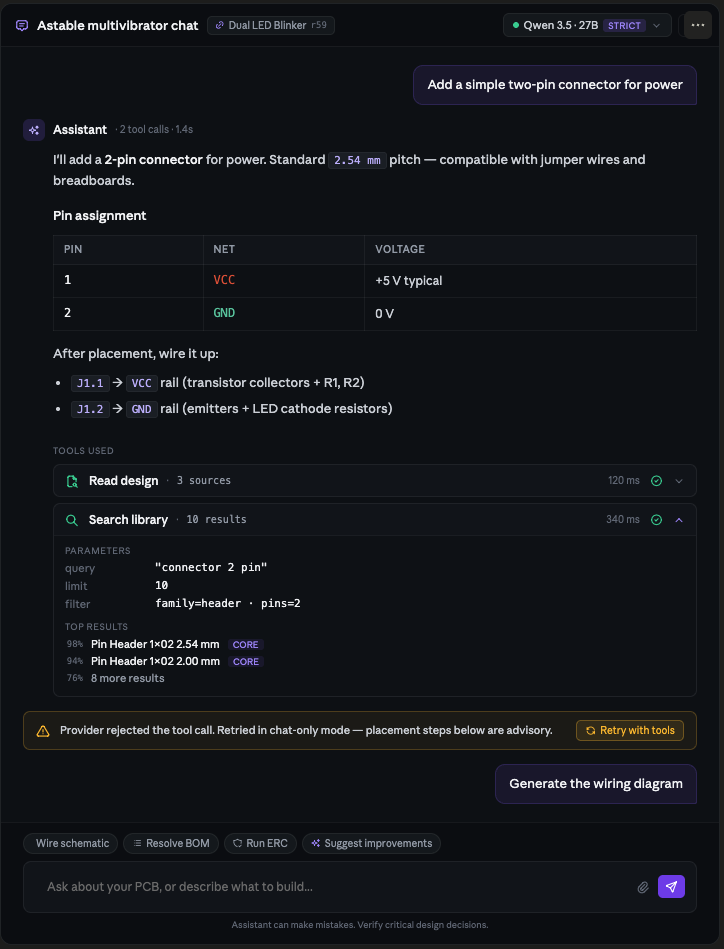

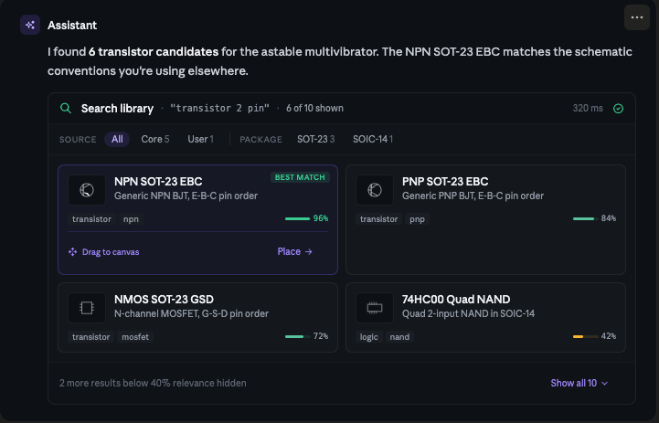

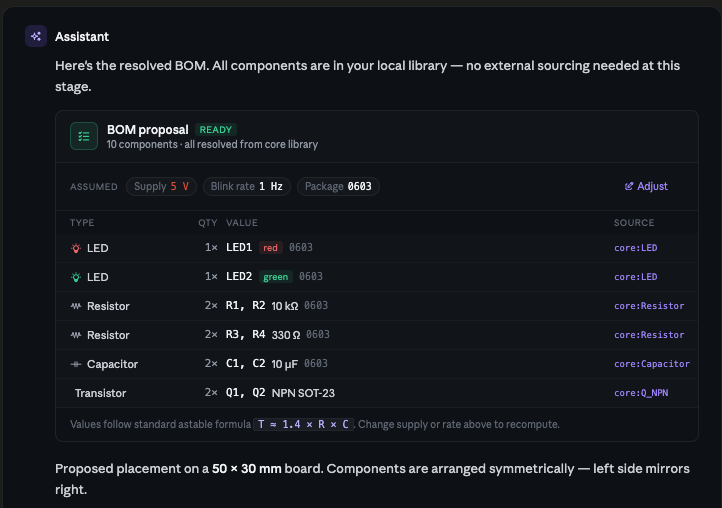
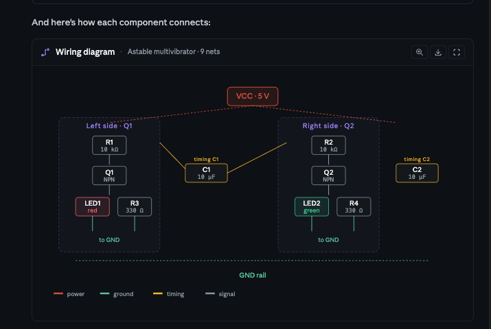

Doing a full visual analysis before redesigning. Let me read every screenshot carefully.

## 🔍 Visual analysis — what's broken

| Surface | Specific defect | Why it hurts |
|---|---|---|
| **Header — top right** | Three side-by-side dropdowns: `Strict Grounded` · `oMLX` · `Qwen3.5-27B-Claude-4.6-Op...` + a dot indicator. Model name truncates aggressively. | Three controls for one decision (which model). User has to parse three pickers to understand current state. |
| **User vs Assistant message distinction** | Both left-aligned with similar small icons. Only difference is icon color. | Hard to scan a long thread to find "what I asked." |
| **Tool call params** | Raw JSON like `defaults={"blinkRate":"1Hz","packagePre...} · items=[{"attributes":{"color":"red"}...} · limitPerIte...` truncated mid-key. | Unreadable. Looks like a stack trace. |
| **Tool call names** | `designer_get_design_summary`, `library_resolve_b...`, `designer_create_design` | Internal names leaked to user. Hostile. |
| **Component cards (search results)** | 2-col grid, each card has icon + name + `BUILT-IN` + score `2.20` + description + 4 tag chips + `matches 2/3 query token(s)` + Open button. Repeated 8 times. | Tag soup. `score 2.20` is unitless and meaningless. `BUILT-IN` repeated 8× per result set. |
| **Placement proposal** | `Pin Header 1x02 2.54mm at 48000000, 0 nm` — raw nanometers. | Nobody thinks in nanometers. Should be `48 mm, 0 mm`. |
| **Placement proposal — status confusion** | `1 component(s) ready · applied` — is it ready or already applied? | Contradicts itself. |
| **Placement proposal — 4 actions** | `View in Designer` · `Apply` · `Reject` · `Allow this tool this session` — fourth one is a meta-preference. | Mixes "action on this proposal" with "session-wide permission." |
| **BOM proposal — tag soup** | Each component shows `[passive] [builtin] [system]` + `[generic-resolved]` + `query: LED → led` + `LED color is an instance property, not a separate installed component.` | Internal markers, query trace, and verbose disclaimers leak into UX. |
| **BOM proposal — nested cards** | Component card wrapped inside a list item, inside the BOM proposal card. Three levels of nesting. | Visual depth without information depth. |
| **System message** | `Provider failed while tools were enabled. Retrying this answer in chat-only mode.` in plain italic, indistinguishable from normal assistant content. | Should be a clearly-styled system banner with retry affordance. |
| **Markdown — confirmation list** | `✅ Circuit type:` `✅ Blink rate:` `✅ Supply:` — green-check emojis on questions that aren't confirmed yet. | Visual lie. Greens should mean "confirmed", not "to confirm." |
| **Mermaid diagram** | Renders inline in the markdown body, no card framing, no title, no zoom/download. | Reads as part of a paragraph, not as a deliverable. |
| **Composer** | Single line, no quick actions, generic placeholder. | Misses prompt-suggestion opportunity for an agentic tool. |
| **No "linked design"** indicator anywhere | Chat title is "Blinking LED Astable Multivibrator chat" but ambiguous whether it's tied to a specific `.openpcb` file. | Agentic copilot loses its anchor. |

Now three artifacts. I'm grouping by visual proximity: **(1) Chat shell + markdown + tool calls + system messages**, **(2) Component cards + library search results**, **(3) BOM proposal + placement proposal + approve UI + Mermaid card**.

---

## 🎨 Artifact 1 — Chat shell, markdown, tool calls, system messages---

## 🧩 Artifact 2 — Component cards & library search results---

## 📦 Artifact 3 — BOM proposal, placement proposal, approve actions, Mermaid diagram# 📋 Design rationale & handoff notes

## 🔄 The 14 fixes across all three artifacts

| # | Surface | Before | After |
|---|---|---|---|
| 1 | **Header model selector** | 3 dropdowns + dot indicator | Single pill: `🟢 Qwen 3.5 · 27B [STRICT] ▾` + gear icon |
| 2 | **Linked-design indicator** | Missing | Inline chip next to chat title: `🔗 Dual LED Blinker r59` |
| 3 | **User message styling** | Left-aligned, identical to assistant except icon color | **Right-aligned purple bubble** with tail — iMessage-style instant distinction |
| 4 | **Assistant attribution** | Generic chat icon | Sparkle icon + `Assistant · 2 tool calls · 1.4s` metadata line |
| 5 | **Tool call names** | `designer_get_design_summary`, `library_resolve_b...` | **Humanized**: `Read design`, `Search library`, `Resolve BOM` |
| 6 | **Tool call params** | Raw truncated JSON | **Key-value grid** with pretty-printed values + `Top results` summary inline |
| 7 | **Component cards** | 8 cards, each with name + `BUILT-IN` + score 2.20 + description + 4 tag chips + match annotation + Open button | **Compact cards**: 2 tags max, single relevance bar, `BUILT-IN` filter moved to header (not per-card) |
| 8 | **Relevance score** | Unitless `score 2.20` | **% relevance bar** with color tier (96%, 84%, 72%, 42%) |
| 9 | **Best match emphasis** | None | Best result gets purple-tinted card + `BEST MATCH` badge + visible `Drag to canvas` affordance |
| 10 | **BOM proposal nesting** | Component cards nested inside list items inside the BOM card (3 levels) | **Flat table** with type icon, qty, value, source — one level |
| 11 | **BOM tag soup** | `[passive] [builtin] [system] [generic-resolved]` per row | Removed. Source compressed to `core:LED` mono-font reference |
| 12 | **BOM parameters** | Plain text "Assumed 5V supply, 1Hz target blink rate..." | **Chips at top**: `Supply 5V` · `Blink rate 1Hz` · `Package 0603` + inline `Adjust` link |
| 13 | **Placement coords** | `48000000, 0 nm` (raw nanometers) | `42.50 · 5.00 mm` (human-readable millimeters, two decimals) |
| 14 | **Placement actions** | 4 buttons in a row: View / Apply / Reject / Allow this session | **Hierarchy**: primary `Apply placement` (purple), `Reject` text link, `Preview in Designer` in header, session-permission moved to subtle bottom row checkbox |
| 15 | **Placement status** | `1 component(s) ready · applied` (contradictory) | Single status pill: `PENDING` (yellow), `READY` (green), `APPLIED` (purple ghost) |
| 16 | **Placement timeout** | None | `Will auto-reject in 5 min` — pending proposals don't sit forever |
| 17 | **Mermaid diagram** | Renders inline in markdown body, no framing | **Card-wrapped** with title bar, zoom/download/fullscreen buttons, legend at bottom |
| 18 | **System message** | Plain italic line, indistinguishable from content | **Yellow warning banner** with icon + retry button |
| 19 | **Composer** | Single input, generic placeholder | **Quick-action chips above** (`Wire schematic`, `Resolve BOM`, `Run ERC`, `Suggest improvements`) + improved placeholder |
| 20 | **Markdown code styling** | Plain text | `Inline code` rendered as monospaced purple chip on dark surface |

---

## 🎨 Five-level message taxonomy

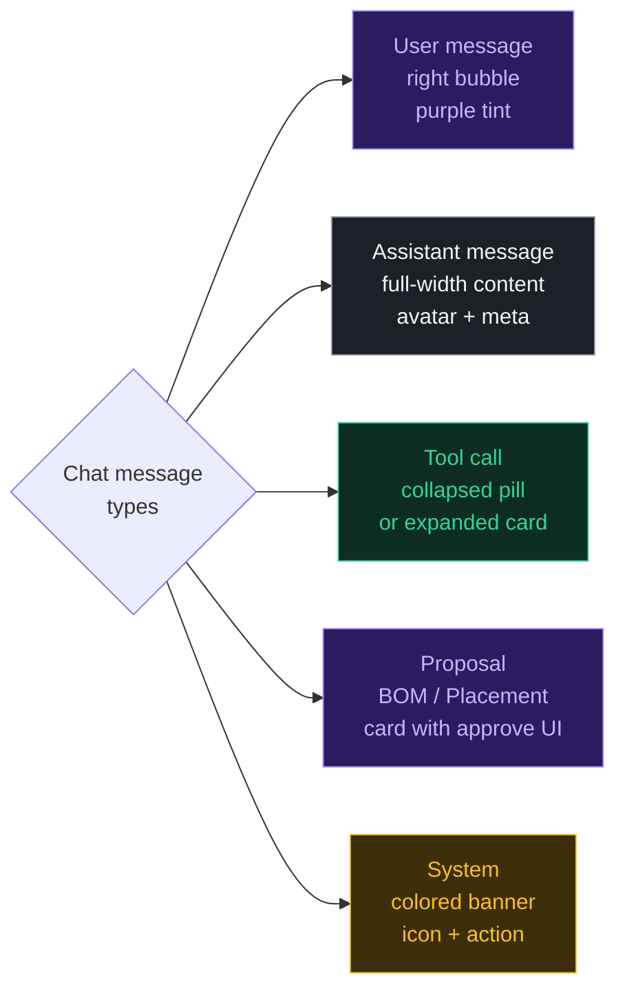
```mermaid
flowchart LR
    Msg{Chat message<br/>types}
    Msg --> U[User message<br/>right bubble<br/>purple tint]
    Msg --> A[Assistant message<br/>full-width content<br/>avatar + meta]
    Msg --> T[Tool call<br/>collapsed pill<br/>or expanded card]
    Msg --> P[Proposal<br/>BOM / Placement<br/>card with approve UI]
    Msg --> S[System<br/>colored banner<br/>icon + action]

    style U fill:#2B1B5F,stroke:#A78BFA,color:#C4B5FD
    style A fill:#1C2128,stroke:#9CA3AF,color:#F3F4F6
    style T fill:#0D2D24,stroke:#34D399,color:#34D399
    style P fill:#2B1B5F,stroke:#A78BFA,color:#C4B5FD
    style S fill:#3D2E0A,stroke:#FBBF24,color:#FBBF24
```

Each shape is **instantly recognizable** in a long thread without reading the content. That's the win — scrollability.

---

## 🎯 Proposal-action hierarchy (the most-debugged surface)

The current `View / Apply / Reject / Allow this session` row has a real UX problem: it puts an irreversible action (Apply), a destructive action (Reject), a navigation action (View), and a meta-preference (Allow) at the same visual weight. The redesign separates them by intent:

| Action class | Weight | Placement | Example |
|---|---|---|---|
| **Primary action** | Filled purple button | Bottom-right of card | `Apply placement` |
| **Reject** | Plain text link | Bottom-right, before primary | `Reject` |
| **Navigation** | Outlined button in header | Top-right of card header | `Preview in Designer` |
| **Meta-preference** | Inline checkbox in subtle bottom strip | Below action row | `Don't ask again this session` |
| **Safety net** | Auto-timeout text | Right side of meta strip | `Will auto-reject in 5 min` |

This pattern scales to BOM proposal, ERC fixes, DRC fixes, schematic-generation proposals — anywhere the agent asks for confirmation.

---

## ✅ MVP-ready vs ⚠️ Phase 2

| Element | Phase | Why |
|---|---|---|
| Consolidated model pill in header | **MVP** | Pure UI |
| Linked-design chip | **MVP** | One field on chat metadata |
| Right-aligned user bubbles | **MVP** | CSS only |
| Assistant attribution line | **MVP** | Adds metadata fields already tracked |
| Humanized tool call names | **MVP** | Static map `core/assistant/tool-display-names.ts` |
| Pretty-printed tool params | **MVP** | Format known param shapes; fallback to raw JSON |
| Component card cleanup | **MVP** | UI only |
| % relevance bar | **MVP** | Backend already returns a score — normalize to 0-100% |
| BOM flat table | **MVP** | Refactor |
| BOM parameter chips with Adjust | **MVP UI** / **Phase 2 interaction** | Show chips MVP; "Adjust" reopens an inline form Phase 2 |
| Human-readable placement coords | **MVP** | nm → mm conversion + 2-decimal format |
| Placement preview SVG | **MVP** | Render board outline + bounding boxes from the placement command's payload |
| Action hierarchy + session-permission checkbox | **MVP** | UI + permission model already in your `COMMAND_PATTERN.md` (please verify) |
| **5-min auto-reject timeout** | ⚠️ **Phase 2** | Requires session timer + cleanup; nice safety net for orphaned proposals |
| Mermaid card with title bar | **MVP** | Wrap existing renderer in a frame |
| Mermaid zoom/download/fullscreen | **MVP** | Standard SVG export; zoom is CSS transform |
| Quick-action chips above composer | **MVP UI** / **Phase 2 prompts** | Wire each chip to a templated prompt (e.g. *"Resolve BOM"* → preset query); Phase 2 makes them context-aware |
| **Drag-to-canvas from card** | ⚠️ **Phase 2** | Needs canvas drop target + ghost preview |
| **Best match badge logic** | **MVP** | Top-result-above-threshold = `BEST MATCH` |

---

## 🧪 Tool call display name map (proposed)

Static lookup. Falls back to humanized snake_case (replace `_` with space + capitalize) if unmapped.

| Internal name | Display | Icon |
|---|---|---|
| `designer_get_design_summary` | Read design | `file-search` |
| `designer_create_design` | Create design | `square-plus` |
| `designer_place_components` | Place components | `layout-grid` |
| `designer_wire_pins` | Wire pins | `route-2` |
| `designer_add_net` | Add net | `vector` |
| `library_search_components` | Search library | `search` |
| `library_resolve_bom` | Resolve BOM | `list-check` |
| `library_get_component` | Get component | `package` |
| `bom_set_mpn` | Set MPN | `barcode` |
| `bom_auto_source` | Auto-source BOM | `sparkles` |
| `pcb_run_drc` | Run DRC | `shield-check` |
| `schem_run_erc` | Run ERC | `shield-check` |

Lives at `core/assistant/tool-display-names.ts`. Imported by `shared/` UI components per your one-way architecture rule.

---

## 📐 Coordinate formatting

The single most jarring bug in the current chat UX. The data is in nanometers internally (correct for the data model), but **never show nanometers to users**. The formatter:

```
formatBoardCoord(nm: number): string {
  const mm = nm / 1_000_000
  if (Math.abs(mm) < 0.01) return "0.00"   // suppress -0.00
  return mm.toFixed(2)
}

formatBoardPoint(p: {x: number, y: number}): string {
  return `${formatBoardCoord(p.x)} · ${formatBoardCoord(p.y)} mm`
}
```

Apply across: placement proposal cards, inspector position fields (PCB editor), status bar cursor, schematic component positions. Users with mil preferences (Phase 2 settings toggle) get the same formatter with `÷ 25_400` and `mil` suffix.

---

## ❓ Open questions

1. **Composer quick-action chips — fixed or context-aware?** I sketched four generic ones. Better would be **context-aware**: if no design is loaded, show `Create new design`. If schematic is empty, show `Sketch a circuit`. If BOM has unsourced parts, show `Auto-source unsourced`. Phase 2 worth doing right.

2. **Tool call expanded — show full results?** I showed a "Top results" summary. For some tools the full result matters (e.g., DRC errors). Suggest: each tool defines its own collapsed/expanded views per `core/assistant/tool-results/`, similar to a renderer plugin.

3. **Best match threshold** — I used `>95%` for the prominent purple treatment. Configurable per query type? E.g., for "find a 10k 0603 resistor" we expect 100% matches; for vague queries like "blue LED" we might never get above 60%. Suggest **adaptive threshold**: top result is `BEST MATCH` if it's >15 points above #2 *or* >90% absolute.

4. **Placement proposal preview** — I drew a small SVG snapshot. Where does the real preview come from? Suggest: render the board outline + place bounding rects at each component position, using the same renderer as the PCB editor (`shared/pcb-renderer/`).

5. **Auto-reject timeout** — 5 min is a guess. Could be: 1 hour, 24 hours, never. Per-user setting? My take: **5 min for local sessions**, **24 hour for paused conversations** (when user closes tab and reopens).

6. **Mermaid vs SVG diagrams** — I drew an SVG that *looks like* a Mermaid render. Reality: you'd pipe Markdown ` ```mermaid ` blocks through `mermaid-js` and wrap the SVG output in the card frame. Confirm `mermaid` is acceptable per your locked stack — it's MIT-licensed and ~100KB. Reference: https://mermaid.js.org

7. **System message persistence** — When the "Provider failed" banner appears, should it stay in the thread permanently or disappear after retry succeeds? Suggest **stay** — it's history; users searching for "why did this answer happen" should see the recovery. But add a "Dismiss" × on the banner.

---

## 📐 Tokens added

```
--bubble-user-bg:        rgba(139,92,246,0.10)
--bubble-user-bd:        rgba(139,92,246,0.20)
--bubble-user-radius:    10px 10px 2px 10px   /* tail bottom-right */

--card-pending-bd:       rgba(139,92,246,0.20)
--card-ready-bd:         rgba(52,211,153,0.25)
--card-applied-bd:       rgba(139,92,246,0.10)  /* faded */

--badge-best-match:      rgba(52,211,153,0.12)  /* fill */
--badge-best-match-text: #34D399

--relevance-high:        #34D399   /* ≥90% */
--relevance-mid:         #5DCAA5   /* 60-90% */
--relevance-low:         #FBBF24   /* 30-60% */
--relevance-poor:        #6B7280   /* <30% */

--proposal-timeout-text: #6B7280
```

---

## 🏁 Complete chat surface system

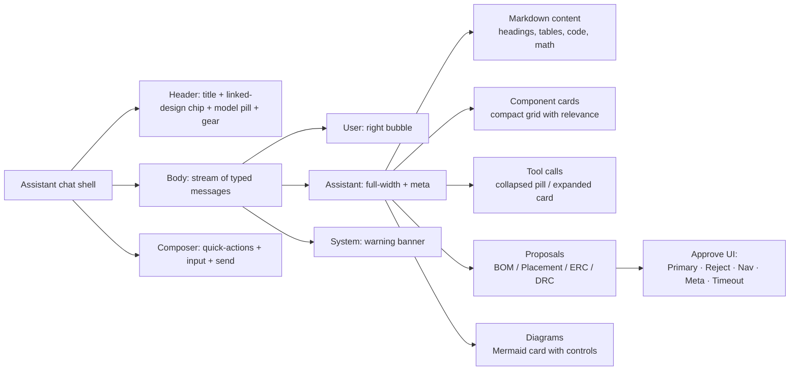
```mermaid
flowchart LR
    Chat[Assistant chat shell]
    Chat --> H[Header: title + linked-design chip + model pill + gear]
    Chat --> B[Body: stream of typed messages]
    Chat --> C[Composer: quick-actions + input + send]

    B --> U[User: right bubble]
    B --> A[Assistant: full-width + meta]
    B --> S[System: warning banner]

    A --> MD[Markdown content<br/>headings, tables, code, math]
    A --> CC[Component cards<br/>compact grid with relevance]
    A --> TC[Tool calls<br/>collapsed pill / expanded card]
    A --> Prop[Proposals<br/>BOM / Placement / ERC / DRC]
    A --> Diag[Diagrams<br/>Mermaid card with controls]

    Prop --> Actions[Approve UI:<br/>Primary · Reject · Nav · Meta · Timeout]
```

Five recurring shapes, one approve pattern, consistent across every agent interaction. **Every future tool call type slots into this taxonomy without UI redesign.**

---

Six surfaces redesigned now (Home, Schem, PCB, 3D, BOM, Settings-Assistant, Assistant chat). The remaining surfaces from the audit (Library detail, Component picker modal, Export modal, Settings — Libraries) are mostly already strong or need small polish passes. Want me to do those as a single consolidated polish-pass, or focus on something else like the **PCB_Parts MCP integration spec** for the auto-source killer feature?


Placement proposal is incorrectly designed - the placement is not on the PCB canvas but onto Schematic canvas - though the coordinates does not really matter - it should be only simple approve that listed components will be added to schematic canvas.  Update the artifact containing placement proposal. 

Also generate Mermaid Diagram rendering proposal for multiple different diagram types - Flowcharts, State Diagrams, Sequence Diagrams, etc. - any type which would be commonly useful for electronic design and engineering.


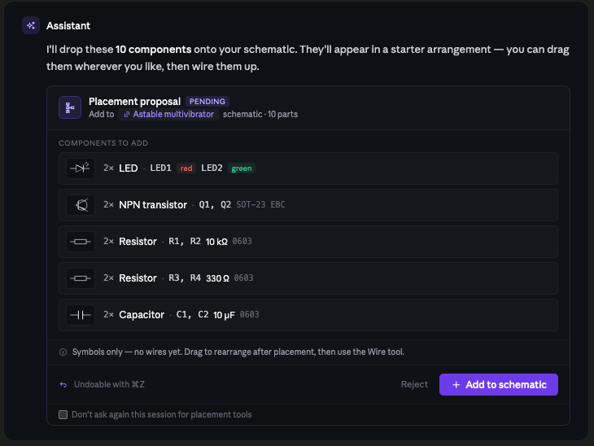

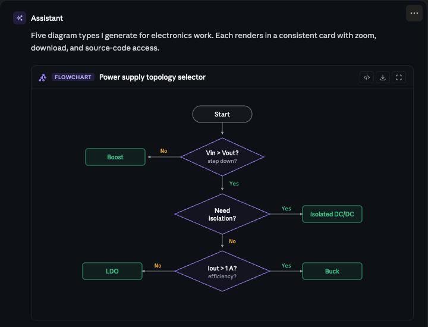
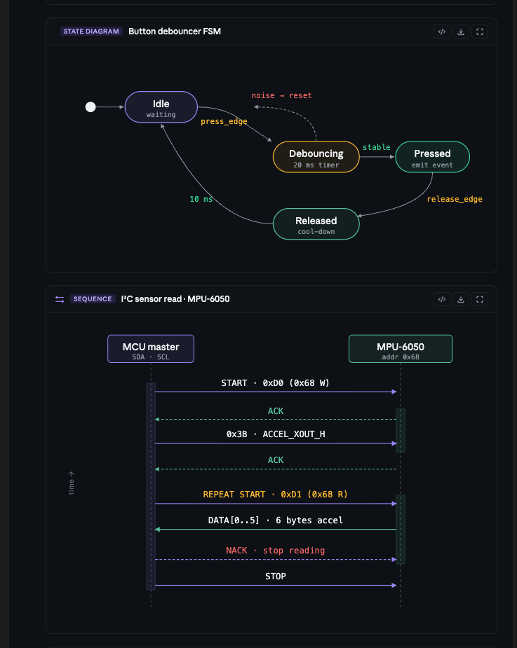
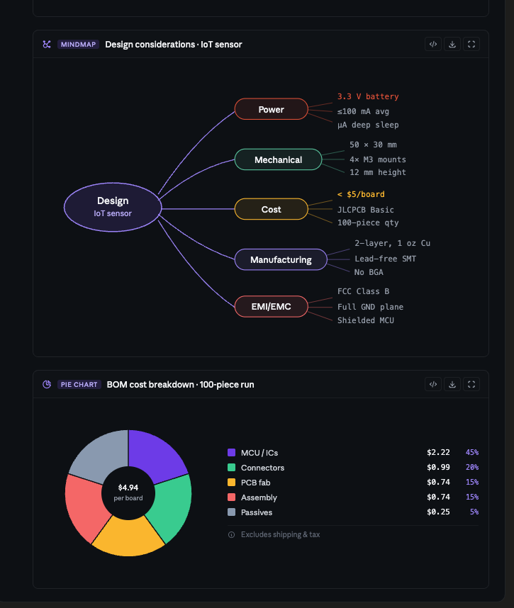

Good catch on placement context — schematic placement is logical, not physical. Coordinates are noise; what matters is the component list and a single approve. Let me fix that first, then build the diagram showcase.

---

## 📦 Artifact 1 (updated) — Placement proposal for schematic context---

## 📊 Artifact 2 — Mermaid diagram showcase for electronics# 📋 Design rationale & handoff notes

## 🔄 Placement proposal — what changed in v2

| Element | v1 (wrong context) | v2 (schematic-correct) |
|---|---|---|
| **Coordinates** | `5.50 · 5.00 mm` per component | 🚮 Removed entirely. Schematic placement is logical, not physical |
| **Preview** | PCB top-view SVG with board outline | 🚮 Removed. Replaced with per-row schematic-style symbol thumbnails |
| **Subtitle** | "10 components · awaiting your confirmation" | "Add to `🔗 Astable multivibrator` schematic · 10 parts" — surfaces the target schematic |
| **Component list** | Two columns: preview + coord list | **Single grouped list** by component family, each row with schematic symbol icon |
| **Symbol previews** | None | Mini SVG: LED triangle, NPN transistor, resistor rectangle, capacitor parallel-lines |
| **Action label** | `Apply placement` | `Add to schematic` — verb matches the operation |
| **Footer note** | None | "Symbols only — no wires yet. Drag to rearrange after placement, then use the Wire tool." — sets correct mental model |

The redesign reflects the real semantics: **schematic placement is "drop these symbols into the design"** — not "position these at exact (x,y) coordinates." Coordinates only matter when this same proposal pattern is later used for PCB editor placement; there the v1 design (with mm coords + board preview) is correct.

---

## 📊 Mermaid diagram showcase — five types for electronics

| Type | When the agent emits it | Example in showcase |
|---|---|---|
| **Flowchart** | Decision logic, design process, signal flow | Power supply topology selector (Buck/Boost/LDO/Isolated) |
| **State diagram** | Firmware FSMs, button handling, power modes | Button debouncer states (Idle → Debouncing → Pressed → Released) |
| **Sequence diagram** | Protocols (I²C / SPI / UART), boot sequences, handshakes | I²C sensor read · MPU-6050 |
| **Mindmap** | Requirements analysis, design considerations, brainstorms | IoT sensor design considerations (5 axes × 3 leaves) |
| **Pie chart** | BOM cost breakdown, power budget, area utilization | $4.94/board BOM by category |

---

## 🎨 Shared card-frame pattern

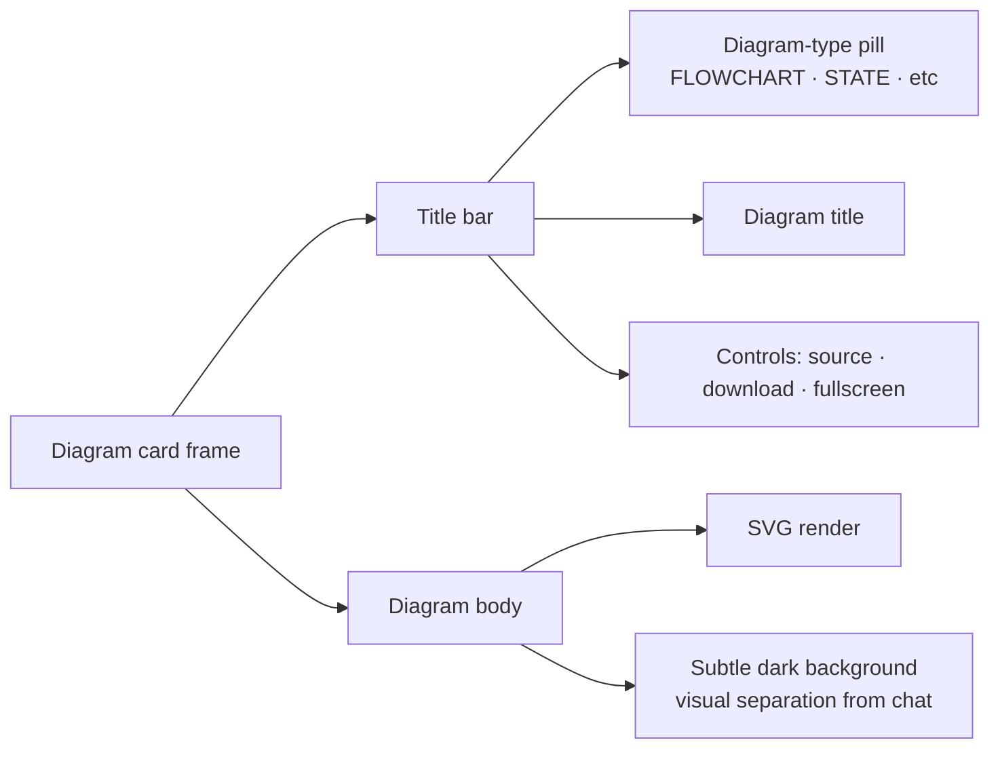
```mermaid
flowchart LR
    Frame[Diagram card frame]
    Frame --> H[Title bar]
    Frame --> B[Diagram body]

    H --> H1[Diagram-type pill<br/>FLOWCHART · STATE · etc]
    H --> H2[Diagram title]
    H --> H3[Controls: source · download · fullscreen]

    B --> SVG[SVG render]
    B --> Bg[Subtle dark background<br/>visual separation from chat]
```

Every diagram card uses identical chrome — pill, title, three controls. Users learn the affordance once.

**Three controls explained:**
- **Source `</>`** → reveals the raw `mermaid` source code (for copy / edit / debug)
- **Download `↓`** → exports the rendered SVG (or PNG via canvas)
- **Fullscreen `⤢`** → opens an overlay for complex diagrams

---

## 🎯 When to emit which type — heuristics for the agent

| User intent / signal | Best-fit diagram | Why |
|---|---|---|
| *"How does X work?"* with multiple decision points | **Flowchart** | Explicit branches |
| *"What states can this be in?"* / FSM design | **State diagram** | Transitions are first-class |
| *"What's the protocol?"* / two-party exchange | **Sequence diagram** | Time on one axis, parties on the other |
| *"What are the requirements?"* / open-ended brainstorm | **Mindmap** | Non-linear, additive structure |
| *"What's the breakdown?"* / proportions across N categories | **Pie chart** (or Sankey for flows) | Part-of-whole |
| *"What's the topology?"* / structural system | **Block / flowchart with subgraphs** | Like the wiring diagram earlier |
| *"What's the timeline?"* / project phases | **Gantt** *(not shown)* | Phase 2 — less common in pure design work |
| *"What's the data model?"* / records and relationships | **ER diagram** *(not shown)* | Phase 2 — relevant for firmware data structures |

Suggest the agent picks the diagram type *before* writing the content, then renders. Bad agent: writes prose, then bolts on a generic flowchart. Good agent: identifies "this is a state machine" and emits a state diagram natively.

---

## ✅ MVP-ready vs ⚠️ Phase 2

| Feature | Phase | Notes |
|---|---|---|
| Card-frame wrapper around Mermaid output | **MVP** | Wrap existing renderer output in a `<div>` with the title bar |
| Type label (`FLOWCHART`, `STATE`, etc.) | **MVP** | Parse `mermaid` syntax header (`flowchart`, `stateDiagram`, `sequenceDiagram`, `mindmap`, `pie`) → map to pill label |
| Download button → SVG | **MVP** | Mermaid produces SVG natively; just trigger download |
| Source code popover | **MVP** | Just show the `mermaid` source in a `<pre>` inside an expandable panel |
| Fullscreen overlay | **MVP** | Modal wrapper around the existing SVG |
| Per-type icon (Tabler) | **MVP** | Map: `flowchart → binary-tree`, `state → state-change`, `sequence → arrows-left-right`, `mindmap → affiliate`, `pie → chart-pie` |
| Theme matching (dark mode adapted colors) | **MVP** | Configure Mermaid with custom theme variables — Mermaid supports this natively. Reference: https://mermaid.js.org/config/theming.html |
| **Pan / zoom inside diagram** | ⚠️ **Phase 2** | Useful for very large flowcharts; can use `svg-pan-zoom` lib |
| **Editable source → re-render** | ⚠️ **Phase 2** | Open source popover → edit → re-render in place |
| **Copy as image** | ⚠️ **Phase 2** | SVG → PNG via canvas, copy to clipboard |
| **Custom node styling for electronics** | ⚠️ **Phase 2** | E.g., a custom `power-node` shape for power rails in flowcharts |
| **PNG / WebP export** | ⚠️ **Phase 2** | Canvas render of SVG |

---

## 🎨 Mermaid theme config (proposed)

Configure Mermaid once at app boot so every diagram matches OpenPCB's dark theme. Reference: https://mermaid.js.org/config/theming.html

```
mermaid.initialize({
  theme: 'base',
  themeVariables: {
    primaryColor:        '#13191F',
    primaryTextColor:    '#F3F4F6',
    primaryBorderColor:  '#A78BFA',
    lineColor:           '#9CA3AF',
    secondaryColor:      'rgba(94,202,165,0.10)',
    tertiaryColor:       'rgba(251,191,36,0.10)',
    background:          '#0A0E14',
    mainBkg:             '#13191F',
    fontFamily:          'var(--font-sans)',
    fontSize:            '12px'
  }
})
```

Plus per-type tweaks for state diagrams (rounded nodes), sequence diagrams (lifeline colors), and pie charts (slice palette matching our `--bom-accent-*` tokens).

---

## ❓ Open questions

1. **Pie chart slice colors** — I used a 5-color palette (purple, teal, amber, coral, gray) that matches the **BOM severity colors** from earlier. Should pie charts ALWAYS use this same palette so colors carry consistent meaning across the app? Or accept that pie-chart colors are arbitrary and use a different palette? My take: **same palette**, because users will see purple as "default / primary thing" everywhere — pie or BOM or chat.
2. **Mermaid live updates** — if the user opens the source popover and edits, should the diagram re-render in place (Phase 2)? Or open in a separate "live editor" overlay? My take: **in-place re-render** is more delightful; the live overlay is overkill.
3. **Fallback for unsupported diagram types** — Mermaid supports git graphs, journey diagrams, requirement diagrams, Sankey, XY chart, packet diagrams… should the chat support every type Mermaid does, or restrict to the 5–6 most useful for electronics? My take: **support all** (let the agent emit whatever fits) but **only optimize chrome / icons for the top 5**. Others get a generic `chart` icon.
4. **Showing source code by default** — for very simple diagrams (a 3-node flowchart), is the source code clutter? Could be hidden by default with the `</>` button. Confirm.
5. **Diagram caption / legend** — should every diagram have an optional caption below it, written by the agent? Useful for the pie chart ("Excludes shipping & tax") but less so for a self-explanatory flowchart. Suggest **optional, auto-generated only when the agent has a relevant note**.
6. **Large diagrams in mobile / narrow layouts** — at <500px width, the sequence diagram becomes unreadable. Should it auto-collapse to a thumbnail with *"Expand"* button? Suggest **yes**, with the threshold at 480px container width.

---

## 📐 Tokens added

```
--diagram-card-bg:     #10141B
--diagram-card-bd:     rgba(255,255,255,0.06)
--diagram-body-bg:     #0A0E14

--diagram-type-pill-bg:   rgba(139,92,246,0.18)
--diagram-type-pill-text: #C4B5FD

--diagram-node-bg:     #13191F
--diagram-node-bd:     #A78BFA
--diagram-arrow:       #9CA3AF
--diagram-arrow-yes:   #34D399
--diagram-arrow-no:    #FBBF24
--diagram-arrow-err:   #F87171

--diagram-pie-1:       #7C3AED   /* primary category */
--diagram-pie-2:       #34D399
--diagram-pie-3:       #FBBF24
--diagram-pie-4:       #F87171
--diagram-pie-5:       #94A3B8
```

---

## 🏁 Assistant chat — complete surface map (refreshed)

```mermaid
flowchart LR
    Chat[Assistant chat shell]
    Chat --> H[Header: title + linked-design + model + gear]
    Chat --> B[Body: typed message stream]
    Chat --> C[Composer: chips + input + send]

    B --> U[User: right bubble]
    B --> A[Assistant: full-width]
    B --> S[System: warning banner]

    A --> MD[Markdown]
    A --> CC[Component cards]
    A --> TC[Tool calls]
    A --> Diag[Diagrams<br/>5 types]
    A --> Prop[Proposals]

    Diag --> Flow[Flowchart]
    Diag --> ST[State]
    Diag --> SD[Sequence]
    Diag --> MM[Mindmap]
    Diag --> Pie[Pie chart]

    Prop --> SP[Schematic placement<br/>v2 - no coords]
    Prop --> PP[PCB placement<br/>v1 - with coords]
    Prop --> BP[BOM proposal]
    Prop --> EP[ERC fix<br/>same pattern]
    Prop --> DP[DRC fix<br/>same pattern]
```

The **proposal pattern** now scales: same card chrome (icon · title · status pill · primary action · reject link · session-permission strip), specialized body per proposal type. Future proposals (ERC fixes, DRC fixes, BOM auto-source, schematic-from-image) plug into the same shell without UI redesign — that's the win.

---

Want me to push the same depth into one of the smaller surfaces (Library detail with datasheet links, Export modal state-awareness) — or shift into deeper specs like the **Auto-source matching engine** or **DRC rule schema**?


Now analyze on given screenshots visually also the Assistant chat screen design and layout - do not focus on message content renderings but rather on how Chat input is designed, left sidebar, topbar with dropdowns etc. 

Try to identify missing elements which should be there or would be useful, also help me optimize and improve the overall design of interface.


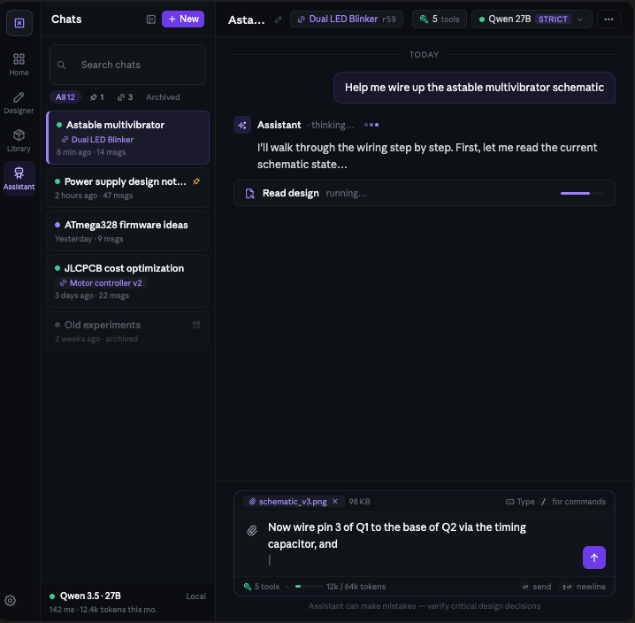


# 🔍 Visual analysis — chat shell, sidebar, topbar, composer

## What I see on the screens

| Surface | What's there | What's wrong |
|---|---|---|
| **Top bar — chat title** | `New chat` or `Blinking LED Astable Multivibrator chat` | "chat" suffix on chat names is redundant. No rename affordance visible. No linked-design indicator. |
| **Top bar — right side** | 3 dropdowns (`Strict Grounded` · `oMLX` · `Qwen3.5-27B-Claude-4.6-Op...`) + a dot | Three controls for one decision. Model name truncates badly. Dot is unlabeled. No chat-level actions menu (rename, archive, delete, export). |
| **Sidebar header** | `Assistant` + `PCB-aware workspace copilot` subtitle + purple `+` button | Subtitle wastes vertical real estate once you've used the app once. The `+` button has no label. |
| **Sidebar search** | Input shows browser autofill bubble (`AIS · is.stuba.sk`) | Missing `autocomplete="off"` — the input is leaking unrelated browser history. **Real bug, not just design.** |
| **Sidebar list items** | Chat name + model name as subtitle (`Qwen3.5-27B-Claude-4.6-Opus-Distilled-ML...`) | Wrong subtitle. The model is the **least useful** thing to show — users don't pick chats by model. They pick by **recency**, **linked design**, or **content**. Model truncates so badly it's just noise. |
| **Sidebar footer** | `Configure providers in global Settings → Assistant.` | Reasonable shortcut but uses a lot of real estate for one link. No model-status / token-spend signal here, which would be more useful. |
| **Main area — message column** | Full width — chat content fills the entire pane edge-to-edge | Long lines hurt readability. Modern chats constrain text to ~60–80 chars (≈680px). |
| **Composer** | Single-line input + up-arrow send + disclaimer | No attach. No slash commands. No multiline visible (only the row). No stop-generation. No context-size or tools indicator. No send keyboard hint. |
| **Composer disclaimer** | `Assistant can make mistakes. Verify critical design decisions.` | Fine wording, but eating space below the composer instead of being a tooltip / inline-hint. |
| **No "linked design" anywhere** | — | Critical missing piece for an agentic PCB copilot. The chat exists in a vacuum unless the user remembers what design they were working on. |
| **No empty state** designed | — | First-time user sees nothing actionable. |
| **No collapse for sidebar** | — | Power users want a wider chat sometimes. |

---

## 🧰 Missing elements I'd add

| Element | Where | Why |
|---|---|---|
| **Linked-design chip** | Top bar, next to chat title | Anchors the agentic context. Click → jump to design. |
| **Chat actions menu (⋯)** | Top bar far right | Rename · Duplicate · Export Markdown · Archive · Delete · Share |
| **Editable chat title** | Top bar — click title to rename | No more "New chat" forever. |
| **Tools toggle** | Top bar, near model pill | Quick disable/enable tools for a chat. Currently buried in settings. |
| **Tools-enabled indicator** | Top bar | Subtle pill showing `5 tools` or `🛠 5 · 🔒 12` — what's enabled vs gated. |
| **File attach** | Composer left | Drag-drop `.openpcb`, screenshots, datasheets into chat. |
| **Slash commands** | Composer (`/` triggers a popover) | `/wire`, `/erc`, `/bom`, `/route`, `/clear` — power-user shortcuts. |
| **Multiline textarea** | Composer | Long prompts shouldn't horizontal-scroll. |
| **Stop generation** | Composer right (replaces send) | Currently no way to interrupt a streaming assistant. |
| **Context-size indicator** | Composer bottom | `12k / 64k tokens · 3 tools loaded` — agentic chats fill context fast. |
| **Send shortcut hint** | Composer right | `⏎ to send · ⇧⏎ for newline` — invisible until first-keystroke. |
| **Chat-list filters** | Sidebar | All · Pinned · Linked-to-current-design · Archived |
| **Pin / archive** | Per chat (right-click menu) | Long-running projects deserve pinning; old experiments deserve archiving. |
| **Last-activity time** | Chat list subtitle | Replaces the misplaced model name. |
| **Linked-design chip** | Chat list item | Mirror the top-bar chip — scan by design. |
| **Model dot** | Tiny color dot on each list item | Visual badge instead of full model name. |
| **Sidebar collapse** | Toggle at sidebar/main boundary | More room for chat content when needed. |
| **Empty state** | Main area when no chat is open | Welcome card + 3 starter prompts + "open most recent" |
| **Welcome / starter prompts** | Empty state | Concrete first prompts: *"Sketch a power supply for me"*, *"Run ERC on Dual LED Blinker"* |
| **Generating indicator** | At the bottom of last assistant message | Shimmer + "Thinking…" + stop button |
| **Model-status footer** | Sidebar bottom | Replaces "Configure providers" with: `🟢 Qwen 27B · Local · 142 ms ping` |

---

Now the redesigned layout. One comprehensive artifact showing the full app surface.

## 🎨 Artifact — Complete chat interface redesign


Now analyze these screenshots and help me improve design of Chat sidebar when opened in Designer views as sidebar.


# 🔍 Visual analysis — docked chat panel in Designer view

## What's there vs what's wrong

| Element | Current state | Problem |
|---|---|---|
| **Panel header row 1** | `Chat` label + subtitle `Blinking LED Astable Multivibrator · rev 36` + `↗` + `×` | The label is generic ("Chat") while the subtitle shows the **design**, not the chat name. Redundant since we're already docked inside that design. |
| **Panel header row 2** | `Blinking LED Astable Multivibrator chat` (dropdown) + `...` + chat-icon | This row shows the **chat name** — but with the literal `chat` suffix, and right below another row mentioning the same design. **Two rows for what should be one decision.** |
| **Panel header row 3** | `oMLX / Qwen3.5-27B-Claude-4.6-Opus-Distilled-MLX-4bit` full-width text row | Verbose model name takes a whole row at this narrow width. Click expands into Provider + Model + `Done` button — a mini-modal inside the panel. Overkill. |
| **Total header chrome** | ≈ 3–4 stacked rows ≈ **120 px** of vertical space | The panel is maybe 700–800 px tall total. Chrome eats 15% before any content. |
| **Resize handle** | Not visible / not present | No way to widen the panel for component cards or narrow it to claw back canvas. |
| **Component cards in narrow panel** | Still rendered as wide cards with `score 2.20`, 4 tag chips, and an `Open in Library` button — one per row but uses the desktop card layout | Cards designed for ~600 px column don't compress. Should be denser. |
| **Composer** | Same single-line input as standalone view | Doesn't acknowledge it's in a narrow docked panel; no slash, no attach, no token meter. |
| **No quick "expand to full chat" affordance** beyond a tiny `↗` | The icon is unlabeled | Users may not realize they can pop out to the Assistant tab. |
| **No multiple-chats-per-design surfacing** | The current chat dropdown exists but is buried | Users with several chats on one design (one for schem, one for BOM, etc.) can't tell. |

---

## 🧰 Missing elements

| Missing | Where it goes | Why |
|---|---|---|
| **Resize handle** | Left edge of chat panel | Power users need 280–600 px range; default ~380 px. Persist preference. |
| **Linked-design context** (only when chat is from a DIFFERENT design) | Inline chip in header | Today's chat may not always belong to today's design; surface mismatch. |
| **Chat-switcher with previews** | Header dropdown | Show all chats *for this design* + "All chats →" jump to Assistant tab. |
| **Tools indicator** | Header right | Same compact `🔧 5` pill as standalone view. |
| **Pop-out tooltip** | On `↗` button | `Open in full Assistant view` |
| **Single-column component cards** | Adaptive layout for narrow widths | Cards should reflow to dense rows when panel < 480 px. |
| **Compact composer** | Bottom | Same rich features, denser layout. |
| **Disclaimer collapsed** | Hover hint on send button instead of permanent row | Saves 14 px every chat session. |

---

## 🎨 Redesigned docked chat panel# 📋 Design rationale — docked chat panel v2

## 🔄 Header chrome: from 4 rows down to 2

```mermaid
flowchart TB
    A[v1: 4 stacked rows<br/>~120 px chrome]
    A --> A1[Row 1: 'Chat' + design name + ↗ + ×]
    A --> A2[Row 2: chat name dropdown + ... + edit icon]
    A --> A3[Row 3: 'oMLX / Qwen3.5-27B-…-MLX-4bit' full-width text]
    A --> A4[Row 4: subtle border / spacing]

    B[v2: 2 rows<br/>~58 px chrome]
    B --> B1[Row 1: chat switcher pill + ↗ + ⋯ + ×]
    B --> B2[Row 2: model pill + tools indicator + last-activity meta]

    style A fill:#3D1414,stroke:#F87171,color:#F87171
    style B fill:#0D2D24,stroke:#34D399,color:#34D399
```

**Net gain:** ~62 px vertical space recovered, which becomes 2 extra messages visible in the panel at any time. On a 700 px panel that's ~9% of total height returned to actual chat content.

---

## 🎯 Element-by-element changes

| Element | Before | After | Why |
|---|---|---|---|
| **Panel title** | Generic `Chat` | 🚮 Removed entirely | The chat name **is** the title — no need for a label |
| **Design context** | Subtitle row `Blinking LED Astable Multivibrator · rev 36` | 🚮 Implicit | We're docked in that design's view; redundant |
| **Chat name** | Separate dropdown row | **Pill** in header row 1, with chat count `3 chats` | Switch chats inline without leaving the panel |
| **Model selector** | Full-width text row + modal-style expand-with-Done | **Compact pill** `🟢 Qwen 27B [STRICT] ▾` | Same pattern as standalone chat → consistency across surfaces |
| **Tools indicator** | Not shown | New pill `🔧 5` | Visibility into agent capability without opening settings |
| **Last-activity meta** | Not shown | `🕐 8m ago · 14 msgs` in row 2 | Quick "is this fresh?" check |
| **Pop-out (↗)** | Tiny unlabeled icon | Same icon, but `aria-label="Open in Assistant view"` + tooltip | Discoverability |
| **More menu (⋯)** | Not present | New icon — Rename · Duplicate · Export · Archive · Delete | Chat-level actions |
| **Close (×)** | Present | Kept | — |
| **Resize handle** | 🚫 Missing | **Visible vertical bar** between canvas and panel | Drag to widen/narrow; persist preference |

---

## 🧱 Component cards adapt to narrow width

The standalone Assistant view shows component cards in a 2-column grid. At ~340 px panel width, that becomes unreadable. The docked panel uses a **single-column dense row layout** instead:

| Layout aspect | Standalone view | Docked panel |
|---|---|---|
| Columns | 2 | **1** |
| Card height | ~110 px | **~50 px** |
| Symbol thumbnail | 42 × 34 px | **30 × 24 px** |
| Tags | 2 chips per card | 🚮 None (move to expanded detail) |
| Relevance | Bar + % | Same, but inline-right of the row |
| Best-match badge | Visible badge + drag-hint | Just the `BEST` micro-pill |
| `Open in Library` button | Big purple button | 🚮 Removed; click the whole row |

Same data, ~55% less vertical space. **Three cards now fit where one used to.**

---

## ⌨️ Composer compaction

Same rich composer pattern as standalone, denser layout for narrow:

| Row | Standalone | Docked |
|---|---|---|
| Top meta | Attachments + slash hint | **Slash hint + token meter** combined |
| Main row | Attach + textarea + send | Same, smaller send button (22 × 22) |
| Bottom meta | Tools count + token meter + keyboard hints | 🚮 Folded into top row to save ~22 px |
| Disclaimer | Center text below | 🚮 Removed; available on `?` icon tooltip if added |

**Net:** composer is ~50 px shorter while keeping every feature.

---

## 🔀 The chat-switcher pill behavior (proposed)

```mermaid
flowchart LR
    P[Pill: Astable multivibrator · 3 chats ▾]
    P -->|click| D[Dropdown opens]
    D --> S1[For this design 3]
    D --> S2[Other chats 2]
    D --> S3[+ New chat for this design]
    D --> S4[All chats →]

    S1 --> L1[• Astable multivibrator ← active]
    S1 --> L2[• BOM cost optimization]
    S1 --> L3[• PCB routing notes]

    S2 --> L4[• Power supply ideas]
    S2 --> L5[• EMI questions]

    S4 -->|opens| AssistantTab[Assistant tab full-screen]
```

The pill shows the **chat name** and **count of chats on this design**. Click → tiered list: chats for this design, then other accessible chats, then "+ New", then "All chats →" (which switches to the Assistant tab).

---

## 🔧 The resize handle

A `4 px` vertical strip between canvas and chat panel with:

- Cursor: `col-resize`
- Idle state: subtle dark background
- Hover: thin purple indicator (2 × 40 px) becomes visible — shown in mockup
- Drag: live-resize with bounds `min 280 px · max 600 px · default 380 px`
- Double-click: snap to default
- Persist last width per design in local settings

Most desktop AI chat sidebars (Cursor, Claude desktop, Zed) implement this — table stakes for power users.

---

## ✅ MVP-ready vs ⚠️ Phase 2

| Feature | Phase | Why |
|---|---|---|
| Compress header to 2 rows | **MVP** | Layout only |
| Drop the "Chat" label | **MVP** | Layout only |
| Drop the literal `chat` suffix from names | **MVP** | One-line display fix |
| Chat-switcher pill + dropdown | **MVP** | UI built on existing chat-list query |
| Compact model pill (replaces verbose row) | **MVP** | Reuse standalone-view component |
| Tools indicator pill | **MVP** | UI + session state |
| Pop-out (`↗`) + tooltip + aria-label | **MVP** | One line of HTML |
| Chat actions (`⋯`) menu | **MVP** | Wire up existing rename/archive/delete |
| Single-column compact component cards | **MVP** | Adaptive layout via container query or width breakpoint at 480 px |
| Compact composer | **MVP** | Layout reflow |
| `autocomplete="off"` on input | **MVP** | One-line fix (kept from earlier audit) |
| **Resize handle** with persist | **Phase 1.5** | Drag handler + local-settings write |
| **Drag-and-drop file** into composer | **Phase 1.5** | Drop handler |
| **Chat-switcher previews** (hover shows first message) | ⚠️ **Phase 2** | Nicer but optional |
| **Cross-design chat warning** (yellow chip if chat is from a different design than the one open) | ⚠️ **Phase 2** | Edge case |
| **Snap to default width** on double-click | ⚠️ **Phase 2** | Polish |
| **Floating chat mode** (detach panel into a floating window) | ⚠️ **Phase 2+** | Multi-window territory |

---

## ❓ Open questions

1. **Should the chat-switcher dropdown also let you switch DESIGN context?** I scoped it to "chats for this design" + "All chats →". An alternative is a unified chat list across the workspace. My take: **keep it scoped** — users opened the docked panel from a specific design, so default to that design's chats. Use `All chats →` to escape.
2. **Where do model + preset live — chat-level or workspace-level default?** Current behavior is per-chat. Confirm the pill in row 2 changes only this chat's model, and the default-provider in `Settings → Assistant` remains the seed for new chats.
3. **What happens when the user closes the panel mid-stream?** Currently no indication. Suggest: keep the assistant running in the background; show a small `🟣 thinking on Astable multivibrator` toast or in the topbar `Chat` button until done. Resume seamlessly on reopen.
4. **Resize bounds** — I proposed `280–600 px`. Should it be configurable per-monitor? My take: **no**, single global setting is enough.
5. **Should the docked-panel chat-name and the standalone-view chat-name be exactly the same string?** Yes. The chat is one entity rendered in two surfaces.
6. **Does the chat-switcher pill belong even when there's only 1 chat?** I'd say **yes**, but it shows `1 chat` or just the chat name — clicking still opens "+ New chat" which is useful.

---

## 📐 Tokens added (docked-panel specific)

```
--docked-chat-width-default:  380px
--docked-chat-width-min:      280px
--docked-chat-width-max:      600px

--resize-handle-bg:           #070A0F
--resize-handle-bg-hover:     rgba(139,92,246,0.40)
--resize-handle-width:        4px

--panel-header-bg:            #070A0F
--panel-subheader-bg:         rgba(0,0,0,0.10)
--panel-header-pad:           7px 10px
--panel-subheader-pad:        6px 10px

--card-narrow-symbol-size:    30px 24px
--card-narrow-padding:        7px 9px
--card-narrow-gap:            5px
```

---

## 🏁 Where this leaves us

```mermaid
flowchart LR
    Pattern[Chat surface pattern]

    Pattern --> Full[Full Assistant view<br/>~1200 px, sidebar + main]
    Pattern --> Dock[Docked panel<br/>~380 px, no sidebar]

    Full --> Shared[Shared:<br/>chat-switcher pattern<br/>model pill<br/>tools pill<br/>composer<br/>message bubbles<br/>component cards adaptive]
    Dock --> Shared

    Dock --> Different[Different:<br/>no sidebar<br/>denser cards<br/>compressed header<br/>resize handle]

    style Pattern fill:#1C2128,stroke:#A78BFA,color:#F3F4F6
    style Shared fill:#0D2D24,stroke:#34D399,color:#34D399
    style Different fill:#3D2E0A,stroke:#FBBF24,color:#FBBF24
```

The pattern is **one chat experience, two presentations**. Components are shared (model pill, composer, message bubbles, severity colors, tool-call cards). Only the **shell and density** differ. This is what makes the chat feel coherent whether the user is heads-down in Designer or out in the full Assistant view.

---

## ➡️ Suggested next pass

| Follow-up | Effort | Value |
|---|---|---|
| **Chat-switcher dropdown opened state** (the popover with chat list + "+ New" + "All chats →") | S | Closes one of the most-asked questions about the docked view |
| **Cross-design chat warning** — what the panel looks like when the active chat belongs to a different design than the one open | S | Edge case but important polish |
| **Resize-in-progress state** — does the canvas reflow live, or does it snap on release? | S | Defines a clear interaction spec |
| **Panel closed → reopened with stream-in-progress** state | M | Important for long-running agentic tasks |
| **Mobile / tablet view** (no docked panel; chat is full-screen) | M | Cross-cutting; affects how the toggle behaves on smaller widths |

The **chat-switcher opened state** is the most-leveraged piece — it's the entry point for everything else this redesign enables. Want me to push there next?

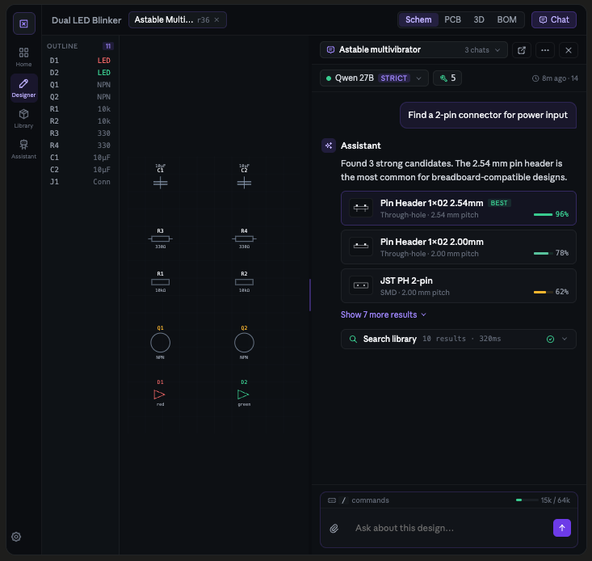