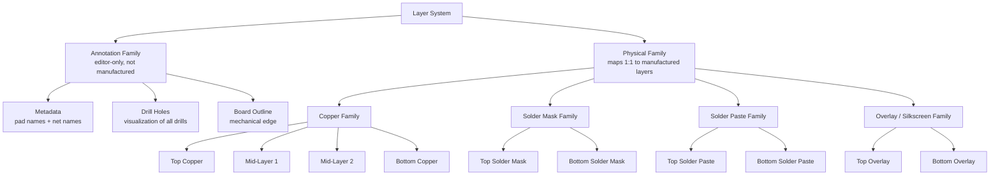
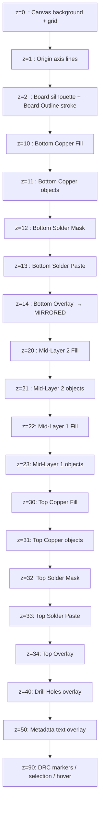
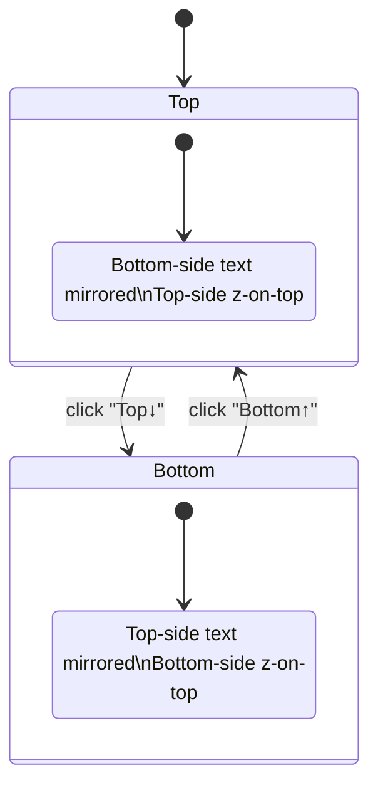

# OpenPCB — PCB Canvas Layer System & Rendering Specification

> Derived from a frame-by-frame visual analysis of **27 Flux.ai canvas screenshots**
> of the same reference design (ATTINY13A LED driver, top-side MCU, bottom-side LEDs).
> This document is the **reference model** for OpenPCB's PCB canvas. It defines
> *what each layer is*, *how it renders*, *in what order*, and *how the user toggles it*.
>
> **Status:** draft v1 — derived from observed Flux.ai behavior + market norms (KiCad, Altium).
> **Does NOT replace** `PROPOSED_ARCHITECTURE.md` or `DATA_MODEL.md` — it slots underneath
> them as the visual + behavior spec for the PCB canvas slice (`shared/frontend/canvas/layers/`).

---

## Table of contents

1. [Scope & non-goals](#1-scope--non-goals)
2. [Glossary (EDA terms used here)](#2-glossary-eda-terms-used-here)
3. [Observed reference — the Flux.ai canvas](#3-observed-reference--the-fluxai-canvas)
4. [Layer taxonomy](#4-layer-taxonomy)
5. [Render pipeline — back-to-front order](#5-render-pipeline--back-to-front-order)
6. [Per-layer rendering rules](#6-per-layer-rendering-rules)
7. [Copper pour / fill — the critical case](#7-copper-pour--fill--the-critical-case)
8. [Bottom-side mirroring rule](#8-bottom-side-mirroring-rule)
9. [Layer panel UX](#9-layer-panel-ux)
10. [Side-of-board mode (Top / Bottom)](#10-side-of-board-mode-top--bottom)
11. [Always-on canvas primitives](#11-always-on-canvas-primitives)
12. [Comparison — KiCad · Flux · OpenPCB plan](#12-comparison--kicad--flux--openpcb-plan)
13. [Implementation notes (R3F / three.js)](#13-implementation-notes-r3f--threejs)
14. [Open questions](#14-open-questions)

---

## 1. Scope & non-goals

### In scope
- The **layer model** — what layers exist, what physical artifact each represents
- The **render pipeline** — z-order, fill style, stroke style, color, opacity
- The **panel UI** — visibility toggles, groupings, two-toggle copper rows
- The **side mode** — top-down vs. bottom-up view (mirroring)
- The **always-on chrome** — grid, axes, board silhouette

### Out of scope (separate specs)
- ❌ The **command pattern** for editing geometry (`COMMAND_PATTERN.md`)
- ❌ The **data model** for entities/components (`DATA_MODEL.md`)
- ❌ **3D mode** (Phase 2 — Flux has 3D, KiCad has 3D — out of MVP)
- ❌ **Gerber/ODB++ export** mapping (separate spec — must align with this one though)
- ❌ **DRC (Design Rule Check) rendering** of violations (separate spec)
- ❌ **Selection / hover highlights** (canvas interaction spec)

---

## 2. Glossary (EDA terms used here)

Defined here so the rest reads cleanly. Every term **bold-marked** below is reused.

| Term | What it means |
|---|---|
| **Copper layer** | A conductive sheet of copper. Boards have 2, 4, 6, 8+ stacked. Top + Bottom are the outer two; everything between is an "inner" or "mid" layer. |
| **Trace** | A copper line that routes a signal between pads. |
| **Pad** | A copper area where a component pin solders. Two flavors: **SMT pad** (flat, surface) and **THT pad** (with a hole through the board). |
| **Via** | A small drilled-and-plated hole used to move a signal from one copper layer to another. |
| **Drill hole** | Any hole through the board — for vias, THT pins, or mechanical mounting. |
| **Pour / fill / zone** | A large copper region (usually GND or a power net) flooded across a layer with automatic gaps around foreign nets. |
| **Net** | Logical group of all pads + traces electrically connected together (e.g. "GND", "VCC", "Net_7"). |
| **Clearance** | Required gap between copper objects on different nets. Visualized as a black halo around objects when a pour is rendered. |
| **Solder mask** | The green (or other color) lacquer covering the PCB. Has **openings** at every pad so solder can wet copper. |
| **Solder paste** | Sticky tin-bearing paste applied to **SMT pads** through a metal stencil before reflow assembly. Not applied to THT pins. |
| **Overlay / silkscreen** | Printed ink layer (usually white IRL) with reference designators (R1, U1…), component outlines, polarity markers. Two layers: Top Overlay + Bottom Overlay. |
| **Reference designator** | The label of a component on the silk — `U1`, `R1`, `LED2`, etc. |
| **Pad designator** | The pin number/name on a single pad — `VCC`, `PB1`, `1`, `A`, `K`. |
| **Board outline** | The mechanical perimeter of the PCB. Also called *board edge* or *Edge.Cuts* (KiCad). |
| **Mirroring** | Visual X-flip applied to bottom-side artwork in a top-down view, so it reads correctly when you imagine flipping the board over. |
| **Annular ring** | The copper ring left around a drilled hole on a THT pad / via. |
| **Tented via** | A via whose openings on the solder mask layer are intentionally covered (no mask opening). |

---

## 3. Observed reference — the Flux.ai canvas

### 3.1 The reference circuit

The 27 screenshots all show one tiny PCB:

- **U1** — ATTINY13A-SSU (SOIC-8 MCU) on **TOP** side
- **J1** — 2-pin THT connector for 3V3 supply, on TOP side
- **C1** — decoupling cap (SMT, 2-pad), on TOP side
- **R1** — 500 Ω resistor (SMT, 2-pad), on TOP side
- **LED1 / LED2 / LED3** — three SMT LEDs on **BOTTOM** side (text reads mirrored in top-down view → confirms bottom placement)

This is enough to exercise **every layer type** (SMT pads, THT pads, vias, traces on top + bottom, silk on both sides, holes, board outline) on a small enough surface that no detail is hidden.

### 3.2 What the canvas chrome looks like

```
┌─────────────────────────────────────────────────────────┐
│  "Layout"                                               │   ← page label
│  ┌──────────grid──────────┬─pink axis line─────────────│
│  │   ╔══════════════╗  ←──── rounded board silhouette  │
│  │   ║              ║                                   │
│  │   ║   [board    ]║       blue vertical axis         │
│  │   ║   content   ║                                   │
│  │   ╚══════════════╝                                   │
│  └─────────────────────────────────────────────────────│
│ [Layer] [Top↓] [2D] [⛶] [🖥]   [▶ Auto-Layout] [...] [i]│
│                                              ⛔ 5 ⚠ 2 Reviews│
└─────────────────────────────────────────────────────────┘
```

Bottom bar elements:
- **Layer** button — opens the layer panel pop-over
- **Top↓** — side selector (top-down or bottom-up)
- **2D** — view mode (2D vs 3D)
- **⛶** — fullscreen
- **🖥** — looks like a layer preset / view preset switcher
- **▶ Auto-Layout** — auto-routing AI action (Flux-specific, **not** part of canvas spec)
- **⛔ 5 ⚠ 2 Reviews** — DRC violation badge (red = errors, yellow = warnings)

### 3.3 What's visible even when *every* layer is OFF

This is critical for OpenPCB: even in `PCB_No_layer_shown.png` (every toggle off), the canvas still shows:

- The infinite **grid** (major + minor lines)
- The two **origin axis lines** (1 vertical blue, 1 horizontal pink)
- A faint **board silhouette** (dark rounded rectangle, even darker than canvas background)
- Faint **component markers** at pad/via positions (tiny dots)

→ The board silhouette and grid are **canvas chrome**, not user-toggleable. See §11.

---

## 4. Layer taxonomy

Every observed Flux layer falls into one of **5 families**. We'll use these families everywhere in the spec.



### 4.1 Full table

| # | Family | Layer name | Flux color | What it represents physically | Render style |
|---:|---|---|---|---|---|
| 1 | Annotation | **Metadata** | Light gray dot in panel; white text in canvas | Editor-only labels (pad names, net names) | Small text overlay, top-most |
| 2 | Annotation | **Board Outline** | Green stroke | Mechanical board edge | Bright stroke around silhouette |
| 3 | Annotation | **Drill Holes** | Green | Every drilled hole (THT + via + mechanical) | Stroked rings |
| 4 | Copper | **Top Overlay** | Cyan | Silkscreen ink on TOP face | Strokes + text |
| 5 | Paste | **Top Solder Paste** | Pink / lavender | Stencil opening for SMT solder paste | Filled apertures (SMT only) |
| 6 | Mask | **Top Solder Mask** | Green (saturated) | Opening in green lacquer over copper pads | Filled apertures |
| 7 | Copper | **Top Copper** (objects) | Red | Top-side copper traces + pads + vias | Filled shapes |
| 7b | Copper | **Top Copper Fill** | Red | Top-side copper pour (zone) | Net-aware flood with clearance halos |
| 8 | Copper | **Mid-Layer 1** (objects) | Yellow | First inner copper layer (traces/pads from THT) | Filled shapes |
| 8b | Copper | **Mid-Layer 1 Fill** | Yellow | Inner-layer pour | Net-aware flood |
| 9 | Copper | **Mid-Layer 2** (objects) | Cyan (dark) | Second inner copper layer | Filled shapes |
| 9b | Copper | **Mid-Layer 2 Fill** | Cyan (dark) | Inner-layer pour | Net-aware flood |
| 10 | Copper | **Bottom Copper** (objects) | Blue | Bottom-side copper traces + pads + vias | Filled shapes |
| 10b | Copper | **Bottom Copper Fill** | Blue | Bottom-side pour | Net-aware flood |
| 11 | Mask | **Bottom Solder Mask** | Green | Bottom-side mask openings | Filled apertures |
| 12 | Paste | **Bottom Solder Paste** | Light blue | Bottom-side paste apertures | Filled apertures (SMT only) |
| 13 | Overlay | **Bottom Overlay** | Magenta / pink | Silkscreen ink on BOTTOM face | Strokes + text, **mirrored** |

### 4.2 Why copper has **two** toggles

Every copper-family layer renders **two independent things**:

| Toggle | What it shows | Visual analogy |
|---|---|---|
| **Objects** | Traces, pads, vias as they were drawn | "the lines I routed" |
| **Fill** | The flooded zone(s) on this layer, with clearance halos | "the GND/VCC plane that wraps around them" |

Hiding *objects* alone is meaningless (you'd lose context). Hiding *fill* alone is useful because copper pours visually drown out the traces — turning the pour off makes routing inspection easier.

→ **OpenPCB must keep two toggles per copper layer**, identical to Flux.

---

## 5. Render pipeline — back-to-front order

The canvas paints **back to front** with z-order. Bottom-side stuff sits low in the stack; top-side stuff sits high; annotations sit on top of everything.



### 5.1 Rules of thumb

1. **Bottom side at lowest z, top side at highest z.** Looking at the board top-down, top-side stuff visually wins.
2. **Within one side:** copper fill < copper objects < mask < paste < overlay. This matches the physical stack-up — copper is below the green lacquer (mask), which is below the stencil paste deposit, which is below the printed silk.
3. **Drill holes are rendered *on top of* all physical layers.** Even though a drill is "through" copper physically, in the editor we want to clearly see drill positions. (Flux does this — drill rings sit visually on top of pads.)
4. **Metadata sits above everything except live UI.** Editor labels must always be readable.
5. **Mid-layer order is editor convention**, not physical (you don't see inner layers in real life). Pick a stable order and stick to it.

### 5.2 Side-mode flip (top-down vs. bottom-up view)

When the user clicks the side selector from **Top** to **Bottom**, the entire z-order **reverses for the physical layers** (bottom-side things end up on top). Annotation layers (metadata, drills, board outline) stay in place. Mirroring is also re-applied — see §8 and §10.

---

## 6. Per-layer rendering rules

### 6.1 Copper objects (Top / Mid 1 / Mid 2 / Bottom)

| Object | Render style |
|---|---|
| **Trace segment** | Filled rounded-cap rectangle, full layer color, no stroke |
| **SMT pad** | Filled rectangle (or other defined shape) in layer color |
| **THT pad on this layer** | Filled shape with drill area subtracted (negative hole through pad) |
| **Via on this layer** | Filled circle = pad area; drill subtracted as small inner dark dot |
| **Vias not on a fill's net** get rendered with the via showing its layer color, surrounded by clearance halo when fill is enabled |

Notes from screenshots:
- Pads of different shapes (square, circle) are honored — `PCB_BottomCopper.png` shows the two J1 pads with different shapes (square and ring-only). The renderer reads pad geometry from the entity, not a hard-coded square.

### 6.2 Copper fill / pour

Rendered as **negative artwork**:

1. Flood the entire enclosed pour polygon in the layer color.
2. For each copper object **not on the pour's net**: subtract a clearance halo (object shape + clearance margin) → renders as a black/transparent ring.
3. For each copper object **on the same net as the pour**: do NOT subtract — let it merge cleanly into the flood.
4. For each drill hole that pierces this layer: subtract the drill area + clearance.

This is **net-aware** rendering. The pour entity must store its net and the renderer needs the net of every overlapping object.

See §7 for the dedicated breakdown.

### 6.3 Solder mask (Top / Bottom)

- Rendered as **filled apertures in saturated green** — one shape per pad opening + any user-defined mask cutouts.
- The aperture shape is **the pad shape expanded by the mask expansion value** (typically 0.05 mm per side; configurable per design).
- THT pads show a mask aperture with the drill area subtracted (donut / ring shape) — visible in `PCB_TopSolderMask_*.png` where the larger J1 pad's mask is a green ring around the drill.
- Tented vias: **no mask aperture is drawn** → via is fully covered in green IRL. (Editor: simply skip aperture for that via.)
- Editor color is **always green** regardless of the final manufacturing mask color (red, blue, black, etc.) — that's a build-time export setting, not an editor concern.

### 6.4 Solder paste (Top / Bottom)

- Rendered as **filled apertures in pink (top) or light blue (bottom)**.
- **SMT pads only.** THT pads get **no paste** — they may show an outline ring only as a UI hint (Flux shows a faint ring at THT positions; we can replicate or omit).
- Aperture shape is typically equal to the SMT pad shape (no expansion, sometimes a slight shrink defined by paste mask shrink).

### 6.5 Overlay / silkscreen (Top / Bottom)

- Rendered as **strokes + filled text** in the layer color (cyan top, magenta bottom in Flux's palette).
- Contains:
  - Component **body outlines** (the rectangle around U1, around J1)
  - **Reference designators** (R1, C1, U1, J1, LED1...)
  - **Component values** (500Ω)
  - **Pin-1 markers** (small notches, dots)
  - **Polarity indicators** (cathode bars, +/− marks)
  - **Courtyard** outlines if drawn (visible as a dashed inner outline inside U1 in `PCB_TopOverlay_*.png` — these are placement-clearance boundaries)
  - User-drawn assembly notes (lines, text)
- **Bottom Overlay is mirrored** along X axis — see §8.

### 6.6 Drill Holes

- Rendered as **stroked rings** in green over everything physical.
- Diameter = the drill diameter from the via/pad entity.
- May contain a small **orientation marker** for THT pads (the little vertical white line through J1's holes is a pin-1 indicator from Flux).
- Drill rings are visible **regardless of which copper layer is on**, so user always knows where holes are.

### 6.7 Board Outline

- Rendered as a **bright green stroke** following the board polygon.
- Stroke width is constant in screen space (zoom-independent feel) so the edge is always crisp.
- Arc/round-corner geometry honored — see the rounded rectangle in every screenshot.

### 6.8 Metadata

- Annotation overlay. White (or light gray) text.
- Anchored to entities (pad → pad name, trace → net name, component → reference if Overlay is off).
- **Always rendered in canvas orientation** — never mirrored, even for entities on the bottom side. See `PCB_BottomCopper_BottomOverlay_*.png` where "A" and "K" labels on LED pads are right-reading while the magenta "LED1" silk is mirrored.
- May fade or hide automatically below a certain zoom level (Flux appears to do this — at very low zoom there's no clutter).

---

## 7. Copper pour / fill — the critical case

This is the most failure-prone part of any PCB renderer. Getting it wrong = users distrust the tool.

### 7.1 The rule, in one sentence

> A copper pour is a **net-tagged polygon** rendered as a solid color, with **clearance halos automatically subtracted** around every overlapping copper object that belongs to a **different net**.

### 7.2 Worked example from screenshots

In `PCB_TopCopper_TopCopperFill_DrillHoles_BoardBorder_Metadata.png`:

```
Pour net: GND (assumption; appears red because pour color = Top Copper red)
Board:    flooded red

Object                  Net       Visible result
─────────────────────── ───────── ───────────────────────
J1 pin 2 pad            GND       merges into red (no halo)
J1 pin 1 pad            3V3       black square halo
U1 pin "GND" pad        GND       merges into red (no halo)
U1 pin "PB1" pad        Net_7     black halo
trace from PB1          Net_7     black halo along trace
via on Net_5            Net_5     black halo around via
via on GND              GND       merges (no halo)
drill in J1 pads        N/A       always subtracted (no copper at hole)
```

### 7.3 Required inputs to the fill renderer

```
input:
  pour:        { polygon, layerId, netId, clearance, thermal? }
  objects[]:   { shape, layerId, netId }       // pads, traces, vias on same layer
  holes[]:     { center, radius }              // every drill that pierces this layer
output:
  filled region geometry (one polygon per net's flooded area)
```

### 7.4 Thermal relief (Phase 2)

Real EDAs render **thermal relief spokes** when a same-net pad connects to a pour — instead of merging fully, the pad attaches with 2–4 thin "spokes" to keep heat from sinking into the plane during soldering.

Flux does NOT appear to show thermal relief in these screenshots (every same-net pad just merges flat). For MVP, **match Flux** — flat merge is acceptable. Thermal spokes are a **Phase 2** rendering refinement.

### 7.5 Anti-aliasing in screenshots

The clearance halos in the screenshots look pixel-clean (no jaggies). This means Flux is rendering vector polygons with proper AA, not blitting raster apertures. R3F with three.js + `Shape` / `ExtrudeGeometry` + MSAA will give the same result.

---

## 8. Bottom-side mirroring rule

### 8.1 The convention

When viewing the board **top-down** (the default), bottom-side artwork is rendered as if you could see through the board. So **bottom-side asymmetric content gets X-flipped** (mirrored across the vertical axis).

| Object on bottom side | Mirrored? | Reason |
|---|---|---|
| Bottom Copper pad (rectangle, circle) | No visual change (symmetric) | Looks the same flipped |
| Bottom Copper trace | No visual change | Symmetric |
| Bottom Overlay text ("LED1") | **YES — mirrored** | Otherwise won't read right when board flipped |
| Bottom Overlay component body outline | **YES — mirrored** | Geometry follows physical placement |
| Bottom Solder Paste rectangle | No visual change | Symmetric |
| Bottom Solder Mask aperture | No visual change | Symmetric |
| **Metadata** (pad names, net names) on bottom-side entities | **NO — not mirrored** | Editor convenience overrides physical realism |

### 8.2 Why metadata escapes the mirror

Metadata is the **editor's annotation overlay**, not a physical PCB layer. A user reading "PB1" should always read it left-to-right, regardless of which side the pad is on. Flux follows this rule — see `PCB_BottomCopper_BottomCopperFill_*.png` where "A" and "K" sit upright on bottom-side LED pads.

### 8.3 Switching to "Bottom" side view

When user toggles to bottom view:
- Camera transform applies an X-flip to the **entire scene**.
- Top-side text now becomes mirrored (and bottom-side text un-mirrors).
- Z-order reverses for physical layers (bottom is now visually on top).
- Metadata still renders in screen-space orientation → user sees right-reading text.

---

## 9. Layer panel UX

### 9.1 Panel structure (from screenshots)

```
┌──────────────────────────────────────┐
│ ●  Metadata                    👁    │   ← 1 toggle
│ ●  Board Outline               👁    │   ← 1 toggle
│ ●  Drill Holes                 👁    │   ← 1 toggle
│ ▭  Top Layers                  👁    │   ← group header (mass toggle)
│   ●  Top Overlay               👁    │
│   ●  Top Solder Paste          👁    │
│   ●  Top Solder Mask           👁    │
│   ●  Top Copper             👁  👁   │   ← 2 toggles (objects | fill)
│ ●  Mid-Layer 1               👁  👁  │
│ ●  Mid-Layer 2               👁  👁  │
│ ●  Bottom Copper             👁  👁  │
│ ●  Bottom Solder Mask          👁    │
│ ●  Bottom Solder Paste         👁    │
│ ●  Bottom Overlay              👁    │
│ ▭  Bottom Layers               👁    │   ← group footer (mass toggle)
└──────────────────────────────────────┘
```

Legend:
- Filled circle ● = layer color swatch
- 👁 = visibility toggle (eye = visible, eye-with-slash = hidden)
- ▭ = group icon

### 9.2 Observed behaviors

| Behavior | Status from screenshots |
|---|---|
| Single-row toggle hides/shows a layer | ✅ |
| Group header (Top Layers / Bottom Layers) toggles all child rows at once | Likely (group header has its own toggle) |
| Copper rows show **two** toggles (objects, fill) | ✅ confirmed |
| Non-copper rows show **one** toggle | ✅ confirmed |
| Color swatch click → open color picker | Not shown; assume yes for Phase 1 |
| Reorder layers via drag | Not shown; not needed for MVP (order is fixed) |
| Solo / isolate a layer (alt-click) | Not shown; deferred to Phase 2 |

### 9.3 Recommended additions for OpenPCB (not in Flux)

| Feature | Why |
|---|---|
| **Keyboard shortcut** to cycle visible-layer focus (`1`, `2`, `3` = top, mid, bottom) | KiCad has this, power users expect it |
| **"Active" layer indicator** (which layer new routes go on) | Flux has this implicitly; make it explicit with a highlight |
| **Layer presets dropdown**: "Top side", "Bottom side", "All copper", "Assembly view" | The 🖥 button at bottom-left in Flux likely is this — replicate |
| **Per-layer opacity slider** (Phase 2) | KiCad has it; useful for inspecting overlap |

---

## 10. Side-of-board mode (Top / Bottom)

The bottom-left bar shows a **`Top↓`** button. We have no screenshot of the Bottom-mode equivalent, so this is inferred from convention.

### 10.1 Inferred behavior

- Button label switches: `Top↓` ⇄ `Bottom↑`
- Camera flips the X-axis transform for the whole scene
- Z-order reverses for physical layers (see §5.2)
- Mirror rule (§8) re-applied — now top-side overlay becomes the one mirrored

### 10.2 Model



### 10.3 ⚠️ Open question

Whether the Layer Panel rows **reorder** or **re-color** to reflect the active side. Flux *might* do this — we have no evidence either way. Recommend: **do not reorder rows**, but **highlight the active side group**. Less confusing.

---

## 11. Always-on canvas primitives

These render regardless of layer-panel state.

| Primitive | Source | Render |
|---|---|---|
| **Background** | Theme | Near-black (#0a0a0a-ish) flat fill |
| **Major grid lines** | Grid config | Light gray, every N units (default 5 mm or 0.1") |
| **Minor grid lines** | Grid config | Very faint gray, every 1 unit |
| **Origin axis (X horizontal)** | Hard-coded at (0,0) | Pink/magenta thin line |
| **Origin axis (Y vertical)** | Hard-coded at (0,0) | Blue thin line |
| **Page label** ("Layout") | Active page name | Small text top-left |
| **Board silhouette** | Board entity polygon | Dark fill (darker than canvas) |

Note: **board silhouette ≠ Board Outline layer**. The silhouette is the "physical substrate" appearance; the Board Outline layer is the highlight stroke. The silhouette persists even when Board Outline is off (visible in `PCB_No_layer_shown.png`).

→ **Render board silhouette unconditionally.** Render Board Outline stroke only when toggled.

---

## 12. Comparison — KiCad · Flux · OpenPCB plan

### 12.1 Layer naming

| Concept | KiCad | Flux | OpenPCB plan |
|---|---|---|---|
| Top copper | `F.Cu` (Front Copper) | Top Copper | **Top Copper** (match Flux) |
| Bottom copper | `B.Cu` (Back Copper) | Bottom Copper | **Bottom Copper** |
| Inner copper | `In1.Cu`, `In2.Cu`, ... `In30.Cu` | Mid-Layer 1, Mid-Layer 2 | **Mid-Layer 1 … N** (match Flux for friendliness) |
| Top silkscreen | `F.SilkS` | Top Overlay | **Top Overlay** (match Flux) — most non-KiCad tools call it Overlay or Silkscreen, Flux's name is friendlier than KiCad's cryptic abbrev |
| Bottom silkscreen | `B.SilkS` | Bottom Overlay | **Bottom Overlay** |
| Top solder mask | `F.Mask` | Top Solder Mask | **Top Solder Mask** |
| Bottom solder mask | `B.Mask` | Bottom Solder Mask | **Bottom Solder Mask** |
| Top paste | `F.Paste` | Top Solder Paste | **Top Solder Paste** |
| Bottom paste | `B.Paste` | Bottom Solder Paste | **Bottom Solder Paste** |
| Board edge | `Edge.Cuts` | Board Outline | **Board Outline** |
| Annotations | None (uses fab/courtyard layers) | Metadata | **Metadata** |
| Drill | rendered from pad geometry | Drill Holes | **Drill Holes** |

**Recommendation:** Adopt Flux's naming verbatim. KiCad's `F.Cu`/`B.Cu` shorthand has high friction for our target market (KiCad refugees who *don't love* KiCad's UX).

### 12.2 Capabilities

| Feature | KiCad 10 | Flux.ai | OpenPCB MVP plan |
|---|---|---|---|
| Max copper layers | 32 | 8 | **8 for MVP** (enough for 95% of JLCPCB hobby/prosumer work; extend later) |
| Copper fill (zones) | ✅ + thermal relief, hatching | ✅ flat merge only | **MVP: flat merge** (match Flux). Thermal spokes Phase 2 |
| Layer color customization | ✅ | Limited | **Themed defaults + per-layer color picker** |
| Single-side view (visual flip) | ✅ (`B` shortcut) | ✅ (Top/Bottom button) | **YES — match** |
| Per-layer opacity | ✅ | ❌ visible | **Phase 2** |
| Tented vias | ✅ | ✅ | **YES — by mask aperture omission** |
| 3D viewer | ✅ separate window | ✅ inline 2D/3D toggle | **2D MVP, 3D Phase 2** |
| Drill-pair stack-up | ✅ buried/blind vias | ✅ | **Through-hole vias only for MVP**; buried/blind Phase 3 |

### 12.3 Color palette plan

Flux's palette is **strong and saturated** — high readability against the dark background. Recommend OpenPCB ship a near-identical default palette so KiCad refugees can be productive immediately, with a theme override.

| Layer | Flux color (approx.) | OpenPCB default (proposed) |
|---|---|---|
| Top Copper | `#E03030` red | `#E03030` |
| Mid-Layer 1 | `#FFCC00` yellow | `#FFCC00` |
| Mid-Layer 2 | `#00B8E0` cyan | `#00B8E0` |
| Bottom Copper | `#3858E8` blue | `#3858E8` |
| Top Overlay | `#3DD7CC` teal | `#3DD7CC` |
| Bottom Overlay | `#E040A0` magenta | `#E040A0` |
| Top Solder Mask / Bottom Solder Mask | `#28C04A` green | `#28C04A` |
| Top Solder Paste | `#E0A0D8` pink | `#E0A0D8` |
| Bottom Solder Paste | `#A0DDF0` light blue | `#A0DDF0` |
| Board Outline | `#34D058` bright green | `#34D058` |
| Drill Holes | `#34D058` bright green | `#34D058` (same green) |
| Metadata | `#F0F0F0` near-white | `#F0F0F0` |

---

## 13. Implementation notes (R3F / three.js)

OpenPCB's canvas is **R3F + three.js**, per `CURRENT_STATE_REPORT.md`. The layer system maps cleanly onto three.js groups and z-positioning.

### 13.1 Suggested scene graph

```
<PCBScene>
  <CanvasChrome>                            // z = 0..2
    <BackgroundPlane />
    <GridSystem />
    <OriginAxes />
    <BoardSilhouette />
  </CanvasChrome>

  <PhysicalLayers side={'top' | 'bottom'}>  // group transform handles mirroring
    <BottomGroup z=10..14>
      <CopperFillLayer  layer="B.Cu" />
      <CopperObjectsLayer layer="B.Cu" />
      <SolderMaskLayer  layer="B.Mask" />
      <SolderPasteLayer layer="B.Paste" />
      <OverlayLayer     layer="B.Silk" mirrored />
    </BottomGroup>

    <MidGroup z=20..23>
      <CopperFillLayer  layer="In2.Cu" />
      <CopperObjectsLayer layer="In2.Cu" />
      <CopperFillLayer  layer="In1.Cu" />
      <CopperObjectsLayer layer="In1.Cu" />
    </MidGroup>

    <TopGroup z=30..34>
      <CopperFillLayer  layer="F.Cu" />
      <CopperObjectsLayer layer="F.Cu" />
      <SolderMaskLayer  layer="F.Mask" />
      <SolderPasteLayer layer="F.Paste" />
      <OverlayLayer     layer="F.Silk" />
    </TopGroup>
  </PhysicalLayers>

  <AnnotationLayers>                        // z = 40..50, never mirrored
    <DrillHolesLayer z=40 />
    <BoardOutlineStroke z=41 />
    <MetadataLayer z=50 />
  </AnnotationLayers>

  <UILayers z=90>
    <SelectionHighlights />
    <DRCMarkers />
    <ToolPreview />
  </UILayers>
</PCBScene>
```

### 13.2 Rendering primitives

| Need | three.js primitive | Notes |
|---|---|---|
| Filled polygon (trace, pad, pour) | `THREE.Shape` + `ShapeGeometry` | 2D shapes, GPU-friendly |
| Stroked polygon (board outline, drill ring) | `Line` from `LineGeometry` + `LineMaterial` | Constant screen-space width via `MeshLine` or `Line2` |
| Pour with clearance halos | `THREE.Shape` with holes (the clearance halos are subtractive paths) | Build via 2D Boolean ops (clipper-2 or sjsr) |
| Text (silk + metadata) | `troika-three-text` | High-quality SDF text |
| Grid | Custom shader on a plane | Cheap, infinite |

### 13.3 Material plan

Every layer is **flat shaded** (no lighting in 2D mode). Use `MeshBasicMaterial` with the layer color and an opacity uniform per layer (for Phase 2 opacity slider).

Set `transparent: true` only where needed (overlays). Solid copper can stay opaque for performance.

### 13.4 Update granularity

When a layer's visibility toggles, **toggle `group.visible`** — do not destroy/rebuild geometry. The PCB view store (`src/modules/designer/frontend/pcb/...`) maintains a `Map<LayerId, { visible: boolean, fillVisible?: boolean, opacity: number, color: string }>`.

The renderer subscribes to this map via Zustand and only the affected group toggles.

### 13.5 Pour geometry — heavy operation

Pour polygons with clearance halos are **expensive** to compute. Trigger only on:
- Routing edits that touch the pour's net
- Pour parameter changes
- Layer net assignment changes

Cache result per (pourId, designRevision). Use a Web Worker if it gets slow on dense boards.

---

## 14. Open questions

These need a decision before we lock the spec for Claude Code:

| # | Question | Why it matters |
|---|---|---|
| 1 | Do we ship a **bottom-side mode** in MVP, or top-only? | Flux ships both. If we only have top, users routing on bottom face awkward UX. **Recommend: ship both.** |
| 2 | Do we allow **per-layer color customization** in MVP? | Easy to ship; helps colorblind users; Flux has it. **Recommend: yes.** |
| 3 | Does **Layer Panel** show colors and toggles only, or also **pad/trace counts** per layer? | Counts are nice diagnostics but extra effort. **Recommend: defer to Phase 2.** |
| 4 | Should `mid-layer N` rows appear only when the board's stackup has them, or always show 0–6 placeholder rows? | Cleaner UI vs. discoverability. **Recommend: dynamic — only show layers in the active stackup.** |
| 5 | Same green for **Drill Holes** and **Board Outline** in Flux's palette — should we keep them visually distinct in OpenPCB? | Flux's choice causes minor confusion. **Recommend: nudge drill rings to a slightly different green (`#88E090`).** |
| 6 | Should **Metadata** be one row, or split into `Pad Names`, `Net Names`, `Reference Designators` rows? | KiCad-style fine control vs Flux-style single row. **Recommend: single row for MVP; subdivide later if requested.** |
| 7 | **Top Layers** group header — does the toggle "Set all top child layers to visible" or "Toggle each individually"? | Behavior ambiguity. **Recommend: forces all children to the group state (mass set, not toggle).** |
| 8 | Do we support **layer-soloing** (alt-click row = hide all others) in MVP? | Heavy users love this; not visible in Flux screenshots. **Recommend: yes, cheap to add.** |
| 9 | Active routing layer — where is it indicated? | Must be obvious. **Recommend: bold the row + add an "active" badge.** |
| 10 | When user is in **Bottom side mode**, do the layer rows **reorder** so bottom rows come first? | Flux behavior unknown. **Recommend: do NOT reorder; just highlight the active side group.** |

---

## Appendix A — Screenshot index

For provenance, the screenshots underlying this spec, what each one demonstrates:

| Filename | Demonstrates |
|---|---|
| `Schematic_reference.png` | The ATTINY13A LED driver circuit we routed |
| `PCB_No_layer_shown.png` | Always-on canvas chrome only; board silhouette visible without Board Outline |
| `PCB_DrillHoles_only.png` | Drill layer in isolation — green rings only |
| `PCB_BoardBoarder_DrillHoles_Metadata.png` | Baseline editor frame — silhouette + outline + drills + labels |
| `PCB_DefaultView.png` | Flux's default visibility set — most layers on, copper fills off |
| `PCB_TopCopper.png` | Top Copper objects only (no fill) — traces, pads, vias clearly |
| `PCB_TopCopper_TopCopperFill.png` | Top Copper objects + fill — proves negative-pour rendering with clearance halos |
| `PCB_TopCopper_DrillHoles_BoardBorder_Metadata.png` | Top Copper + drills + metadata — pad designators visible on red pads |
| `PCB_TopCopper_TopCopperFill_DrillHoles_BoardBorder_Metadata.png` | Full top-side composite with pour and labels — net-aware merge for GND pads |
| `PCB_TopSolderMask_*.png` | Mask aperture rendering, including ring for THT donut |
| `PCB_TopSolderPaste_*.png` | Paste apertures on SMT only |
| `PCB_TopOverlay_*.png` | Silkscreen — outlines, designators, values, pin-1 marks |
| `PCB_TopOverlay_TopSolderPaste_*.png` | Composite of overlay + paste — overlay above paste in z |
| `PCB_BottomOverlay_*.png` | Bottom silk **mirrored** (LED1/2/3 reads as 1DEL/2DEL/3DEL) |
| `PCB_BottomOverlay_BottomSolderPaste_*.png` | Bottom paste apertures + mirrored silk |
| `PCB_BottomSolderMask_*.png` | Bottom mask apertures |
| `PCB_BottomSolderPaste_*.png` | Bottom paste only |
| `PCB_BottomCopper.png` | Bottom Copper objects only |
| `PCB_BottomCopper_BottomCopperFill.png` | Bottom Copper objects + fill |
| `PCB_BottomCopper_BottomOverlay_*.png` | Bottom copper + bottom silk together — metadata stays right-reading while silk is mirrored |
| `PCB_BottomCopper_BottomCopperFill_*.png` | Full bottom composite |
| `PCB_MidCopper_DrillHoles_BoardBorder_Metadata.png` | Mid-Layer 1 — only J1 THT pads visible (nothing routed) |
| `PCB_MidCopper_MidCopperFill_*.png` | Mid-Layer 1 with fill — confirms inner-layer pour same model as outer |
| `PCB_Mid2Copper_*` / `Mid2CopperFill_*` | Mid-Layer 2 — different net from Mid-1 (different clearance pattern) |
| `PCB_TopLayers_all.png` | All top-side physical layers stacked correctly without copper fill |

---

*End of spec v1. Ready for review.*
