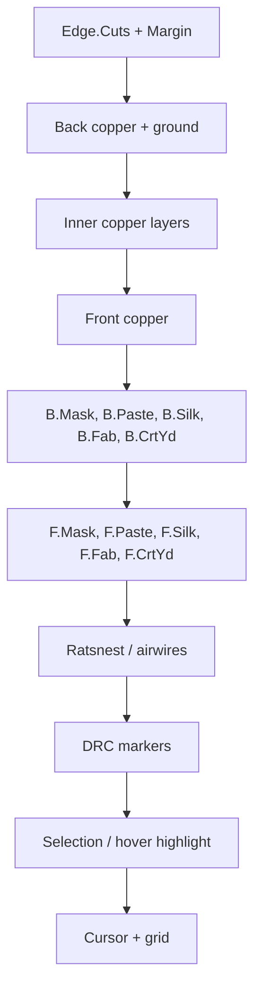
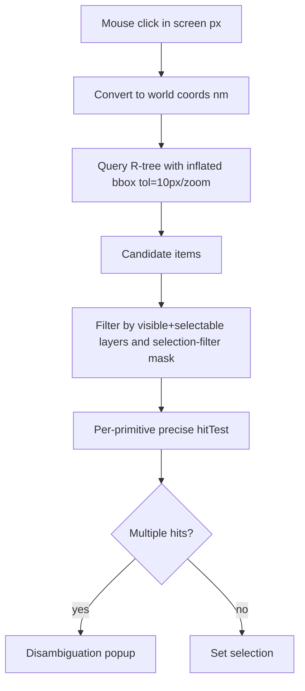
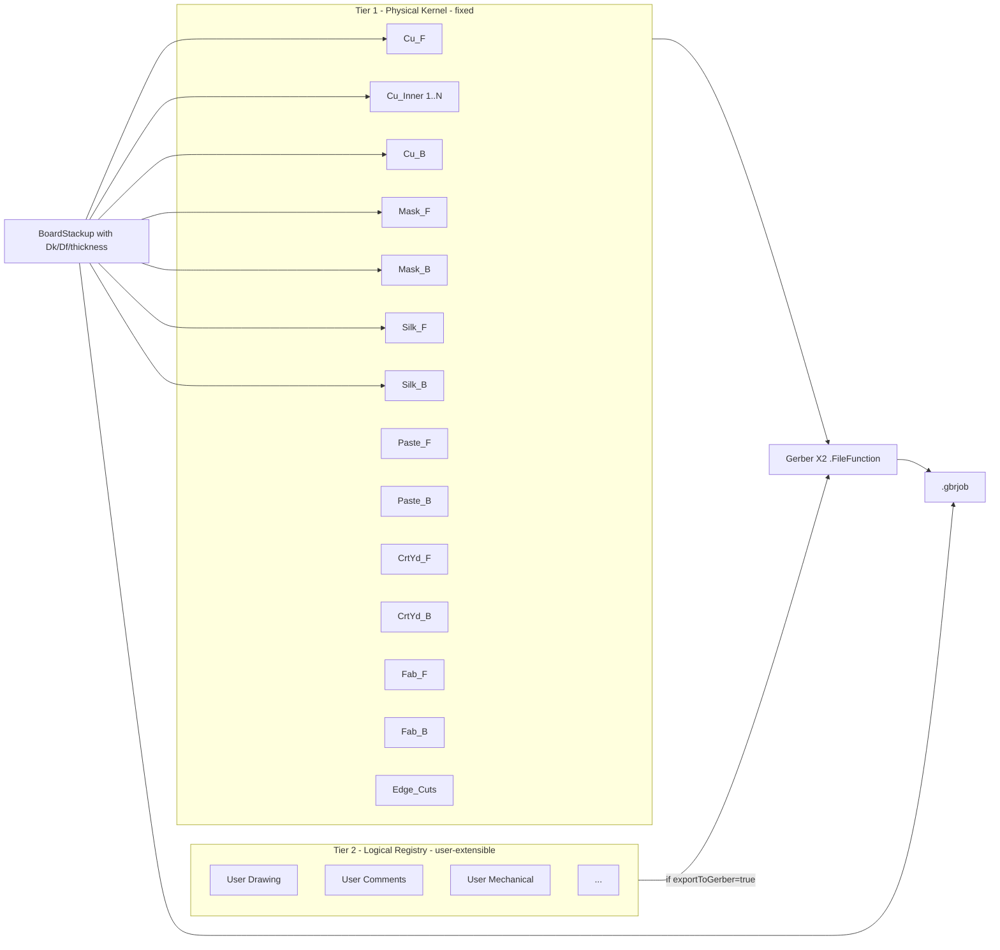
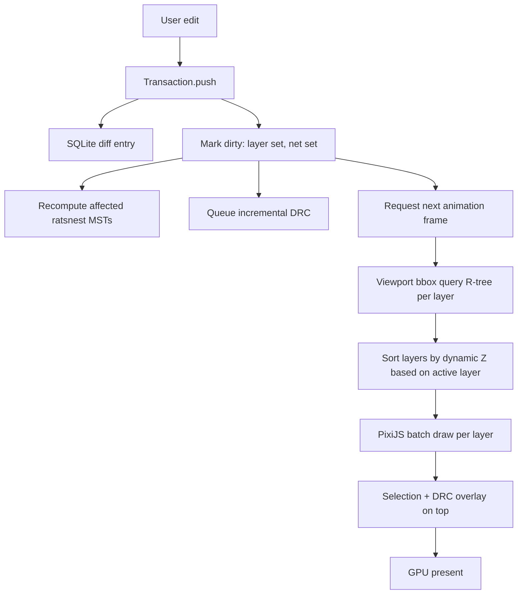

# OpenPCB Canvas Specification — Deep Research Report

**Scope:** Research input for the OpenPCB layout-canvas specification. OpenPCB is a local-first, open-source desktop PCB EDA tool (Electron + React + SQLite) aimed at KiCad refugees and JLCPCB hobbyists/prosumers. This document compares physical vs logical layer models, summarizes the standards that govern PCB fab data, dissects canvas rendering, hit-testing and spatial-indexing strategies used by KiCad, Altium, Flux.ai and EasyEDA, then proposes a hybrid layer model for OpenPCB.

A short glossary appears at the top of Part 1; every PCB-specific term is defined in-line on first use.

---

## Table of Contents

1. Glossary of canvas / PCB terms
2. PART 1 — Physical vs logical layer models
   - 1.1 KiCad (strict physical model)
   - 1.2 Altium Designer (strict physical model, larger surface)
   - 1.3 Flux.ai (logical / abstract model)
   - 1.4 EasyEDA Standard & Pro (hybrid)
   - 1.5 Side-by-side layer table
3. PART 2 — Standards deep dive
   - 2.1 IPC-2221 (Generic Standard)
   - 2.2 IPC-4761 (Via protection)
   - 2.3 IPC-7351B (SMT land patterns / courtyard)
   - 2.4 Gerber X2 / X3 (Ucamco)
   - 2.5 ODB++ (Valor / Siemens)
   - 2.6 IPC-2581 (open data exchange)
4. PART 3 — Canvas rendering deep dive
   - 3.1 Coordinate system + units
   - 3.2 Layer rendering / Z-order / visibility
   - 3.3 Selection model
   - 3.4 Hit-testing per primitive
   - 3.5 Spatial indexing
   - 3.6 GPU vs Canvas2D for Electron
   - 3.7 Ratsnest (airwires) algorithm
   - 3.8 Multi-select, undo/redo, snapping, grids
5. PART 4 — Competitive teardown (KiCad / Altium / Flux / EasyEDA)
6. Hybrid layer-model proposal for OpenPCB
7. Open questions, uncertainties, where sources disagree

---

## 1. Glossary (define-once)

- **Copper layer (Cu)** — a physical conducting layer of the PCB; signals are routed here.
- **Plane layer** — a copper layer treated as a solid pour, usually for power/ground. In Altium, plane layers are stored as *negative* (drawn = no copper).
- **Silkscreen (silk / legend)** — non-conductive ink (usually white) printed on top of soldermask: ref-des, polarity dots, logos.
- **Soldermask (mask)** — the green/red/black coating that covers copper everywhere except pads and exposed traces.
- **Solder paste (paste)** — used only for the SMT stencil; defines where solder paste is deposited on pads before reflow.
- **Courtyard** — a non-printing layer holding a 2D rectangle around a part that defines minimum mechanical + assembly clearance to neighbours (IPC-7351B).
- **Assembly / Fab layer** — non-fabrication documentation that shows simplified outlines of components for the assembly house.
- **Edge.Cuts / Board Outline / GKO** — the closed polygon that the fab uses to route the board outline.
- **Adhesive layer** — glue dot locations (used for wave-solder of SMT parts).
- **Via** — a plated hole through the board connecting two or more copper layers; "tented", "plugged", "filled", "capped" describe how the hole opening is treated (see IPC-4761 §2.2).
- **Ratsnest / airwires** — the thin guide lines drawn between pads of the same net that are not yet routed.
- **Pad** — a copper land on a footprint that a component lead solders to.
- **Footprint** — the PCB-side counterpart of a schematic symbol: pads + silk + courtyard + 3D model.
- **Stackup** — the ordered list of copper + dielectric layers with their thickness, material and Dk/Df (dielectric constant / loss tangent).
- **DRC** — Design Rule Check.
- **Gerber** — Ucamco's ASCII vector format that is the de facto fab image format (one file per layer, plus drill).
- **ODB++** — Valor / Siemens proprietary single-archive fab format.
- **IPC-2581** — open XML fab data exchange standard (single file, "Gerber replacement").

---

## 2. PART 1 — Physical vs logical layer models

### 2.1 KiCad — strict physical model with a fixed enum

KiCad models layers as a fixed C++ enum `PCB_LAYER_ID` defined in `layer_ids.h` (KiCad source mirror, file `pcbnew/include/layer_ids.h`). **Clarification on layer counts**: the *enum itself* has well over 200 entries, which is where the "60+ layers" or "200+ layers" claims come from — but most of those entries are **GAL virtual layers** (cursor, grid, DRC markers, selection shadows, ratsnest, net-tie graph, footprint anchor, etc.), not physical PCB layers. The Doxygen for `layer_ids.h` lists them in groups: copper layers + technical/silk/mask/paste/fab/courtyard + user + a long tail of `LAYER_*` virtual UI layers.

**Physical/board layers in the enum (KiCad 8/9):**

| Group | Layers | Purpose |
|---|---|---|
| Copper | `F_Cu`, `In1_Cu` … `In30_Cu`, `B_Cu` | Up to 32 copper layers (front, inner 1..30, back). KiCad 9's `MAX_CU_LAYERS` raised the upper bound vs. KiCad 6 (which capped at 32 total). Only **even counts** (2, 4, …, 32) are officially supported. |
| Adhesive | `F_Adhes`, `B_Adhes` | Glue dots for wave-soldering SMT. |
| Solder paste | `F_Paste`, `B_Paste` | SMT stencil. |
| Silkscreen | `F_SilkS`, `B_SilkS` | Printed legend. |
| Solder mask | `F_Mask`, `B_Mask` | Mask opening (negative semantics for pads). |
| Courtyard | `F_CrtYd`, `B_CrtYd` | IPC-7351B placement clearance. |
| Fab | `F_Fab`, `B_Fab` | Documentation outline of component bodies. |
| Edge | `Edge_Cuts`, `Margin` | Board outline + edge keep-out margin. |
| User | `Dwgs_User`, `Cmts_User`, `Eco1_User`, `Eco2_User`, `User_1` … `User_9` | Free user/notes/drawing layers. KiCad 9 added User_1..9 with **flip-pair semantics**: if User.2 is defined as front and User.3 as back, flipping a footprint moves items between them. |

The enum is **fixed (not extensible)**. Adding a layer requires editing C++. From the KiCad documentation (`github.com/KiCad/kicad-doc/blob/master/src/pcbnew/pcbnew_layers.adoc`):

> "12 technical layers come in pairs: one for the front, one for the back. You can recognize them with the 'F.' or 'B.' prefix in their names. The elements making up a footprint (pad, drawing, text) of one of these layers are automatically mirrored and moved to the complementary layer when the footprint is flipped."

**Stackup**: A separate object, `BOARD_STACKUP` (Doxygen: `classBOARD__STACKUP.html`), attaches physical material to the copper layers. Each `BOARD_STACKUP_ITEM` is one of `BS_ITEM_TYPE_COPPER`, `BS_ITEM_TYPE_DIELECTRIC`, `BS_ITEM_TYPE_SOLDERMASK`, `BS_ITEM_TYPE_SILKSCREEN`, `BS_ITEM_TYPE_SOLDERPASTE` and carries thickness, dielectric constant (Dk), loss tangent (Df), color, and material name. The KiCad 8 manual (`docs.kicad.org/8.0/en/pcbnew/pcbnew.html`) states: "KiCad currently only supports stackups with an even number of copper layers. To create designs with an odd number of layers (for example, flexible printed circuits or metal-core printed circuits), simply choose the next highest even number and ignore the extra layer." Stackup is configured in **Board Setup → Physical Stackup**.

**Native file format**: `*.kicad_pcb` is a Lisp-style s-expression. Each item carries a `(layer "F.Cu")` token (or a layer-set for multi-layer items like pads). Layers are referenced by name in the file; the C++ enum is an in-memory mapping.

**Gerber export mapping**: KiCad's `GetGerberFileFunctionAttribute()` writes the Ucamco `%TF.FileFunction` attribute per layer (e.g., `Copper,L1,Top,Signal` / `Soldermask,Top` / `Legend,Top` / `Paste,Top` / `Profile,NP`). See `pcbnew/plot_board_layers.cpp` and `pcbnew/gbr_metadata.h`. KiCad also writes the `.gbrjob` Gerber Job file and supports IPC-2581 export through `PCB_IO_IPC2581` and ODB++ export through `PCB_IO_ODBPP` (both v9).

### 2.2 Altium Designer — strict physical model, broader by design

Altium's Layer Stack Manager (Design → Layer Stack Manager; docs: `altium.com/documentation/altium-designer/pcb/defining-layer-stack`) is also a strict physical model but is more expressive than KiCad's, because Altium separates the *stackup* (signal/plane/dielectric/mask/overlay) from a parallel collection of **mechanical layers**.

| Group | Detail |
|---|---|
| Signal layers | Up to 32 routable copper layers; each has name + thickness + copper weight (½oz / 1oz / 2oz). |
| Internal Plane layers | Drawn as *negative*: anything you draw becomes a clearance pull-back. Used for split planes (PCB Editor supports up to 16 power planes). |
| Dielectric layers | Type ∈ {None, Core, Prepreg, Surface}; thickness; dielectric material; Dk; Df via the impedance profile. |
| Solder Mask | Top + Bottom; material; thickness; Dk. |
| Overlay (Silkscreen) | Top + Bottom. |
| Surface Finish | ENIG / HASL / OSP — only tagged in the Gerber Job file. |
| Mechanical layers | Numbered 1..32 in pre-AD17, **1..1024 in Altium Designer 17+**. Can be **paired** (flipped with the part). Mechanical layers can be assigned semantic roles via the Layer Pairs / Layer Class mechanism — e.g., "Mechanical 13" = "Component Body 3D", "Mechanical 15" = "Courtyard", "Mechanical 1" = "Fab Drawing". |
| Drill Pairs | Defines blind/buried via spans. |
| Solder Paste | Top + Bottom (implicit). |
| Keep-Out | A logical class, not a numbered layer. |

Altium also supports **multiple sub-stacks** (rigid-flex), **impedance profiles** computed in the stackup, **stack symmetry** (top/bottom mirror auto-balance), and saving stackups as `.stackup` XML files or to an Altium Vault. The Vault-managed stack import (`altium.com/documentation/altium-designer/nfs-17-0layer-stack-management-enhancements-ad`) supports merging: "performing a merge of the two stacks, to arrive at the desired stack setup … there is also validation, so that a mechanical layer cannot be mapped to a signal layer!"

**File format**: Altium PCBDOC is a proprietary binary (OLE compound document). The layer model is referenced by layer-class IDs; mechanical layers carry user-assignable purpose tags.

**Gerber export mapping**: Altium maps every signal/plane/mask/paste/overlay/mechanical layer to a Gerber file with a `%TF.FileFunction` attribute via the "Output Job" mechanism (Gerber X2 supported since AD 16.x).

### 2.3 Flux.ai — logical / abstract model

Flux is a web-based EDA designed around AI-assisted hardware. Its docs (`docs.flux.ai`, `flux.ai/docs/getting-started/easyeda-to-flux`) describe a deliberately simpler model:

- **Default stackup is 4 layers.** Flux supports **up to 8 copper layers** (per the marketing page on `flux.ai/`: "Flux supports professional multi-layer PCBs up to eight layers").
- There is **no separate "Layer Manager" dialog**. Stackup is a property of the `layout` object: "Navigate to the Objects tab → click the 'layout' object → in the right panel add an Object-Specific rule named 'Stackup' → select an appropriate stack-up from the provided list. Flux offers multiple pre-made stackups tailored for commonly used manufacturers, including AISLER, JLCPCB, and OSH Park" (`flux.ai/docs/getting-started/easyeda-to-flux`).
- Standard "technical" layers (silk, mask, paste, courtyard, assembly, fab) are not user-configurable as discrete enum entries; they are implicit, attached to footprints, and exported when generating fab outputs.
- Flux exports Gerbers, drill files, BOM, pick-and-place, and standard netlists. **Layout import is not supported**; Flux can read Altium ASCII schematics, Cadence EDIF, and KiCad library symbols only.

In short: **Flux hides layers behind manufacturer-template stackups**. This is a logical model in user-facing UX but, behind the scenes, it must still resolve to physical Gerber layers for fab export.

### 2.4 EasyEDA — Standard vs Pro (a hybrid)

EasyEDA Standard (`docs.easyeda.com/en/PCB/Layer-Manager/`) is a strict physical model that mirrors Altium's vocabulary but uses fixed slots:

| Layer name | Purpose |
|---|---|
| TopLayer / BottomLayer | Copper, fixed, cannot be disabled. |
| InnerLayer | Up to 32 additional copper layers (paid for in fab cost). |
| TopPasteMaskLayer / BottomPasteMaskLayer | Solder paste (stencil). |
| TopSolderMaskLayer / BottomSolderMaskLayer | Solder mask (negative). |
| TopSilkLayer / BottomSilkLayer | Silkscreen. |
| TopAssembly / BottomAssembly | Documentation only — not produced in Gerber by default. |
| BoardOutline | Shape definition; the factory cuts to this. |
| MechanicalLayer | Information; only exported on Altium-style flows. |
| DocumentLayer | Editor-only; not in Gerber. |
| RatlineLayer | Virtual — for ratsnest color. |
| HoleLayer | Virtual — NPTH display. |
| Multi-Layer | Virtual — through-hole pads (connects all copper). |
| DRCErrorLayer | Virtual — DRC marker color. |

Notes from EasyEDA docs:
- **EasyEDA Standard uses numeric layer IDs that map to KiCad layers** (per the KiCad import reverse-engineering at `dev-docs.kicad.org/en/import-formats/easyeda/index.html`).
- "EasyEDA support 34 copper layers."
- **Foot-gun**: "Hiding a layer in the UI does not suppress it from Gerber output … the objects of the hidden layer still exist; when you generating the Gerber, they will appear."

EasyEDA Pro (`prodocs.easyeda.com/en/pcb/tools-layer-manager/`) is more flexible:
- Lets you **add user-named layers** that can be designated **Signal** or **Internal Plane** type.
- **Numbering scheme differs from Standard:** in Standard paste = 5/6, mask = 7/8; in Pro mask = 5/6, paste = 7/8 (per KiCad import dev docs — importers must distinguish format versions).
- Adds a **physical stack pane** that is currently *informational only* — "this physical stacking setting does not affect the export of Gerber." Several pre-defined stackups can be chosen from a drop-down.
- Adds **Custom layers** (documentation only). Pro is "Altium-on-the-web" in vocabulary; Standard is "KiCad-on-the-web".

EasyEDA's Standard PCB file is JSON; "EasyEDA Pro" is a ZIP archive of JSON manifests + tilde-delimited shape strings (per the KiCad importer reverse-engineering notes).

### 2.5 Side-by-side layer model table

| Aspect | KiCad | Altium | Flux.ai | EasyEDA Std | EasyEDA Pro |
|---|---|---|---|---|---|
| Max copper layers | 32 (even only) | 32 signal + 16 plane | 8 | 34 | 32+ |
| Layer enum | Fixed C++ enum (`PCB_LAYER_ID`) | Class-based; mechanical slots 1–32 (1–1024 in v17+) | Implicit / per-object stackup constraint | Fixed numeric IDs | Mostly fixed; user-named Signal/Plane layers allowed |
| Stackup as 1st-class | Yes (Board Setup → Physical Stackup) | Yes (Layer Stack Manager) | Yes, but as a *picked manufacturer template* | No (informational only) | Yes (informational only — not used in Gerber) |
| Dk / Df on stackup | Yes (Dk; Df present but mostly used by 3rd-party tools) | Yes; impedance solver included | Implicit in template | No | No |
| Courtyard layer | F.CrtYd / B.CrtYd | Mechanical role | Implicit | Not modeled separately | Custom layer |
| Fab/Assembly | F.Fab / B.Fab | Mechanical role | Implicit | TopAssembly/BotAssembly | TopAssembly/BotAssembly + Custom |
| User layers | Eco1, Eco2, Cmts, Dwgs, User.1–9 (flip-paired) | Mechanical 1–32 / 1–1024 | None explicit | DocumentLayer | Custom layers |
| Gerber X2 file-function on export | Full | Full | Full | Full | Full |
| Native file format | s-expression text | OLE binary | JSON (cloud) | JSON (cloud) | ZIP+JSON (cloud) |
| User-extensible enum? | No (C++ recompile) | Effectively yes via mechanical roles | No | No | Partially |

---

## 3. PART 2 — Standards deep dive

### 3.1 IPC-2221 — *Generic Standard on Printed Board Design* (current Rev C, 2025)

Official spec: `shop.ipc.org/ipc-2221`. Practical summaries: `pcbsync.com/ipc-2221/`, `protoexpress.com/blog/ipc-2221-circuit-board-design/`, `hilpcb.com/en/blog/ipc-2221-pcb/`.

What it says that the canvas must respect:

- **Definition of a copper layer**: any patterned conductor layer in the stackup, classified as *signal*, *plane (power/ground)* or *mixed*. Internal vs external layers have different current-carrying capacity (Table 6-2/6-3).
- **Conductor spacing tables (Table 6-1)** — minimum spacing between two conductors as a function of operating voltage, location (internal/external/coated/uncoated) and altitude. Fixed values are given for ≤500 V; above that the per-volt formula applies (e.g., "2.5 + 0.005·(V−500) mm minimum spacing for external uncoated, 500–1000 V").
- **Clearance vs creepage**: clearance is the through-air gap; creepage is along the dielectric surface and depends on conformal coating + CTI (comparative tracking index).
- **Annular ring, hole size, drilled-hole tolerance** — minimums for plated through-holes.
- **Performance Classes 1/2/3** — hobbyist/consumer, industrial, high-reliability/aerospace. Each has different design-rule magnitudes.

The IPC-2220 series sits *on top of* IPC-2221: IPC-2222 (rigid), IPC-2223 (flex), IPC-2226 (HDI), IPC-2152 (current-carrying capacity).

For the canvas: DRC defaults and the **electrical-rule visualization** must surface clearance + creepage as net-class- and voltage-aware, not as a single global "min track-to-track" number.

### 3.2 IPC-4761 — *Design Guide for Protection of Printed Board Via Structures*

Official: `shop.ipc.org` (purchase). Practical summary: `pcbsync.com/ipc-4761/`, `ncabgroup.com/blog/via-hole-protection/`, `multi-circuit-boards.eu/en/pcb-design-aid/surface/via-covering.html`.

Defines seven types of via covering. Each has direct consequences for how the soldermask layer is generated for that via:

| Type | Description | Mask layer treatment |
|---|---|---|
| I-a / I-b | Tented (one/two-sided) — dry-film mask stretched over the via | Soldermask opening **suppressed** over the via pad |
| II-a / II-b | Tented and covered (mask + liquid mask print) | Mask suppressed + secondary mask pass |
| III-a / III-b | Plugged (partial fill with non-conductive paste) | Mask present + plug operation flag |
| IV-a / IV-b | Plugged and covered | Plug + mask suppressed |
| V | Filled (full non-conductive fill) | Plug-fill flag |
| VI | Filled and covered | Plug-fill + mask suppressed |
| **VII** | **Filled and capped with copper** — required for via-in-pad (pitch < 0.65 mm BGAs) | Plug-fill + copper cap + flat surface |

For OpenPCB the canvas must store an enum on the Via primitive: `viaProtection ∈ {none, I-a, I-b, II-a, II-b, III-a, III-b, IV-a, IV-b, V, VI, VII}` because **the same hole geometry produces a different soldermask Gerber and a different fabrication flag** depending on protection type. IPC-4761 only covers mechanically-drilled vias; microvias are always copper-filled per industry default.

### 3.3 IPC-7351B — *Generic Requirements for Surface Mount Design and Land Pattern Standard*

Official: `shop.ipc.org/ipc-7351/ipc-7351-standard-only/Revision-b/english`. Practical summaries: `pcbsync.com/ipc-7351/`, `resources.altium.com/p/pcb-land-pattern-design-ipc-7351-standard`, `protoexpress.com/blog/features-of-ipc-7351-standards-to-design-pcb-component-footprint/`.

Key concepts the canvas must encode:

- **Three density levels** (selectable per footprint or per design):
  - Level A "Most" — largest pads, robust solder joints (high-vibration / aerospace).
  - Level B "Nominal" — default for consumer products.
  - Level C "Least" — smallest pads (HDI, fine pitch).
- **Solder fillet J-values (Jt / Jh / Js)** that go into the formulas: Z = Lmax + 2·Jt + √(Ltol² + 4F² + 4P²), G = Smin − 2·Jh − √(Stol² + 4F² + 4P²), Y = Wmax + 2·Js + √(Wtol² + 4F² + 4P²).
- **Courtyard boundary** = rectangle around (component body ∪ pads) + courtyard-excess. Excess values per density: Most = 0.50 mm, Nominal = 0.25 mm, Least = 0.10 mm (smaller for chip ≤ 1×0.5 mm; see Tom Hausherr's IPC-7351B reference materials).
- **Silkscreen placement rules**: never under the body (gets covered at assembly); always inside courtyard; polarity dot visible after assembly; pin-1 marker visible.
- **Zero-Component-Orientation (ZCO)**: the standard pin-1 rotation for every package family — important for pick-and-place file generation.
- **One-World CAD Library** naming convention, e.g., `RESC1608X55N` for a 0603 (metric) resistor at "Nominal" density.

For OpenPCB the footprint editor needs separate **silkscreen / courtyard / assembly / fab** layers per IPC-7351B and a "density level" toggle that recomputes pad sizes from the data sheet's Lmin/Lmax/Wmin/Wmax/Smin/Smax inputs (the standard's RMS tolerance model).

### 3.4 Gerber X2 / X3 — Ucamco

Primary spec URL: `ucamco.com/files/downloads/file_en/416/the-gerber-layer-format-specification-revision-2021-02_en.pdf`. Background: `ucamco.com/en/gerber`, X2 FAQ: `ucamco.com/files/downloads/file/125/the_gerber_file_format_version_2_faq.pdf`. Wikipedia overview: `en.wikipedia.org/wiki/Gerber_format`.

- **X1** = pure image (RS-274X). Each PCB layer is one file.
- **X2 (2014+)** adds four attribute commands: `TF` (file), `TA` (aperture), `TO` (object), `TD` (delete). These add metadata without affecting the image. *Backward-compatible*: an X1 reader generates the same image and warns on unknown TF/TA/TO commands.
- **X3 (2020)** adds component and assembly attributes — pick-and-place data embedded in the Gerber package. **Adoption of X3 is still limited as of 2026.**
- **Gerber Job file (`.gbrjob`, JSON, 2018+)** — describes the package: layer order, finish, thickness, ROHS, materials. Replaces the README/fab-drawing PDF.

**The `.FileFunction` attribute** encodes layer identity in a vocabulary every fab understands. Examples (from the Ucamco spec and example jobs):

```
%TF.FileFunction,Copper,L1,Top,Signal*%
%TF.FileFunction,Copper,L2,Inr,Signal*%
%TF.FileFunction,Copper,L3,Inr,Plane*%
%TF.FileFunction,Copper,L4,Bot,Signal*%
%TF.FileFunction,Soldermask,Top*%
%TF.FileFunction,Soldermask,Bot*%
%TF.FileFunction,Legend,Top*%       (silkscreen)
%TF.FileFunction,Legend,Bot*%
%TF.FileFunction,Paste,Top*%
%TF.FileFunction,Paste,Bot*%
%TF.FileFunction,Profile,NP*%       (board outline)
%TF.FilePolarity,Positive*%
%TF.Part,Single*%
```

Aperture attributes (`%TA.AperFunction,…*%`) classify D-codes as `Conductor`, `ViaPad`, `ComponentPad`, `SMDPad,CuDef`, `SMDPad,SMDef`, `NonConductor`, `Fiducial`, etc., which is how fabs distinguish via-pad from BGA-pad on the same copper layer.

For OpenPCB Gerber export, every layer in the OpenPCB stackup must carry a fixed `.FileFunction` value, and every primitive must carry an `.AperFunction` derived from its type.

### 3.5 ODB++ — Valor / Siemens

Spec: `odbplusplus.com` (now hosted under Siemens EDA after the Valor/Mentor/Siemens chain of acquisitions). ODB++ is a single-archive (`.tgz`/`.zip`) hierarchical-directory format containing layers, components, nets, drills, attributes. Long-established and dominant in Asian fabs.

Key properties:
- Each layer is its own subdirectory with a `features` file (vector geometry + attributes).
- The **matrix** file (`steps/<step>/matrix/matrix`) is the stackup: an ordered list with each row = one physical layer + role (`SIGNAL`, `POWER_GROUND`, `MIXED`, `SOLDER_MASK`, `SILK_SCREEN`, `SOLDER_PASTE`, `DRILL`, `ROUT`, `DOCUMENT`).
- The format is **proprietary** but openly documented; Siemens publishes the spec but controls the schema.
- KiCad has ODB++ export since v9 (`PCB_IO_ODBPP` in source); Altium has had it for many releases.

### 3.6 IPC-2581 — open data exchange

Spec: `shop.ipc.org` (Revision C, November 2020 is the current rev as of 2026). Practical summaries: `pcbsync.com/ipc-2581/`, `nextpcb.com/blog/ipc-2581-guide`, `numericalinnovations.com/blog/ipc-2581-standards`.

- **Single XML file** containing stackup, drill data, nets, components, BOM, assembly placement, design-rule attributes.
- **Open and vendor-neutral**, governed by an IPC consortium that includes Cisco, Ericsson, Lockheed Martin, NVIDIA, Cadence, KiCad, Altium, Siemens.
- Revision C (2020) adds bilateral DfX/DFM data, controlled-impedance specification, differential-pair identification at the net level, embedded components.
- **Adoption**: slower than expected. Multiple sources (PCBSync, PCBCart) note "IPC-2581 has not been adopted at a very rapid pace despite its technical benefits." Most Asian fabs still default to Gerber + IPC-356 netlist; ODB++ is the second most common; IPC-2581 is widely *supported* but rarely *required*.

For OpenPCB, "Gerber X2 + drill + .gbrjob + pick-and-place" is the must-have export bundle for JLCPCB; ODB++ and IPC-2581 are nice-to-have v2 features.

---

## 4. PART 3 — Canvas rendering deep dive

### 4.1 Coordinate system + units

**KiCad — 1 nm signed-int32, hard maximum board ~4 m**

From `github.com/KiCad/kicad-source-mirror/blob/master/include/base_units.h` (verbatim comment in source):

> "The next choice is what to use for internal units (IU), sometimes called world units. If nanometers, then the virtual space must be limited to about 1.5 × 1.5 meters square. This is 1518500251 divided by 1e9 nm/meter. The maximum zoom factor then depends on the client window size. … Pcbnew uses nanometers because we need to convert coordinates and size between millimeters and inches. Using a iu = 1 nm avoids rounding issues. Gerbview uses iu = 10 nm because we can have coordinates far from origin, and 1 nm is too small to avoid int overflow."

The KiCad 6/7/8/9 user manual states: "The internal measurement resolution of all objects in KiCad is 1 nanometer, and measurements are stored as 32-bit integers. This means it is possible to create boards up to approximately 4 meters by 4 meters." Macro `pcbIUScale` and constants `IU_PER_MM` (= 1 000 000) and `IU_PER_MILS` are used throughout.

**Why integer**: rounding-error-free Boolean polygon operations (Clipper/boost-polygon is exact on integers), exact transform composition, lossless save/load, deterministic DRC results across machines.

**Altium** — internal units are 1/10 000 mil (= 0.254 µm = 254 nm), 32-bit integer. Coordinate range ~52 m × 52 m. (Reverse-engineered from PCBDOC + Altium docs.)

**Flux.ai** — web app; coordinates appear to be stored as JS doubles (estimated; not documented). For PCB scale this is fine (double = 15–17 significant digits).

**EasyEDA Standard** — per the KiCad-importer dev docs: "EasyEDA PCB units are 10 mil increments." OpenPCB users coming from EasyEDA will be surprised by the coarse base — this is an artefact of the Standard editor's beginnings. EasyEDA Pro stores higher-resolution units closer to 1 nm (also per the KiCad-importer reverse-engineering).

**Origin conventions**:
- **Sheet origin** — the (0,0) for the canvas page, used for display only.
- **Drill / aux origin** — the origin written into Excellon drill files and Gerber files; the fab measures from this point. KiCad: `Place → Drill/Place Origin`.
- **Grid origin** — the offset that defines where snap-grid intersections fall.
- **Board origin** — many designers anchor the bottom-left of the board outline to (0,0) so coordinates match silk-screen rulers.

A designer who forgets to set the drill origin can ship a board where every coordinate is reported relative to the canvas origin, which can confuse pick-and-place automation.

### 4.2 Layer rendering / Z-order / visibility

KiCad's painter (`pcb_painter.cpp`, class `KIGFX::PCB_PAINTER`) renders by layer in a **dynamic Z-order keyed off the active layer**. From the master KiCad manual (`docs.kicad.org/master/en/pcbnew/pcbnew.pdf`):

> "The display order for board layers is dynamic and depends on which layer is selected as the active layer. The active layer is always drawn on top of other layers. In addition, layers that are related to the active layer are drawn on top of layers that are unrelated. For example, if you make B.Silkscreen the active layer, then all of the other back layers (B.Cu, B.Adhesive, B.Paste, B.Mask, B.Fab, and B.Courtyard) will be drawn on top of the front, user, and inner copper layers, with B.Silkscreen topmost. If you make Edge.Cuts active, then it will be drawn on top, and the User.* layers and Margin will also be brought to the front."

Visibility model (KiCad):
- **Per-layer show/hide** in the appearance panel (Ctrl+L).
- **Per-object-class show/hide** (tracks, vias, pads, footprints, zones, text, drawings, ratsnest).
- **Layer presets** — saved combinations stored per-project ("Front Copper + Front Silk + Edge", etc.). A quick-switcher exists at Ctrl+Tab.
- **High-contrast mode (HCM)** — active layer at full opacity, others dimmed. Two sub-modes: "Hide inactive" and "Dim inactive".
- **Single-layer mode** — same as HCM but inactive layers go fully gray.
- **Layer transparency** — per-layer alpha for both 2D and 3D viewer.
- **Selected objects always draw on top, even if not on the active layer.**

**Layer locking** in KiCad is a property on items, not on layers; items can be flagged "locked" (read-only) and a virtual `LAYER_LOCKED_ITEM_SHADOW` paints an indicator. Visibility is independent of locking.

Recommended render order for OpenPCB (back-to-front, re-sorted dynamically by active side):



### 4.3 Selection model

KiCad's selection tool (`pcbnew/tools/pcb_selection_tool.cpp`) supports:

- **Selection filter panel** with toggles per primitive class: *Footprints, Text, Tracks, Vias, Pads, Graphics, Zones, Dimensions, Locked Items, Other (Drawings)*. Items not enabled in the filter are unselectable by box/click.
- **Per-layer selection** — only items on the active or visible layers can be picked (with HCM).
- **Per-net selection** — `Highlight Net` (`)` ) highlights every primitive on a net; `Select Connection (U)` selects a single track segment; `Select Net` selects an entire net.
- **Cycle / disambiguate** — Alt-click cycles through stacked items; right-click shows a disambiguation menu when multiple items are under the cursor.
- **Box select** with intersect / contain modes (drag direction switches the mode in KiCad 7+).
- **"Select Same Footprint"**, "Select All Tracks in Net", etc.

EasyEDA implements similar filters but per-class plus per-layer (`prodocs.easyeda.com/en/pcb/side-right-panel-layer/`): tick the *eye* to hide, tick the *select* checkbox to make unselectable.

Altium has the most powerful: a **Query language** ("PCB Filter") that lets you select by arbitrary attribute expressions (`OnLayer('Mechanical 13') AND IsTrack AND Net = 'GND'`).

### 4.4 Hit-testing per primitive

Standard 2D techniques (KiCad calls all of these from `HitTest(point, accuracy)` virtual methods on every BOARD_ITEM):

| Primitive | Hit test |
|---|---|
| **Track segment** (line + width w) | Point-to-segment distance ≤ w/2 + tolerance. Use squared distance to avoid sqrt: project P onto AB, clamp t ∈ [0,1], test ‖P − (A+t·AB)‖² ≤ (w/2+tol)². |
| **Round pad / via** | ‖P − center‖² ≤ (r+tol)². For an annular ring (via outside, hole inside), test r_hole ≤ ‖P − center‖ ≤ r_outer. |
| **Rectangular / rounded-rect pad** | Transform P into the pad's local frame, then point-in-rounded-rect: clamp to (w/2 − r, h/2 − r) and test radius. |
| **Oval / stadium pad** | Two semicircles + a rectangle; treat as a fat segment. |
| **Custom polygon pad / zone / copper pour** | Crossings test (Jordan curve / ray casting) — count ray-segment intersections, odd = inside. For self-intersecting polygons, use winding number. KiCad uses Clipper2 + `SHAPE_POLY_SET`. |
| **Arc** | Distance to arc = distance to circle, then test that the angle is within [θ_start, θ_end]. Plus stroke-width tolerance. |
| **Bézier / curve** | Subdivide adaptively to a polyline of segments, then hit-test as track. KiCad rasterizes Béziers via De Casteljau. |
| **Text** | Two-pass: cheap bounding-box hit first; if hit and zoomed in, glyph-level hit using the SHAPE polyline of each stroke. KiCad's vector font uses stroked polylines. |
| **Footprint** | Hit any child primitive OR the anchor / courtyard if active. |

OpenPCB recommendation: a base `hitTest(item, point, tolerancePx) → boolean` that maps screen tolerance to world tolerance using current zoom (`tolerance_nm = tolerancePx / zoom`).



### 4.5 Spatial indexing

For a board with O(10⁴–10⁵) primitives across 4–16 layers, a brute-force loop becomes the bottleneck for hit-testing, render culling, and DRC. **KiCad uses R-tree everywhere**, in multiple flavors (confirmed from Doxygen):

| KiCad class | Use |
|---|---|
| `KIGFX::VIEW_RTREE` (`include/view/view_rtree.h`) | **Render culling**: viewport.Query() returns visible items only. Templated R-tree of `VIEW_ITEM*`. |
| `EE_RTREE` (`eeschema/sch_rtree.h`) | Schematic-side equivalent. |
| `PNS::INDEX` (`pcbnew/router/pns_index.h`) | **Push-and-shove router**: a *custom R-tree with sub-indices per item type and per spanned-layer set* to reduce overlap and improve query time. Items are added/removed/replaced incrementally; the index supports copy-on-write for cheap branching during routing search. |

Quote from the KiCad source (`pns_index.h`): *"Custom spatial index, holding our board items and allowing for very fast searches. Items are assigned to separate R-Tree sub-indices depending on their type and spanned layers, reducing overlap and improving search time."*

External commentary on KiCad's architecture (DESOSA 2021 case study at `2021.desosa.nl/projects/kicad/posts/2021-03-15-from-vision-to-architecture/`): *"The internal format for the components is using an R-Tree … so the renderer has to only render the visible parts in the window and not those outside the frame."*

**Comparison of spatial-index choices for OpenPCB:**

| Structure | Build | Query (window) | Point query | Update on edit | Memory | Notes |
|---|---|---|---|---|---|---|
| R-tree (dynamic Guttman) | O(n log n) | O(log n + k) avg | O(log n + k) | O(log n) per insert, rebalancing cost | ~bbox per node | Best for variable-size objects (tracks, zones, pads). KiCad's choice. |
| Hilbert / STR bulk-loaded R-tree | O(n log n) once | Faster avg than dynamic | same | Rebuild needed | similar | Best for "load board, query a lot, edit rarely". |
| Quadtree | O(n log n) | O(log n + k) | O(log n + k) | O(depth) | depth-bound; can degenerate on clustered traces | Simpler to implement; gets deep when traces cluster. |
| Uniform grid / hash grid | O(n) | O(1 + k) cells | O(1 + k) | O(1) | proportional to grid cells; blows up on big sparse boards | Great if cell size matches typical primitive size (e.g., grid = 1 mm). |
| BVH (AABB) | O(n log n) | O(log n) | O(log n) | rebuild or refit | bbox per node | Mostly ray-tracing / 3D; less natural for PCBs. |

**Recommendation for OpenPCB**: R-tree, mirroring KiCad's proven choice. For an Electron app:
- `rbush` (npm, Vladimir Agafonkin, ~5 KB minified) — fast 2D dynamic R-tree in JS based on Hilbert R-tree. Used by Mapbox.
- `flatbush` (also Agafonkin) — a static (build-once) Hilbert R-tree; ~10× faster queries but no incremental insert/remove.

Keep one R-tree per (layer × item-class) bucket — exactly KiCad's design — so that, e.g., a hit-test on top-copper-pads doesn't have to scan inner-copper zones.

### 4.6 GPU vs Canvas2D for Electron

This is the single biggest architecture decision.

**KiCad** uses a custom **Graphics Abstraction Layer (GAL)** with two back-ends: **OpenGL** (default, hardware-accelerated, multi-pass) and **Cairo** (fallback for systems without a working OpenGL driver). The OpenGL renderer batches geometry into VBOs (vertex buffer objects) and renders all items of a layer in one or two draw calls. `KIGFX::PCB_PAINTER::draw()` walks the R-tree in viewport-bbox order and emits geometry. Source files: `include/gal/opengl/`, `include/gal/cairo/`.

**Altium** uses DirectX 9/11 (Windows-only).

**Flux** is web-based — the rendering stack is not publicly documented but, based on observation (high zoom-out frame rate, smooth pan on multi-thousand-primitive boards) and the typical web stack, it almost certainly uses **WebGL** under a 2D scene-graph (likely PixiJS or a custom WebGL renderer). Flux's marketing line "large, multi-layer designs run smoothly in a modern browser" strongly implies GPU rendering.

**EasyEDA** (web) — Standard uses **Canvas2D**; Pro uses **WebGL** (per Pro's FAQ: "opening the PCB needs the support of the graphics card"; "if the client, please use Google Chrome and start hardware acceleration").

| Renderer | Pipeline | Perf ceiling | Dev complexity | Tooling |
|---|---|---|---|---|
| Canvas2D | Browser native | ~5–10k visible primitives before frame drop on a mid laptop | Lowest; easy to start | Excellent (DOM-style debugging via Chrome DevTools) |
| WebGL via PixiJS | Scene graph + sprite batcher | 50–100k visible primitives | Medium; PixiJS hides most boilerplate | Good; SpectorJS, PixiJS DevTools |
| WebGL via regl / OGL | Functional / minimal wrappers | 100k+ | Medium-high; you write shaders | Good but you own more |
| WebGL via three.js | Full 3D engine, but 2D works | 100k+ | Higher; bigger bundle | Excellent |
| WebGPU | Modern explicit GPU API | Best ceiling; compute shaders for DRC | Highest | Limited until Electron ≥ 30 / Chromium 128+ (stable since April 2024) |

**Electron / WebGPU status (May 2026)**: Chromium WebGPU shipped stable in April 2024; Electron 30+ supports it. WebGPU is viable for production but still has driver-quality issues on Linux (Mesa < 24.x). **Recommendation**: ship WebGL2 today, build the renderer behind an abstraction so a WebGPU back-end can be swapped in later. *Uncertainty: WebGPU's performance for sparse 2D vector drawing is comparable to WebGL2 — the real win is compute shaders for DRC / zone-fill, not for the canvas itself.*

**Recommendation for OpenPCB**: **PixiJS v8 over WebGL2** with a stub for a WebGPU back-end. PixiJS gives you:
- Scene graph with z-ordered layers (matches PCB layer model).
- Batched draw calls automatically.
- A `Graphics` API close enough to Canvas2D that a fallback Canvas2D renderer is feasible for headless tests.
- Active maintenance, large ecosystem, MIT-licensed.

For DRC and ratsnest computation, run on the main JS thread with worker offload via `comlink` — *do not* try to do polygon Boolean ops on the GPU in v1.

### 4.7 Ratsnest (airwires) algorithm

**Definition**: Ratsnest, also called *airwires*, are the thin guide lines drawn between pads of the same net that are not yet physically routed by a copper track. They give the designer a visual hint of "what still needs routing" and how short an optimal route would be.

**Algorithm — minimum spanning tree (MST) over pads of a net**:

1. For every net N with pads P = {p₁, p₂, …, pₙ}, build a complete weighted graph K_N where edge weight = Euclidean distance between pad centroids on the working layer.
2. Compute an MST (Prim's or Kruskal's) over K_N. Edges of the MST are the airwires.
3. When a track is routed, its pads become *electrically connected* via the **connectivity algorithm** (KiCad's `CN_CONNECTIVITY_ALGO` in `pcbnew/connectivity/`). For the remaining unconnected sub-components, re-run an MST per connected-component cluster.

**Practical optimization**: Prim's on the full O(n²) graph is too slow for nets with thousands of pads (e.g., a board-wide GND). KiCad uses a **Delaunay triangulation of the pad set** (O(n log n)), then MST on the triangulation (which is a known sub-graph of the complete graph that still contains the MST). Source: KiCad `pcbnew/ratsnest/` (`ratsnest_data.cpp`, classes `RN_NET` and `RN_NODE_AND_FILTER`). The Delaunay is built via a CDT (Constrained Delaunay) library; the MST is then computed in O(n α(n)) with union-find.

**Recompute triggers** in KiCad:
- On any geometric change (move, add, delete) of a primitive that carries a netcode.
- *Throttled / batched* during interactive drag: only affected nets recompute, and only at drag-end for very large nets (>200 pads). Smaller nets recompute every mouse-move frame.
- On layer change of a primitive that affects connectivity.

**Performance**: For a 50k-net, 10k-pad board, a full rebuild is in the 50–500 ms range on a modern laptop; per-net incremental updates are sub-millisecond. *Uncertainty: KiCad's exact incremental algorithm details — I have not located a single source document; the picture above is reconstructed from Doxygen + commit history.*

**OpenPCB recommendation**:
- Use `delaunator` (npm) for Delaunay (very fast in JS).
- Maintain per-net `RN_NET` objects with their MST cached.
- On primitive edit, mark affected nets dirty; recompute lazily before next render.
- For mega-nets (GND with 1000+ pads), recompute on drag-end only and show a "frozen" airwire snapshot during drag.

### 4.8 Multi-select, group ops, undo/redo, snapping, grids

- **Batched operations**: All operations should produce a single undo entry. KiCad wraps tool actions in `BOARD_COMMIT` (`pcbnew/board_commit.cpp`); every action calls `commit.Add(item)` / `commit.Modify(item)` and finally `commit.Push("Description")`. The commit object diffs old vs new and emits one undo entry. **OpenPCB should mirror this** — wrap every user action in a `Transaction` object that batches all geometric changes.
- **Snap to grid**: P → round(P / gridSize) * gridSize, computed in integer nanometers to avoid float drift.
- **Snap to object**: scan R-tree within a screen-px radius around cursor; find nearest snap-anchor (pad center, line end, line midpoint, arc center, intersection). KiCad highlights the snap point visually.
- **Polar grid**: provided in addition to Cartesian. Used for connectors arranged on a circle. KiCad has both (*Preferences → PCB Editor → Grids*); EasyEDA Pro also has both ("Set the size of the common right-angle coordinate system and polar coordinate grid").
- **Grid origins**: independent of drill origin; multiple "user grids" can be saved (KiCad 7+).

---

## 5. PART 4 — Competitive teardown

### 5.1 Side-by-side feature table

| Feature | KiCad 9 | Altium Designer | Flux.ai | EasyEDA Pro |
|---|---|---|---|---|
| Layer model | Fixed enum, physical | Class-based, physical | Logical / stackup-templates | Hybrid |
| Max copper layers | 32 (even) | 32 sig + 16 plane | 8 | 32+ |
| Internal coord unit | 1 nm int32 | 0.254 µm int32 | JS double (est.) | ~10 mil base (Std), finer (Pro) |
| Coord max | ~4 × 4 m | ~52 × 52 m | unlimited | ~5 × 5 m est. |
| Rendering | Custom GAL: OpenGL + Cairo | DirectX 9/11 | WebGL (est., not documented) | Canvas2D (Std), WebGL (Pro) |
| Spatial index | R-tree (custom + per-type sub-indices) | proprietary, effectively R-tree | unknown | unknown |
| Ratsnest | Delaunay-based MST, incremental | similar (proprietary) | shown but per-net detail unclear | MST shown |
| Selection filter | Per primitive class | Query language (most powerful) | Object panel | Object panel |
| Big-board perf (50k+ items) | Excellent post 6.0 | Excellent (paid) | Good (limited at 8 layers) | Adequate; falls off ≥10k tracks |
| Layer presets | Yes, project-saved | Yes (Views) | Limited (Stackup picker) | Limited |
| High-contrast / single layer | Yes (full + dim + hide) | Yes (Layer Sets) | No explicit | Partial (Shift+S highlight one layer) |
| Stackup with Dk/Df | Yes, physical | Yes + impedance solver | Templates only | Informational only |
| Gerber X2 export | Yes | Yes + Job file | Yes | Yes |
| Gerber X3 export | Partial (KiCad 8+) | Yes | unknown | unknown |
| ODB++ export | Yes (v9) | Yes | unknown | Yes |
| IPC-2581 export | Yes (`PCB_IO_IPC2581`) | Yes (extension) | unknown | Yes |
| DRC viz on canvas | Inline markers + shape outlines | Yes | Yes | Yes |
| File format | s-expression text (diffable) | OLE binary | JSON cloud (no public schema) | JSON / ZIP+JSON cloud |
| License | GPLv3 free | Proprietary commercial | Proprietary SaaS | Proprietary, freemium |

### 5.2 Per-tool wins and fails (for OpenPCB to copy or avoid)

**KiCad — copy these:**
- **1 nm int32 coordinates** with a clear 4 m × 4 m bound. Integer math = no floating-point drift, exact Boolean polygon ops.
- **R-tree spatial index with per-(layer, type) sub-indices** — exactly the structure used by the push-and-shove router.
- **Dynamic Z-order keyed off the active layer** — makes "I am editing the back silk" obvious without manual visibility juggling.
- **High-contrast mode** with active-layer full opacity and "dim" or "hide" inactive layers.
- **Selection filter** (per primitive class) + per-layer + per-net.
- **Open file format (s-expression)** — humans can diff in git.

**KiCad — avoid these:**
- **Fixed C++ enum for layers** — extending it requires a recompile and forks of every plug-in. Hostile to extensibility and to OpenPCB's web-stack ecosystem.
- **Even-copper-layer-count restriction** — irritating for flex / metal-core boards (official workaround is to "ignore the extra layer").
- **Two separate editors (Schematic, PCB) with separate undo stacks** — confuses new users.
- **Layer presets are project-scoped but UI is hidden** — a quick-switcher exists (Ctrl+Tab) but is undiscoverable.
- **Default DRC error markers** are tiny exclamation points — easy to miss.
- **Stackup UI is buried** in Board Setup, and you cannot directly load a JLCPCB-published stackup without a third-party script (`gsuberland/jlcpcb_autogenerated_stackups` on GitHub).
- **Single dielectric between copper layers** — community-reported KiCad limitation: "KiCAD does not properly support multiple dielectric layers between copper layers."

**Altium — copy these:**
- **Layer Stack Manager as a first-class document** with impedance profiles and material library.
- **Mechanical layers with assignable roles** — keeps "physical model" but gains "logical extensibility".
- **Query language for selection / filtering** — `OnLayer('B.Silkscreen') AND IsText` is enormously expressive.
- **Stack Symmetry toggle** — automatically mirrors top/bottom edits in the stack manager.

**Altium — avoid:**
- **Proprietary binary file format** — diff-hostile, no git collaboration.
- **DirectX-only renderer** — vendor-locks to Windows.
- **Steep license cost** that's the very reason OpenPCB users will choose us.

**Flux.ai — copy these:**
- **Pre-made manufacturer stackups (JLCPCB, AISLER, OSH Park) selectable from a drop-down** — huge UX win for hobbyists who don't know what a 7628 prepreg is.
- **Browser-native, no install** — Electron isn't web but should feel that frictionless.
- **AI-explainable actions** — every action shown with reasoning. Worth a v2 feature.
- **Hide the stackup dialog by default**; expose it only when the user needs it.

**Flux.ai — avoid:**
- **Hard 8-layer cap** — fine for hobbyists but blocks prosumers.
- **No layout import** — vendor lock-in. OpenPCB should import KiCad, Eagle (BRD), Altium (PCBDOC where possible).
- **Cloud-only** — directly opposed to OpenPCB's local-first DNA.
- **Implicit technical layers** — hides what KiCad refugees expect to see.

**EasyEDA — copy these:**
- **Simple layer manager** with per-layer eye + select + lock columns.
- **Pre-made templates** for common boards.
- **Free tier** and built-in JLCPCB integration (one-click order).
- **Object filter sidebar** with per-class toggle and per-instance reveal.

**EasyEDA — avoid:**
- **Hidden-layer-still-exports-to-Gerber foot-gun** — "the corresponding layer will still be exported during photo preview, 3D preview and Gerber export." OpenPCB must make hide/visibility and export/include orthogonal *and* surface the difference clearly.
- **Pro stackup is informational only** — does not actually flow into Gerber. OpenPCB's stackup must flow into the Gerber Job file.
- **10-mil coordinate base** in Standard — causes rounding mismatch when importing into KiCad.
- **Web-only / cloud-only** for design data.

### 5.3 JLCPCB hobbyist / prosumer focus

Critical canvas + export requirements for the target user:

1. **2-, 4-, and 6-layer-board flow must be one click**. Pre-made JLCPCB-aligned stackups (1.6 mm, FR-4 TG155 or TG135-140, 0.5/1.0 oz copper) selectable in "New Board". The `gsuberland/jlcpcb_autogenerated_stackups` GitHub repo is an excellent data source.
2. **Gerber X2 + Excellon drill + `.gbrjob`** is the must-have export set. JLCPCB consumes X2 attributes for layer identification.
3. **Courtyard, Silk, Paste, Mask must be correct by default** — every footprint must ship with all four populated per IPC-7351B. The "Most/Nominal/Least" density slider must be visible in the footprint editor.
4. **DRC visualization on the canvas** — outline (not just a marker dot) of the violating shape, with hover tooltip explaining the rule.
5. **Drill / aux origin** must be set automatically (default = bottom-left of board outline) and warn loudly if the user moves it before export.
6. **Pick-and-place rotation** must follow IPC-7351B ZCO so JLCPCB's automated assembly doesn't flip every part 90°.

---

## 6. Hybrid layer-model proposal for OpenPCB

OpenPCB should adopt a **two-tier model: a fixed physical-layer kernel + an extensible logical-layer registry**. This gives KiCad-compatible physical fidelity for fab export while keeping the UX of Flux's "the user only sees what matters."

### 6.1 Tier 1 — Physical Layer Kernel (fixed, fab-bound)

Every primitive carries one of these layer codes. The mapping to Gerber `.FileFunction` and ODB++ matrix role is hard-coded.

```ts
enum PhysicalLayerKind {
  Cu_F,        // front copper
  Cu_Inner,    // inner copper (1..N, where N ≤ 30)
  Cu_B,        // back copper
  Mask_F,      // front soldermask (negative semantics)
  Mask_B,
  Paste_F,
  Paste_B,
  Silk_F,
  Silk_B,
  Adhes_F,
  Adhes_B,
  CrtYd_F,     // courtyard (IPC-7351B), front
  CrtYd_B,
  Fab_F,       // assembly / fab notes, front
  Fab_B,
  Edge_Cuts,   // board outline (closed polygon)
  Margin,      // keep-out margin
}

interface PhysicalLayer {
  kind: PhysicalLayerKind;
  copperOrdinal?: number;        // 0 = F.Cu, 1..N inner, N+1 = B.Cu
  gerberFileFunction: string;    // e.g. "Copper,L1,Top,Signal"
  defaultColorLight: string;
  defaultColorDark: string;
}
```

This kernel is **closed for modification**. Anything that goes to the fab is one of these.

### 6.2 Tier 2 — Logical Layer Registry (open, user-extensible)

Sitting *next to* the physical layers, OpenPCB exposes an open registry of user-named documentation layers. These never go to Gerber by default and are stored in the project file. They are the equivalent of KiCad `User.1..9` / `Eco1..2` / `Dwgs.User` / `Cmts.User` + Altium "Mechanical 1..32" + EasyEDA "Custom layers".

```ts
interface LogicalLayer {
  id: string;                    // uuid
  name: string;                  // user-chosen
  flipPair?: string;             // id of paired layer; flip moves item between them
  exportToGerber: boolean;       // default false (solves EasyEDA foot-gun)
  exportFileFunction?: string;   // required when exportToGerber=true
  color: string;
  visibility: 'show' | 'dim' | 'hide';
  selectable: boolean;
  locked: boolean;
}
```

**Why this split is better than KiCad's or Altium's pure model:**
- **KiCad refugees** get back every layer they know by name (F.Cu, B.SilkS, F.CrtYd, etc.) — Tier 1.
- **Hobbyists** can ignore Tier 1 entirely; the default 2-layer template hides everything except Cu_F/Cu_B/Silk*/Mask*/Edge_Cuts.
- **Power users** can add as many doc layers as they want without touching C++ — Tier 2.
- **Fab safety**: only Tier 1 + Tier-2 layers explicitly flagged `exportToGerber = true` are written. This solves the EasyEDA hidden-but-still-exported foot-gun.

### 6.3 Stackup model

Separate from the layer enum, exactly as KiCad does. A `BoardStackup` is an ordered list of `StackupItem`:

```ts
type StackupItem =
  | { kind: 'copper';     layer: PhysicalLayer; thickness_um: number; weight_oz: number; }
  | { kind: 'dielectric'; thickness_um: number; Dk: number; Df: number; material: string; }
  | { kind: 'mask';       side: 'F'|'B'; thickness_um: number; color: string; }
  | { kind: 'silk';       side: 'F'|'B'; color: string; }
  | { kind: 'paste';      side: 'F'|'B'; };
```

**Crucially, support multiple sequential dielectric items between copper layers** (the documented KiCad weakness). This is needed for 4L/6L impedance-controlled stackups where prepreg is built up from multiple sheets (e.g., "7628 ×2").

Stackup flows into:
- 3D viewer (correct layer thicknesses).
- Gerber Job file (`.gbrjob`).
- Length-tuning calculations (via height = sum of intervening dielectrics).
- Impedance calculator (Dk + thickness + trace width).

Ship pre-made stackups for **JLCPCB 2L 1.6mm**, **JLCPCB 4L 1.6mm impedance-controlled**, **JLCPCB 6L 1.6mm**, **PCBWay 2L/4L**, **OSH Park 2L/4L**, **AISLER 2L** as the first-run "New Board" dropdown — Flux-style — but back them with real Dk/Df values pulled from public manufacturer impedance APIs.

### 6.4 Render and selection — concrete recommendations

- **Coord unit**: 1 nm signed int32 (mirror KiCad). Max board ≈ 4 × 4 m.
- **Renderer**: PixiJS v8 over WebGL2; abstract back-end so WebGPU can be swapped in.
- **Spatial index**: `rbush` R-tree, one tree per (PhysicalLayer × ItemKind) for hit-test, plus one global tree for viewport culling.
- **Hit-test**: tolerance = 6 screen-px, converted to nm at current zoom. Disambiguation popup on multi-hit (Alt+click cycles).
- **Z-order**: dynamic by active layer, exactly the KiCad rule. Selection overlay always on top.
- **Visibility model**: per-layer show/dim/hide + per-class show/hide + high-contrast mode. Layer presets saved to project (SQLite).
- **Ratsnest**: Delaunay-MST per net, incremental on edit, drag-frozen for nets > 200 pads.
- **Selection filter**: per primitive class (tracks, vias, pads, footprints, zones, text, drawings) + per layer + per net.
- **Undo/redo**: `Transaction` object, one commit = one undo entry. Stored as compact diffs in SQLite for cross-session undo — a unique selling point vs KiCad.
- **Snapping**: integer-only; snap candidates from R-tree query within 8 screen-px.
- **Grids**: Cartesian default; polar available as a secondary grid.

### 6.5 DRC visualization

Every DRC violation is a separate "marker entity" in SQLite linked to two primitive IDs and a rule ID. The canvas renders:
- A red outline of both offending shapes.
- A small badge at the violation midpoint with rule code.
- A hover tooltip showing rule text + measured-vs-required distance.

This is strictly better than KiCad's "small exclamation mark" default and is the single most actionable UX upgrade for new users.

### 6.6 Diagram — OpenPCB layer-model relationships



### 6.7 Diagram — Render pipeline



---

## 7. Open questions, uncertainties, and where sources disagree

- **KiCad "60+ layers" claim**: This figure refers to the *total enum size* of `PCB_LAYER_ID`, which in KiCad 9 has well over 200 entries — but the vast majority are GAL virtual layers (cursor, grid, DRC markers, selection shadows, ratsnest, per-net coloring, per-via virtual layers for stacked zones, etc.). The number of *physical board layers* a user can route on is bounded by the copper count (32) plus the fixed technical/silk/mask/paste/courtyard/fab/edge/user layers (~25). Treat "60+ layers" as referring to the enum cardinality, not user-visible board layers.
- **KiCad copper-layer ceiling**: KiCad 6 supported 32 total layers including technicals; KiCad 9's `MAX_CU_LAYERS` is also commonly stated as 32 copper, even-only. Forum threads reference experiments with higher counts in 9.x master. *Confidence: medium-high* on 32 copper layers; treat anything higher as experimental.
- **KiCad ratsnest exact algorithm**: I have inferred Delaunay + MST + per-net cache from the `pcbnew/ratsnest/*` source-tree filenames and the connectivity-algorithm Doxygen. I did not find a single authoritative published doc paragraph. *Confidence: medium.*
- **Flux internal coordinate precision and renderer**: Not publicly documented. Inferred WebGL from performance characteristics; could be Canvas2D with offscreen-canvas tricks. *Confidence: low-medium.*
- **Flux file format**: Cloud-only; no published schema. OpenPCB cannot read Flux files (Flux itself can't import layouts either, per their own docs).
- **EasyEDA Pro vs Standard layer numbering**: Sources differ. Per KiCad's importer dev docs: Standard has paste = 5/6 and mask = 7/8; Pro swaps to mask = 5/6 and paste = 7/8. **Importers must distinguish format version**.
- **Gerber X3 adoption**: Ucamco published the spec in 2020 but multiple practitioner blogs (PCBSync, NextPCB) report "adoption still limited compared to X2." Treat X3 as nice-to-have, not must-have, for v1.
- **WebGPU stability in Electron**: WebGPU stable in Chromium since April 2024; Linux driver quality varies. **Ship WebGL2 first.**
- **IPC-2581 vs ODB++ adoption among Asian fabs**: ALLPCB / NextPCB / PCBCart sources all agree ODB++ is more prevalent in Asia today; IPC-2581 is the "preferred future" but adoption is slow. For OpenPCB v1, **Gerber X2 + drill + .gbrjob is the only must-have**.
- **Altium maximum mechanical layer count**: Altium 17.0+ docs reference 1024 mechanical layers; older docs cite 32. Both are correct depending on AD version.
- **Whether KiCad's BOARD_STACKUP supports multi-dielectric between copper layers**: The community (gsuberland's auto-stackup script) reports that "KiCAD does not properly support multiple dielectric layers between copper layers" and works around it by combining adjacent dielectrics. *Confidence: high* — this is a real KiCad limitation OpenPCB should fix.
- **EasyEDA hidden-layer-still-exported behavior**: Explicitly confirmed in EasyEDA Standard docs; Pro docs have the same warning. OpenPCB's UI should separate "hide" (canvas only) from "exclude from export" (.FileFunction).

— End of report —