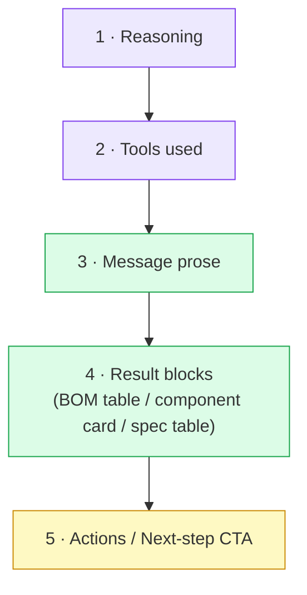
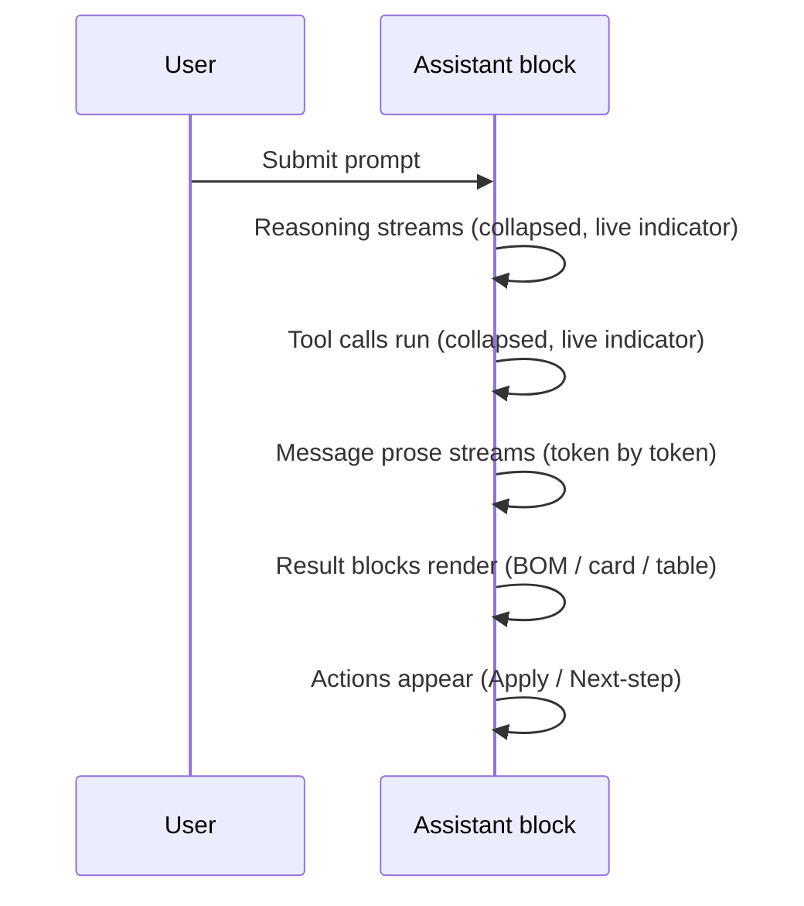

# CHAT_RESPONSE_LAYOUT.md

**Spec for the OpenPCB AI assistant message layout.**
Defines the canonical block order, default states, streaming sequence, and loading UI for every assistant reply.

---

## Table of contents

- [CHAT\_RESPONSE\_LAYOUT.md](#chat_response_layoutmd)
  - [Table of contents](#table-of-contents)
  - [1. Goal](#1-goal)
  - [2. Canonical block order](#2-canonical-block-order)
  - [3. Default states](#3-default-states)
  - [4. Streaming sequence](#4-streaming-sequence)
  - [5. Loading indicator](#5-loading-indicator)
  - [6. Result blocks (BOM / component / spec)](#6-result-blocks-bom--component--spec)
  - [7. Anti-patterns — do NOT do](#7-anti-patterns--do-not-do)
  - [8. Acceptance checklist](#8-acceptance-checklist)

---

## 1. Goal

Every assistant reply must read top-to-bottom as **think → act → answer**.

- **Reasoning** = *how it thought*
- **Tools** = *what it did*
- **Answer** = *the result* (prose, then result cards/tables)
- **Actions** = *next step* (e.g. **Apply** proposed commands)

The current UI scrambles this order. This spec fixes it.

---

## 2. Canonical block order



> **Hard rule:** result blocks live **inside the answer, at the end**.
> No result card ever floats **above** the tool trace or the message prose.

---

## 3. Default states

| # | Block | Default state | Collapsed summary line |
|---|---|---|---|
| 1 | **Reasoning** | **Collapsed** | `Reasoning` |
| 2 | **Tools used** | **Collapsed** | `Resolve BOM · 6 src · 17ms` (tool name · sources · latency) |
| 3 | **Message prose** | Always visible | — |
| 4 | **Result blocks** | Always visible | — |
| 5 | **Actions** | Always visible | — |

- Collapsed blocks show a **one-line summary** so the user sees the trust trail without expanding.
- If **no tools** ran → omit the Tools block entirely (no empty shell).
- If **no reasoning** → omit the Reasoning block.

---

## 4. Streaming sequence

Temporal order **equals** visual order. Nothing reorders after the fact.



**Rules**

1. **Prose streams first**, token by token.
2. **Result blocks render last**, after prose completes — never before.
3. Each phase shows **one** active loading indicator at the current position (see §5).
4. Reasoning + Tools blocks stay **collapsed** during and after streaming.

---

## 5. Loading indicator

**One indicator. Inline. No border. No duplicate dots.**

| Rule | Value |
|---|---|
| Count | **Exactly one** active indicator at a time |
| Style | Plain inline text + spinner — **no bordered box** |
| Position | At the active block (header status, then body caret as prose streams) |
| Stop control | Inline `Stop` link/button next to the status text |
| Bouncing `• • •` dots | **Removed** — they duplicate the status |

**Target rendering (prose phase):**

```
✦ Writing response…   [Stop]
▏(prose streams here)
```

**Phase labels:**

| Phase | Status text |
|---|---|
| Reasoning | `Thinking…` |
| Tool call | `Running tools…` (or tool name, e.g. `Resolving BOM…`) |
| Prose | `Writing response…` |

---

## 6. Result blocks (BOM / component / spec)

- Reuse the **existing card/table designs** — visuals are approved, only **position** changes.
- They render **inline at the end of the answer**, under the prose.
- A result block (BOM, component pick, spec) is an **AI proposal** → its primary action ties to the **command pattern** (`Propose` level by default).

**Actions block (§2 block 5):**

| Result type | Primary action |
|---|---|
| BOM proposal | `Apply BOM` / `Place components` (dispatches commands, never direct JSON) |
| Single component | `Add to schematic` |
| Spec / explanation | none (informational) |

> Per project knowledge (`Brainstormings`, AI approval UX): AI defaults to **Propose**, applies commands only on explicit user click. The CTA is that click — not gray prose.

---

## 7. Anti-patterns — do NOT do

| ❌ Anti-pattern | ✅ Correct |
|---|---|
| Result card floating **above** tools/prose | Result block at **end** of answer |
| Tools block in the **middle** of content | Tools block **2nd**, under reasoning |
| Intro prose appearing **last** | Intro prose **before** result blocks |
| **Bordered box** around "Writing response…" | Inline status text, no border |
| `Writing response…` box **+** separate `• • •` dots | **One** inline indicator only |
| Duplicate part shown as card **and** table | **One** result block per part |
| Next-step as faint gray prose | Next-step as an **action button** |

---

## 8. Acceptance checklist

- [ ] Reasoning is block 1, collapsed by default, with summary line.
- [ ] Tools is block 2, collapsed by default, summary = `name · src · ms`.
- [ ] Message prose streams **before** any result block renders.
- [ ] BOM / component / spec render **inline at the end**, never floating above.
- [ ] No standalone result card above the tool trace.
- [ ] Exactly one loading indicator, inline, **no border**, no bouncing dots.
- [ ] `Stop` is inline next to the status text.
- [ ] Tools block omitted entirely when no tools ran.
- [ ] Result blocks expose a command-based action (`Apply` / `Add to schematic`), not gray prose.