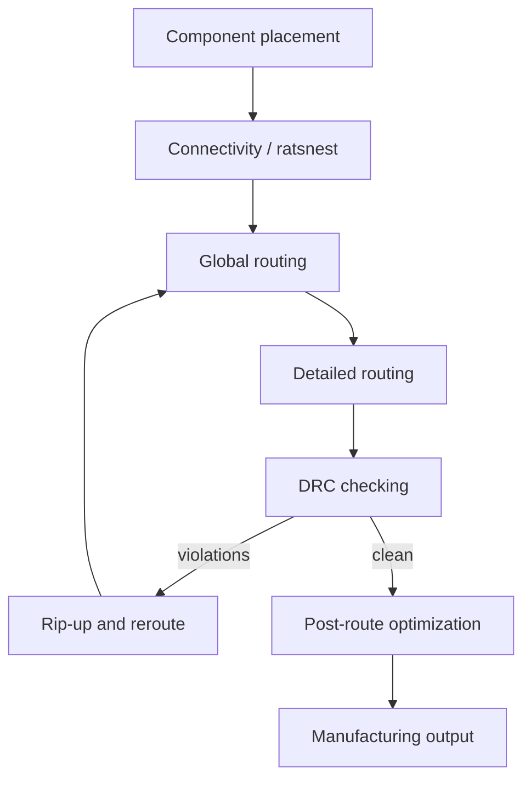
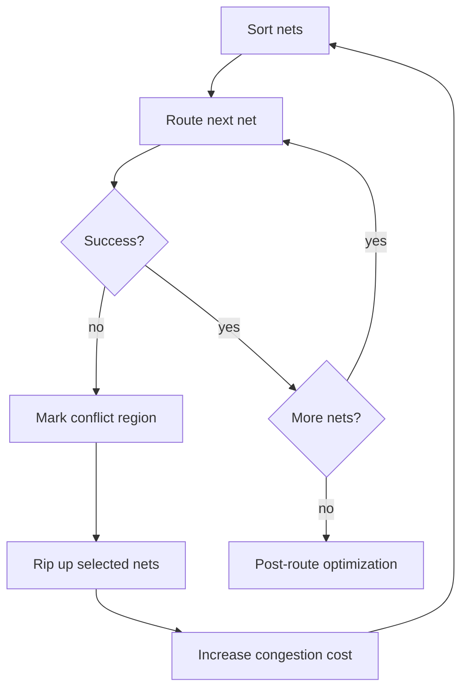
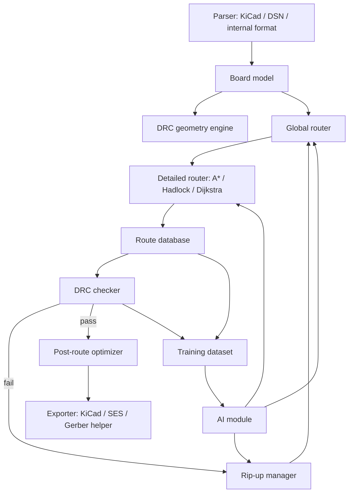

## Executive summary

For a serious **PCB autorouter**, I would not start with a pure **Genetic Algorithm** or pure **Reinforcement Learning** router.

The most practical architecture is:

> **Classical deterministic router core**
>
> * **AI/ML for strategy decisions**
> * **strict DRC verification after every move**

The router core should be based on **A*** / **Dijkstra** / **Hadlock** / **maze routing**, plus **rip-up and reroute**, **global + detailed routing**, and later **topological / shape-based routing**.

AI is best used for:

* **Net ordering**
* **Rip-up / reroute decisions**
* **Congestion prediction**
* **Cost-map tuning**
* **Layer assignment**
* **BGA escape strategy**
* **Router parameter optimization**

Pure AI-generated geometry is risky because PCB routing has hard constraints: **clearance**, **net classes**, **vias**, **differential pairs**, **impedance**, **length matching**, and **manufacturing rules**. A 2026 paper on DreamerV3 + FreeRouting reports strong results for model-based RL, but also notes that PPO, DQN, generative AI, and LLM-style agents can fail due to sparse rewards, probabilistic DRC violations, and spatial hallucinations. ([ScienceDirect][1])

---

# 1. Why PCB autorouting is hard

PCB routing is a **multi-objective constrained optimization problem**.

You are not only finding “a path.” You are finding many paths that must all coexist while respecting:

* **Clearance rules**
* **Trace width rules**
* **Layer stack rules**
* **Via rules**
* **Net classes**
* **Differential pair constraints**
* **Length matching**
* **Impedance constraints**
* **BGA escape routing**
* **Power/ground constraints**
* **Manufacturing limits**
* **Signal integrity / power integrity**

PCB routing is computationally hard. One PCB-routing dissertation describes PCB routing as **NP-hard**, and notes that real boards may contain thousands of pins and many layers. It also says existing PCB approaches often split the problem into **escape routing** and **area routing**, which can create coupling problems: a successful escape route can make later area routing infeasible. 

A useful mental model:



---

# 2. Classical autorouting architecture

Most useful autorouters are not one algorithm. They are a **pipeline of algorithms**.

## 2.1 Global routing

**Global routing** works on a coarse model of the board.

It answers:

* Which rough corridor should this net use?
* Which layer should it prefer?
* Where are congested areas?
* Which nets are likely to conflict?

Typical algorithms:

| Algorithm                                   | Use                                           |
| ------------------------------------------- | --------------------------------------------- |
| **Coarse grid routing**                     | Divide PCB into cells and route approximately |
| **Steiner tree / rectilinear Steiner tree** | Estimate topology for multi-pin nets          |
| **Minimum spanning tree**                   | Simple approximation for multi-pin nets       |
| **Min-cost flow / max-flow**                | Model routing capacity and congestion         |
| **Negotiated congestion**                   | Iteratively increase cost of overused areas   |
| **Linear programming / ILP**                | Exact or semi-exact solving for small regions |

Steiner-style routing is very common in EDA because multi-pin nets are not just point-to-point paths. VLSI global-routing material describes **rectilinear Steiner minimum trees** and sequential Steiner heuristics for global routing. It also notes that constructing RSMTs is NP-hard, but feasible in practice using heuristics and lookup methods for small nets. ([ifte.de][2])

## 2.2 Detailed routing

**Detailed routing** converts rough routes into exact geometry:

* Exact trace segments
* Exact via locations
* Exact clearance handling
* Exact layer transitions
* Exact pad exits

Typical algorithms:

| Algorithm               | Use                                                     |
| ----------------------- | ------------------------------------------------------- |
| **Lee maze routing**    | Guaranteed shortest path on uniform grid                |
| **Dijkstra**            | Weighted shortest path                                  |
| **A***                  | Fast weighted path search with heuristic                |
| **Hadlock**             | Efficient rectilinear shortest path using detour number |
| **Line-search routing** | Faster than full grid expansion                         |
| **Shape-based routing** | Works with actual geometry, not only grid cells         |
| **Push-and-shove**      | Moves existing traces locally                           |
| **Rip-up and reroute**  | Removes bad routes and tries again                      |

A classic paper on maze-running and line-search algorithms says sequential routing is widely used for **global routing**, **detailed routing**, and **PCB design**. It separates sequential methods into **maze-running** and **line-search** algorithms. ([Users FIU][3])

---

# 3. Pathfinding algorithms for PCB routing

## 3.1 Lee algorithm / maze routing

**Lee routing** is basically BFS on a grid.

Good:

* Complete on finite grid
* Finds shortest path with uniform costs
* Simple to implement

Bad:

* Memory-heavy
* Slow on large boards
* Not enough by itself for real PCB constraints

Use it for:

* Learning
* Small boards
* Baseline implementation
* Debugging

## 3.2 Dijkstra

**Dijkstra** is useful when edges have different positive costs.

For PCB, edge cost can include:

```text
cost =
    length_cost
  + via_cost
  + bend_cost
  + congestion_cost
  + layer_penalty
  + near_obstacle_penalty
  + crosstalk_penalty
  + preferred_direction_penalty
```

Good:

* Handles weighted routing
* More realistic than Lee
* Works well with cost maps

Bad:

* Can be slow without acceleration

## 3.3 A*

**A*** is usually the first serious algorithm I would implement.

Use a heuristic such as:

```text
h = Manhattan distance to target
```

For multilayer PCB:

```text
h = manhattan_distance + estimated_layer_change_cost
```

Good:

* Much faster than Dijkstra
* Easy to customize
* Excellent MVP choice

Bad:

* Still sequential
* Can greedily block future nets
* Needs rip-up/reroute for full-board success

## 3.4 Hadlock algorithm

**Hadlock** is a strong PCB/VLSI candidate.

It biases search toward the target using a **detour number**. Instead of expanding by pure distance from source, it counts how much a path moves away from the target. Lecture material describes Hadlock as a shortest-path algorithm for grid graphs that uses detour number, has **O(MN)** time and space complexity, reduces searched cells, and still finds the shortest path. 

Use it for:

* Rectilinear routing
* Dense orthogonal grids
* Fast two-pin connection search

## 3.5 Line-search algorithms

Line-search methods reduce the search space by expanding long line segments instead of individual cells.

Good:

* Less memory
* Often faster than maze routing
* Useful for sparse boards

Bad:

* Some variants are not complete
* Some do not guarantee shortest paths

The maze-running/line-search paper notes that dense grid graphs are inefficient in time and space, and line-search methods were proposed for better performance. ([Users FIU][3])

## 3.6 Jump Point Search

**Jump Point Search** is an A* optimization for uniform-cost grids. It prunes symmetric paths and jumps over unnecessary cells. The original JPS system describes it as a symmetry-breaking strategy for speeding up optimal pathfinding on grid maps. ([Harabor][4])

For PCB routing, JPS is useful only in limited cases:

* Uniform grid
* Mostly uniform movement cost
* Simple obstacles

It becomes less useful when you have:

* Different layer costs
* Via costs
* Clearance classes
* Congestion costs
* Differential pair constraints
* Net-specific design rules

So: **interesting optimization**, but not the main router.

## 3.7 Theta* / any-angle routing

Any-angle pathfinding can create more natural routes than strict 90°/45° grid routing.

This is relevant because some commercial topological routers support **any-angle routing** and arcs. TopoR, for example, advertises no preferred 45° direction and support for routing with arcs; this is vendor material, so I would treat its performance claims carefully, but the routing idea is valid. ([eremex.com][5])

Good for:

* Flexible PCBs
* RF layouts
* Smooth routing
* Arc-based routing
* Topological routers

Bad for:

* Harder DRC geometry
* Harder manufacturing constraints
* More complex collision detection

---

# 4. Existing PCB autorouter approaches

## 4.1 Grid-based autorouters

This is the classic approach.

Board is discretized into grid cells:

```text
node = (x, y, layer)
edge = movement to neighboring node
via = edge from layer N to layer N+1
```

Then route with:

* Lee
* Dijkstra
* A*
* Hadlock
* Rip-up/reroute

Best for:

* MVP
* Educational router
* Digital boards
* Predictable geometry

Limitations:

* Grid resolution tradeoff
* Poor support for curved / arbitrary geometry
* Can miss valid off-grid solutions
* Large memory usage

## 4.2 Shape-based autorouters

Shape-based routers work with real geometry:

* Polygons
* Pads
* Keepouts
* Trace shapes
* Vias
* Obstacles inflated by clearance

They are more complex but closer to real PCB design.

FreeRouting supports practical PCB features such as preferred layer directions, via insertion, fanout pass, postroute pass, trace length reduction, via count reduction, neckdown, clearance matrices, and cost parameters. ([freerouting.org][6])

FreeRouting is also useful as a baseline because it imports **Specctra/Electra DSN** files and exports **SES** session files, making it compatible with tools like KiCad and EAGLE. ([GitHub][7])

## 4.3 Topological autorouters

Topological routers first find a **topological path** before converting it into physical traces.

Altium’s Situs router documentation says it uses **topological mapping** first to define routing paths, then uses proven routing algorithms to convert those paths into physical routes. It also emphasizes that **component placement** strongly affects routing performance. ([Altium][8])

This is important.

A good autorouter needs not only pathfinding. It also needs:

* Good placement feedback
* Good ratsnest analysis
* Good net ordering
* Good congestion avoidance

## 4.4 Triangular-grid / non-rectangular global routing

A 2023 PCB global-routing paper proposes a **triangular grid** instead of a rectangular grid, then uses **maximum flow** for global routing and detailed routing afterward. The paper reports faster results than two state-of-the-art routers and no design-rule violations on its industrial PCB instances. ([MDPI][9])

This is interesting because rectangular grids are not always ideal for PCBs.

Potential idea:

* Use rectangular grid for MVP.
* Later test triangular / hex / visibility graph models.
* Compare route quality, via count, congestion, and runtime.

## 4.5 BGA escape routing

BGA routing is a special subproblem.

Common methods:

* Pattern-based escape routing
* Ordered escape routing
* Min-cost flow
* Multi-commodity flow
* LP / ILP
* Heuristics
* Genetic algorithms

Recent PCB literature still treats BGA escape routing as an active research area. A 2025 paper proposes a two-stage ordered escape-routing method combining LP/MMCF modeling with heuristics for large-scale PCBs. ([ScienceDirect][10])

---

# 5. Rip-up and reroute

A sequential router often fails because an early net blocks a later net.

So you need:

1. Route all nets in some order.
2. Detect failed nets or congested areas.
3. Rip up selected traces.
4. Increase costs in congested regions.
5. Reroute.
6. Repeat.



This is where AI can help a lot.

AI does not need to draw the final trace. It can decide:

* Which net to route next
* Which trace to rip up
* Which area is risky
* Which layer should be preferred
* Which cost weights should change

---

# 6. Genetic Algorithm vs Reinforcement Learning

## Short answer

| Approach                   | Good for                                                           | Bad for                                                     | Recommendation                       |
| -------------------------- | ------------------------------------------------------------------ | ----------------------------------------------------------- | ------------------------------------ |
| **Genetic Algorithm**      | Parameter tuning, net ordering, placement, BGA escape variants     | Slow if each genome requires full autoroute                 | Useful as optimizer, not core router |
| **Reinforcement Learning** | Net ordering, rip-up policy, routing strategy, cost-map decisions  | Sparse rewards, hard training, poor generalization if naive | Promising, but use at high level     |
| **Supervised ML / GNN**    | Congestion prediction, routability prediction, cost-map generation | Needs dataset                                               | Best first AI component              |
| **MCTS + DRL**             | Search-guided routing, research prototype                          | Expensive                                                   | Good advanced experiment             |
| **World-model RL**         | Learns simulated routing dynamics                                  | Complex to build                                            | Promising long-term                  |
| **LLM agent**              | Rule explanation, constraint setup, assistant UI                   | Bad at exact geometry                                       | Do not use for geometry              |

---

# 7. Genetic Algorithms for autorouting

A **Genetic Algorithm** can represent routing decisions as a chromosome.

Possible chromosome designs:

```text
chromosome = [
  net_order,
  layer_preference_per_net,
  via_penalty,
  bend_penalty,
  congestion_penalty,
  preferred_direction_weight,
  ripup_threshold,
  BGA_escape_pattern_choice
]
```

Fitness function:

```text
fitness =
  + completion_rate * big_weight
  - DRC_violations * huge_weight
  - total_wire_length
  - via_count * via_weight
  - layer_count * layer_weight
  - bend_count * bend_weight
  - diff_pair_skew_penalty
  - runtime_penalty
```

GA has been used in routing research for a long time. A classic VLSI channel-routing paper used a GA for the channel routing problem, which is NP-complete. ([dl.acm.org][11])

There is also PCB-specific work combining **genetic algorithms** and **Lee routing**: GA for component allocation/placement and Lee routing for connections. ([ResearchGate][12])

### Where GA fits well

Use GA for:

* **Net ordering**
* **Router parameter tuning**
* **Layer assignment policy**
* **Component placement**
* **Component rotation**
* **BGA escape choices**
* **Finding good cost weights**

Do not use GA as the low-level pathfinder for every trace. That will usually be too slow.

### Practical GA idea

Use GA outside the router:

```text
GA proposes router settings
        ↓
classical autorouter runs
        ↓
DRC + metrics are evaluated
        ↓
GA evolves better settings
```

This is simple, useful, and easy to parallelize.

---

# 8. Reinforcement Learning for autorouting

RL is attractive because routing is sequential:

```text
state -> action -> new state -> reward
```

But PCB routing has a big problem: **rewards are sparse**.

You may route 80% of the board successfully, then fail because of one earlier bad decision.

## 8.1 Low-level RL

Low-level RL means the agent chooses moves like:

```text
up, down, left, right, via_up, via_down
```

This is conceptually simple but usually weak.

Problems:

* Huge action horizon
* Sparse reward
* Hard DRC constraints
* Poor scaling to large boards
* Easy to create invalid geometry

Use only for research or small test grids.

## 8.2 High-level RL

This is much better.

Actions:

* Pick next net
* Pick routing corridor
* Pick layer assignment
* Pick trace to rip up
* Adjust cost weights
* Choose BGA escape pattern
* Choose fanout strategy

This keeps geometry deterministic and DRC-safe.

A 2019 deep RL global-routing paper framed routing as connecting many circuit components while obeying design rules. It reports that a DRL method outperformed a sequential A* benchmark in its simulated setting. ([arXiv][13])

## 8.3 RL for net ordering

This is one of the most realistic AI targets.

Net order strongly affects final success.

A 2025 IJCAI paper proposes transformer-based RL for **net ordering** in detailed routing, because expert-designed net-order heuristics are common but limited. ([ijcai.org][14])

Good action space:

```text
action = select next net from unrouted nets
```

Reward:

```text
+ successful route
- DRC violations
- new congestion
- vias
- wirelength
+ final completion bonus
```

## 8.4 RL for rip-up and reroute

Another strong target:

```text
action = choose which existing nets to rip up
```

Reward:

```text
+ previously failed net now routes
- number of ripped traces
- extra wirelength
- extra vias
- DRC violations
```

There is research on RL-guided rip-up and reroute for global routing. The problem is natural because many routers already use rip-up/reroute schemes. ([openreview.net][15])

## 8.5 MCTS + DRL

This is a very interesting hybrid.

A 2024 PCB-routing dissertation proposes **MCTS guided by a DRL policy**. The DRL policy guides rollouts; MCTS still performs search. The dissertation reports higher success rates and minimized wirelength compared with traditional sequential A*-based routers on its test set. 

The same work explicitly says a DRL policy gives useful action probabilities, but does not directly route the circuit; MCTS remains useful to explore and generate feasible paths. 

This is a strong research direction:


## 8.6 World-model RL

The most advanced current direction I found is **model-based RL**.

A 2026 Expert Systems with Applications paper presents **DreamerV3+FR**, integrating a world-model RL framework with **FreeRouting**. It claims 96% completion rate, 21% reduced training time compared with DQN, generalization to unseen 6-layer PCBs, and lower rework rate. ([ScienceDirect][1])

Important caution:

This is promising, but also complex.

To reproduce this kind of system, you need:

* Router simulator
* Lots of training boards
* Strict DRC interface
* Good state representation
* Reward shaping
* GPU training setup
* Benchmark suite
* Baseline comparison

For a first implementation, I would not start here.

---

# 9. Machine learning approaches besides RL

## 9.1 Congestion prediction

This is probably the **best first AI feature**.

Train a model to predict:

* Which board regions will be congested
* Which nets are risky
* Which pin escapes are hard
* Which areas should receive higher routing cost

Input features:

```text
- Occupancy grid
- Pin density
- Net bounding boxes
- Layer availability
- Component outlines
- Keepouts
- Via availability
- Ratsnest crossings
- Net classes
```

Output:

```text
- congestion heatmap
- routability score
- risk per net
```

Then feed this into A* / Dijkstra as cost:

```text
edge_cost = base_cost + predicted_congestion_penalty
```

A 2022 survey of ML-based routing groups ML-routing work into **routing violation prediction**, **routing optimization**, and **intelligent routing**. That maps very well to this staged approach. ([ScienceDirect][16])

## 9.2 Supervised learning from existing routers

You can generate training data by running:

* FreeRouting
* Your own A* router
* Commercial router results if available
* Human-routed examples

Learn:

* Net ordering
* Layer choices
* Route corridors
* Congestion maps
* Rip-up candidates

This is easier than RL because you can train on examples before doing online optimization.

## 9.3 GNN / graph neural networks

PCB routing is graph-like:

* Components = nodes
* Pads = terminals
* Nets = hyperedges
* Routing regions = graph cells
* Obstacles = blocked regions

Use GNNs for:

* Net priority prediction
* Routability prediction
* Congestion prediction
* Layer assignment

This is more scalable than image-only CNNs because the PCB netlist is naturally a graph.

## 9.4 LLMs

LLMs are not good at exact geometry.

Use LLMs for:

* Explaining routing failures
* Suggesting constraint settings
* Generating design-rule templates
* UI assistant
* Interpreting DRC reports
* Creating scripts

Do not use LLMs as the geometric autorouter.

The 2026 DreamerV3+FR paper explicitly reports that LLM agents failed due to **spatial hallucinations**, while generative methods struggled with probabilistic DRC violations. ([ScienceDirect][1])

---

# 10. Recommended implementation roadmap

## Phase 1 — Build a deterministic routing kernel

Start with a **grid-based multilayer router**.

Data model:

```text
Board
 ├─ Layers
 ├─ Obstacles
 ├─ Pads
 ├─ Vias
 ├─ Nets
 ├─ Net classes
 ├─ Clearance matrix
 └─ Routing grid
```

Each routing node:

```text
Node = (x, y, layer)
```

Each edge:

```text
Edge:
  from Node
  to Node
  cost
  allowed_by_DRC
```

Implement:

* A*
* Dijkstra
* Hadlock
* DRC obstacle inflation
* Via transitions
* Clearance classes
* Trace width rules
* Net class rules

MVP target:

> Route simple 2-layer boards with 90° traces and fixed via size.

## Phase 2 — Multi-net sequential routing

Add:

* Net ordering
* Multi-pin net decomposition
* MST / rectilinear MST
* A* per segment
* Occupancy updates
* Basic rip-up and reroute

Simple net ordering heuristics:

* Shortest nets first
* Most constrained nets first
* BGA / fine-pitch nets first
* Critical nets first
* Nets with small bounding boxes first
* Differential pairs before normal signals
* Power nets separately

## Phase 3 — Cost-based routing

Create a flexible cost function.

Example:

```text
cost =
    1.0 * length
  + 8.0 * via
  + 1.5 * bend
  + 5.0 * congestion
  + 2.0 * wrong_layer_direction
  + 10.0 * near_keepout
  + 20.0 * diff_pair_skew
```

This is the heart of the router.

Most “AI integration” can initially mean:

> Learn or optimize these weights.

## Phase 4 — Rip-up and reroute

Add failure recovery.

Basic strategy:

1. If net fails, find blocking traces.
2. Rip up the lowest-priority blocking traces.
3. Increase congestion cost in that area.
4. Reroute failed net.
5. Reroute ripped nets.
6. Stop after iteration limit.

## Phase 5 — Post-route optimization

Add:

* Pull-tight
* Corner cleanup
* Via reduction
* Trace length reduction
* Bend reduction
* Teardrop support
* Neckdown near small pads
* Differential pair cleanup
* Length tuning

FreeRouting has similar practical concepts such as fanout passes, postroute passes, cost parameters, via-count reduction, cumulative trace-length reduction, and automatic neckdown. ([freerouting.org][6])

## Phase 6 — Add AI, but safely

Add AI in this order:

### 1. **GA / Bayesian optimization for router parameters**

Easy and useful.

```text
input: router cost weights
output: best completion / lowest DRC / shortest length
```

### 2. **Supervised congestion prediction**

Train on routed boards.

```text
input: board before routing
output: congestion heatmap
```

Then:

```text
A* edge cost += ML_congestion_penalty
```

### 3. **RL for net ordering**

Keep pathfinding deterministic.

```text
RL action = choose next net
router action = deterministic A*
```

### 4. **RL for rip-up decisions**

```text
RL action = choose traces to rip up
router action = deterministic reroute
```

### 5. **MCTS + neural policy for hard local regions**

Use this only for difficult areas:

* BGA breakout
* Dense connector regions
* Small local conflicts

### 6. **World-model RL**

Only after you have:

* A stable router
* Benchmarks
* Simulator
* Training data
* DRC engine
* Metrics

---

# 11. Suggested software architecture



Recommended module split:

| Module                    | Responsibility                                   |
| ------------------------- | ------------------------------------------------ |
| **Geometry kernel**       | Polygons, clearance, collision, keepouts         |
| **Grid/cost-map builder** | Converts board to routing graph                  |
| **Pathfinder**            | A*, Dijkstra, Hadlock                            |
| **Global router**         | Coarse route planning                            |
| **Detailed router**       | Exact trace generation                           |
| **Rip-up manager**        | Conflict recovery                                |
| **Post-route optimizer**  | Cleanup and quality improvement                  |
| **DRC engine**            | Hard rule validation                             |
| **AI strategy layer**     | Net ordering, cost tuning, congestion prediction |
| **Benchmark runner**      | Compare quality and runtime                      |

---

# 12. Recommended first prototype

Build this first:

```text
2-layer grid router
90-degree traces only
fixed trace width
fixed clearance
fixed via size
A* pathfinder
sequential net routing
basic rip-up/reroute
KiCad DSN import/export or simplified JSON
```

Then evaluate with:

```text
completion_rate
DRC_violation_count
wire_length
via_count
bend_count
runtime
failed_net_count
```

Do not start with advanced AI.

Start with deterministic routing. Then add AI where it has measurable benefit.

---

# 13. Best AI approach for your case

My ranking:

## Best first AI: **Supervised congestion prediction**

Why:

* Easy to train
* Easy to debug
* Does not break DRC
* Improves classical routing
* Works with existing routers
* Can be trained from generated data

Use model output as a **cost map**, not as final geometry.

## Best second AI: **RL for net ordering and rip-up**

Why:

* Small action space
* Clear reward
* Uses deterministic router underneath
* Avoids invalid geometry
* Directly targets the biggest weakness of sequential routing

## Best research AI: **MCTS + DRL**

Why:

* Search remains explicit
* Neural network guides search
* Better than pure RL for hard constraints
* Good for dense local routing

## Best long-term AI: **World-model RL**

Why:

* Promising current research
* Can simulate future routing consequences
* Useful for net ordering and planning

But it is complex. Use only after the deterministic router is mature.

---

# 14. Practical algorithm stack I would implement

## MVP stack

```text
A* + Dijkstra + Hadlock
MST for multi-pin nets
sequential routing
basic rip-up/reroute
weighted cost map
DRC checker
```

## Good production stack

```text
global routing
detailed routing
negotiated congestion
rip-up/reroute
shape-aware DRC
push-and-shove
post-route optimization
ML congestion prediction
RL net ordering
GA/Bayesian cost tuning
```

## Research stack

```text
topological routing
visibility graphs
triangular grid / non-rectangular grid
MCTS + DRL
world-model RL
GNN routability prediction
SAT/ILP for local dense regions
```

---

# 15. Final recommendation

Build the autorouter as a **classical EDA optimizer first**.

Then integrate AI like this:

```text
AI decides strategy.
Classical router creates geometry.
DRC engine verifies everything.
```

The most appropriate AI approach is:

> **Hybrid ML/RL-assisted routing**, not pure RL and not pure GA.

Specifically:

1. **A*** / **Hadlock** / **Dijkstra** for pathfinding.
2. **Rip-up and reroute** for multi-net closure.
3. **Cost maps** for congestion and design preferences.
4. **Supervised ML / GNN** to predict congestion.
5. **RL** for net ordering and rip-up decisions.
6. **GA or Bayesian optimization** for tuning router parameters.
7. **MCTS + DRL** for hard local regions.
8. **World-model RL** only as a later research direction.

This gives you a realistic path from simple prototype to serious research-grade autorouter.

[1]: https://www.sciencedirect.com/science/article/abs/pii/S0957417426003374 "Automation of PCB autorouting via world-model reinforcement learning and freerouting integration - ScienceDirect"
[2]: https://www.ifte.de/books/eda/chap5.pdf "VLSI Physical Design, Springer Verlag"
[3]: https://users.cis.fiu.edu/~iyengar/publication/backup/J-%281993%29%20-%20Efficient%20Maze%20Running%20and%20Line%20Search%20Algorithms%20for%20VLSI%20Layout%20-%5BIEEE%5D.pdf "Efficient maze-running and line-search algorithms for VLSI layout - Southeastcon '93, Proceedings., IEEE"
[4]: https://harabor.net/data/papers/harabor-grastien-socs12.pdf?utm_source=chatgpt.com "The JPS Pathfinding System - Daniel Harabor"
[5]: https://www.eremex.com/products/topor/competitiveadvantages/autorouting/ "High-quality autorouting"
[6]: https://freerouting.org/freerouting/manual/routing-options "Routing Options | FreeRouting Documentation"
[7]: https://github.com/freerouting/freerouting "GitHub - freerouting/freerouting: Advanced PCB auto-router · GitHub"
[8]: https://www.altium.com/documentation/altium-designer/pcb/routing/situs-topological-autorouter?srsltid=AfmBOoobrPtmL7ZPE7CEwfR4uFRSxVanSqmQUoibEC0e8AERD9Zqvrws "Automated Board Layout using the Situs Topological Autorouter | Altium Designer Technical Documentation"
[9]: https://www.mdpi.com/2079-9292/12/24/4942?utm_source=chatgpt.com "A Novel Global Routing Algorithm for Printed Circuit ..."
[10]: https://www.sciencedirect.com/science/article/abs/pii/S0167926024001342?utm_source=chatgpt.com "Two stage Ordered Escape Routing combined with LP and ..."
[11]: https://dl.acm.org/doi/pdf/10.1162/evco.1993.1.4.293?utm_source=chatgpt.com "A genetic algorithm for channel routing in vlsi circuits"
[12]: https://www.researchgate.net/publication/316450145_The_implementation_of_Genetic_Algorithm_and_Routing_Lee_for_PCB_design_optimization?utm_source=chatgpt.com "The implementation of Genetic Algorithm and Routing Lee ..."
[13]: https://arxiv.org/abs/1906.08809 "[1906.08809] A Deep Reinforcement Learning Approach for Global Routing"
[14]: https://www.ijcai.org/proceedings/2025/1055?utm_source=chatgpt.com "Transformer-based Reinforcement Learning for Net ..."
[15]: https://openreview.net/forum?id=jjdngaZiwVb&utm_source=chatgpt.com "A Reinforcement Learning-based Rip-up and Reroute ..."
[16]: https://www.sciencedirect.com/science/article/abs/pii/S0167926022000542 "A survey on machine learning-based routing for VLSI physical design - ScienceDirect"
