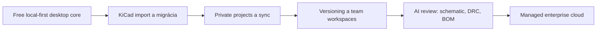
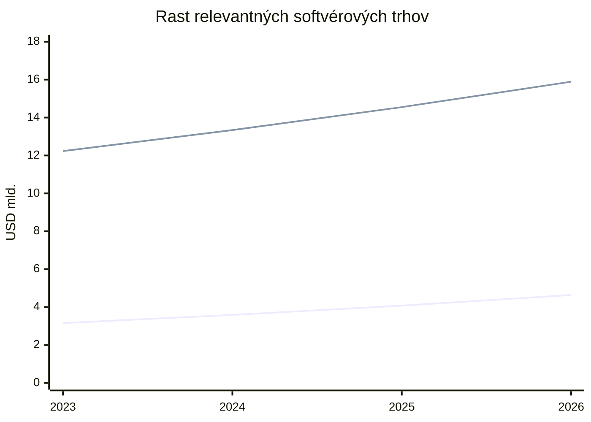

# OpenPCB trhový fit a veľkosť trhu

## Executive summary

OpenPCB má **silnú produktovú tézu**, ale dnes je ešte vo fáze **veľmi skorého verejného objavenia**. Verejne dostupný repozitár opisuje OpenPCB ako **modulárny open-source desktop EDA nástroj** so schémou, PCB layoutom, knižnicou komponentov, KiCad importom a rozpracovaným AI asistentom; projekt je **pre‑1.0**, má **252 commitov**, PCB editor je len **čiastočne doručený** a AI modul je zatiaľ skôr infraštruktúra než hotový produkt. Zároveň je projekt už teraz **dual-licensed**: AGPL pre komunitu a komerčná licencia pre organizácie. To je dobrý základ pre free-core model, ale ešte nie dôkaz produkt-market fitu. citeturn39view0turn40view0

Trh je dostatočne veľký na venture-scale výsledok, ak sa OpenPCB bude pozicionovať nie ako „ďalší Altium“, ale ako **local-first alternatíva ku KiCad + platená cloudová a AI vrstva**. Samotný globálny trh **PCB design software** bol podľa Fortune Business Insights v roku **2025 na úrovni 4,08 mld. USD** a v roku **2026 má dosiahnuť 4,64 mld. USD**, s rastom na **13,48 mld. USD do roku 2034**. Širší trh **EDA software** bol podľa Precedence Research v roku **2025 na 14,55 mld. USD** a v roku **2026 na 15,89 mld. USD**; zároveň SEMI/ESD Alliance reportoval, že širší elektronický design ekosystém dosiahol v **Q4 2025 tržby 5,47 mld. USD za kvartál**, čo ukazuje pokračujúci rast. citeturn43search0turn43search7turn41search0turn41search2

Najsilnejší dôvod veriť v market fit OpenPCB nie je len rast trhu, ale **diera v produktovej mape**. KiCad je zdarma a lokálny, ale nemá natívne monetizovanú cloudovú kolaboráciu a AI vrstvu. Flux má silné AI a cloud funkcie, ale je **browser-first/cloud-first**; Altium je silný v enterprise workflow, ale je **drahý a uzavretý**; EasyEDA je zdarma, no je výrazne previazaný s cloudom a výrobným ekosystémom JLCPCB/LCSC. Spomedzi AI-native nástrojov je trh fragmentovaný: Flux, CELUS, JITX, Quilter, Diode, Circuit Mind a AllSpice pokrývajú len časti workflowu, pričom **nikto z verejne identifikovaných hráčov nespája open-source, local-first desktop core a platené cloud+AI rozšírenia** v jednom produkte. citeturn14search18turn18view0turn12view0turn11view0turn17view0turn25search3turn7search1turn31search0turn8search2turn7search2turn30search17turn33view0turn35search1turn36search2

Investor-friendly záver: **TAM je reálny**, **SAM je atraktívny**, ale **SOM treba stavať disciplinovane**. Najrealistickejší wedge nie je „full autonomous board generation“, ale **private projects + sync + versioning + team workspaces** ako prvý platený krok, a až potom **AI review vrstvy**: schematic review, DRC/DFM checklist, BOM sanity check, suggested alternates a manufacturing readiness. To presne zodpovedá tomu, kde je už dnes trh aj AI nástroje najviac zrelé. citeturn39view0turn18view0turn36search2turn8search2turn26search0turn27search20turn26search7

## Produktová téza a signály market fitu

OpenPCB dnes verejne komunikuje smer, ktorý je z investorovho pohľadu logický: **desktopový local-first EDA nástroj**, ktorý pokrýva schému, PCB, knižnicu komponentov a postupne stavia AI vrstvu. Verejný README uvádza schematický editor, čiastočne doručený PCB layout s routovaním, vias, live DRC a ratsnestom, KiCad import a AI assistant modul s providermi OpenAI/Ollama/LM Studio; zároveň výslovne hovorí, že PCB layout je stále len **Phase 4 partially shipped** a AI je ešte v **dev** režime. To znamená, že produkt je koncepčne správne postavený, ale zatiaľ nie „distribution-ready“. citeturn39view0

Najdôležitejšia produktová sila OpenPCB je **kombinácia open-source distribúcie a monetizácie mimo jadra návrhového editora**. OpenPCB už dnes verejne deklaruje AGPL licenciu pre komunitu a samostatnú komerčnú licenciu pre organizácie, čo je vhodné pre model „free core, paid collaboration/compliance“. Pri produktoch tohto typu je oveľa ľahšie rozšíriť free desktop nástroj do komunity a potom monetizovať **súkromie, synchronizáciu, tímové workflow, governance a AI spotrebu**, než predávať drahý seat-based CAD od prvého dňa. citeturn39view0

Trhová potreba je dobre doložená aj konkurenciou. Altium predáva desktop + cloud spoluprácu ako hlavný benefit a uvádza **built-in version history**, spoluprácu v Altium 365 a pricing od **1 990 USD/rok** pre Altium Develop a od **3 850 USD/rok** pre Altium Designer Standard. Flux zasa explicitne predáva **private projects**, **shared workspace**, **pooled AI credits**, real-time collaboration a AI review/auto-layout. Inými slovami, platené value pools v modernom PCB softvéri už dnes nie sú len „draw tools“, ale najmä **workflow, cloud a intelligence layer**. To priamo podporuje cenový model, ktorý chce OpenPCB zaviesť. citeturn11view0turn12view0turn10view0turn18view0

Slabina je tiež jasná: verejná adopcia je zatiaľ prakticky nulová. Pri poslednom načítaní mal GitHub repozitár OpenPCB **0 stars, 0 forks, 0 watchers**, hoci zároveň ukazoval 252 commitov a viacero release tagov. To neznamená, že produkt je slabý; znamená to, že OpenPCB je ešte vo fáze, kedy treba **dokázať distribúciu**, nie len technický stack. Pre investora je to dôležité: dnes je to ešte skôr **thesis-led bet** než traction-led bet. citeturn40view0turn39view0

## Veľkosť trhu a rámec TAM, SAM, SOM

### Veľkosť relevantných trhov

Najrelevantnejší priamy anchor je trh **PCB design software**. Fortune Business Insights uvádza, že globálny trh mal hodnotu **4,08 mld. USD v roku 2025**, v roku **2026 má rásť na 4,64 mld. USD** a do roku **2034** dosiahnuť **13,48 mld. USD**. To implikuje približne **14,3 % CAGR** v dlhšom horizonte. Na základe týchto dvoch bodov som pre roky 2023–2024 urobil len jednoduchý **back-cast model** pri zachovaní podobného rastového tempa; ide teda o pracovný odhad, nie o priamo publikované číslo. citeturn43search0

Širší trh **EDA software** je podľa Precedence Research väčší: **14,55 mld. USD v 2025**, **15,89 mld. USD v 2026** a **34,71 mld. USD do 2035**, pri **9,08 % CAGR**. Ešte dôležitejšie je, že actuals z SEMI/ESD Alliance ukazujú pokračujúci reálny rast v širšom elektronickom design ekosystéme: **Q1 2024 = 4,52 mld. USD**, **Q4 2024 = 4,93 mld. USD**, **Q1 2025 = 5,10 mld. USD**, **Q2 2025 = 5,09 mld. USD**, **Q4 2025 = 5,47 mld. USD**. To nepotvrdzuje len veľkosť trhu, ale aj to, že spend v dizajnových nástrojoch stále rastie. citeturn43search7turn41search0turn41search2turn41search5turn41search6turn41search11

Výrobný trh PCB je násobne väčší. Fortune Business Insights odhaduje **74,12 mld. USD v 2025** a **77,45 mld. USD v 2026**, so scenárom **129,65 mld. USD do 2034**. Precedence Research je vyššie a uvádza až **97,11 mld. USD v 2025** a **169,18 mld. USD do 2035**. Priemyselný trade source navyše hovorí o **85,4 mld. USD output value v 2025** a medziročnom raste **5,5 %**. Táto divergencia je normálna; z investičného pohľadu stačí, že výrobný downstream je **veľký, rastový a API-integrable**, čo robí partnerstvá s výrobcami strategicky hodnotnými. citeturn42search0turn42search1turn42search10

Hardvérové startupy sú pre OpenPCB kľúčový „customer creation engine“, ale tento segment je dátovo menej štandardizovaný než softvérové trhy. Najsilnejší použiteľný proxy je európsky deep-tech ekosystém: podľa Dealroom bolo v Európe v roku 2025 deep tech už **32 % všetkého VC**, deep-tech ekosystém mal hodnotu **690 mld. USD**, každý rok približne **900 európskych deep-tech startupov** získava prvé VC kolo a **takmer 60 % deep-tech VC** smeruje do **hardware-related startups**. To naznačuje, že prítok nových hardvérových tímov je zdravý a štrukturálny. citeturn22search0turn22search6turn43search10turn43search2

*Poznámka: hodnoty 2023–2024 pri PCB design software a 2023–2024 pri EDA software sú modelované spätné odhady z publikovaných 2025–2026 bodov a CAGR, nie priamo zverejnené baseline hodnoty.* citeturn43search0turn43search7

### CAGR scenáre na päť až desať rokov

Pre investorov je rozumné pracovať s tromi scenármi. Pri **PCB design software** považujem za rozumné pásmo **10 % low case**, **14,3 % base case** podľa Fortune a **17,8 % high case** podľa Maximize Market Research. Pri **EDA software** by som držal **8 % low**, **9,1 % base** podľa Precedence a **11–12 % high**, čo zodpovedá aktuálnym medzikaždoročným rastom reportovaným ESD Alliance v 2024–2025. Pri **PCB manufacturing** je bezpečné uvažovať **4,3 % low**, **5,7–6,7 % base/high**, keďže zdroje sa líšia, ale všetky ukazujú rast. citeturn43search0turn43search1turn43search7turn41search0turn41search2turn42search6turn42search1turn42search0

### TAM, SAM a SOM pre OpenPCB

Pre OpenPCB je zlé používať celý PCB software market ako priamy TAM, pretože jadro appky bude zadarmo. Monetizovateľný TAM preto treba počítať len z tej vrstvy, za ktorú firmy reálne platia: **private collaboration, governance, managed libraries, reviews, AI assistance a usage**. V tomto reporte preto používam vlastný explicitný model.

| Metrika | Výpočet | 2026 odhad |
|---|---|---:|
| **TAM** | 4,64 mld. USD PCB design software × **20 % monetizovateľná cloud+AI vrstva** *(assumption)* | **928 mil. USD** |
| **SAM** | TAM × **55 % EU+NA geografia** × **45 % startup/SMB/consultancy/education-heavy segment** × **60 % product-fit relevance** *(all assumptions)* | **~138 mil. USD** |
| **SOM** | SAM × **1 % / 2,5 % / 5 %** 5-ročný attainable share | **1,4 / 3,5 / 6,9 mil. USD ARR** |

Význam týchto čísel je jednoduchý. **TAM** ukazuje, že len monetizovateľná vrstva nad free desktop CAD môže mať skoro **1 mld. USD**. **SAM** zužuje trh na segmenty, kde local-first/open-source/free-core model dáva najväčší zmysel. **SOM** potom hovorí, že aj relatívne malý podiel na tomto trhu môže vytvoriť zaujímavý startup. Ide o model, nie o priamo zverejnené trhové segmenty, ale sedí s tým, ako konkurencia reálne monetizuje collaboration a AI. citeturn43search0turn10view0turn11view0turn12view0turn36search2

Bottom-up sanity check vychádza podobne. Ak by OpenPCB dosiahol **10 000 platiacich používateľov** s blended ARPA **300–350 EUR ročne**, dostane sa na **3,0–3,5 mil. EUR ARR**. To je menej než **1 %** z Fluxom komunikovanej bázy **1,355 mil. builders** a zároveň len malá časť Altium bázy **100k+ users / 62,7k subscription seats**. Z tohto pohľadu nie je 3–4 mil. ARR v horizonte piatich rokov nerealistické, ak distribúcia zafunguje. citeturn18view0turn13search4

## Konkurenčná mapa a medzera pre AI v PCB workflow

### Mainstream konkurencia a adopčné metriky

| Produkt | Cenový model | Verejná adopcia / proxy | Enterprise dosah | Investor takeaway |
|---|---|---|---|---|
| **KiCad** | zdarma, open-source citeturn14search18 | GitHub mirror **2,7k stars**, **636 forks**, **55k+ commits**; release 10 mal **7 609 unique commits** citeturn15view0turn14search0 | Corporate sponsors: PCBWay, NextPCB, AISLER, Digi-Key a ďalší citeturn21view0 | Silný free/local incumbent; slabší natívny cloud/AI monetization layer |
| **Altium** | od **1 990 USD/rok** (Develop) a od **3 850 USD/rok** (Designer Standard) citeturn11view0turn12view0 | **100k+ users**, **62,7k seats on subscription** k 31.12.2023 citeturn13search4 | silný workspace, review, BOM, enterprise workflow citeturn11view0 | Premium enterprise anchor; cenovo otvára priestor pre free-core disruptor |
| **EasyEDA** | editor zdarma; platené sú služby, nie feature gating editora citeturn9search2turn17view0 | **1M+ free libraries**, **thousands of open-source projects**, silné akademické rozšírenie cez **2000+ universities** citeturn17view0turn17view1 | silná väzba na JLCPCB/LCSC workflow citeturn17view0turn25search3 | Free/browser incumbent pre makers a education |
| **Flux** | **16 USD**, **112 USD/editor**, **120 USD/editor** pri annual billing; enterprise custom citeturn10view0 | **1 355 000+ builders**, **120 000+ circuit board designs** citeturn18view0 | partnerstvá s JLCPCB, PCBWay, Seeed, AISLER, MacroFab, NextPCB, OSH Park, Lioncircuits citeturn18view0 | Najsilnejší AI/cloud benchmark; ale cloud-first, nie local-first |
| **AllSpice** | sales-led Growth/Enterprise citeturn34search12 | **100k+ design reviews**, **2,5M+ comments/interactions** citeturn36search2 | trusted by Meta, Cisco, Bose, Pure Storage a ďalší citeturn36search2 | Potvrdzuje hodnotu review/versioning vrstvy nad ECAD |

Najdôležitejší strategický záver z tejto tabuľky je, že OpenPCB nemusí hneď poraziť Altium vo full enterprise CAD funkčnosti. Trh už teraz ukazuje, že sú veľmi hodnotné tri monetizovateľné vrstvy: **collaboration**, **design review/versioning** a **AI assistance**. To sú presne vrstvy, v ktorých vie local-first free core vytvoriť veľmi dobrý funnel. citeturn11view0turn10view0turn36search2

### Inventory AI nástrojov a startupov v PCB/electronics

| Firma | AI fokus | Verejná trakcia / funding | Kde je medzera |
|---|---|---|---|
| **Flux** | AI architecture, parts research, schematic generation, routing, AI review citeturn18view0 | **37 mil. USD** funding; **1,355M+ builders** citeturn7search1turn18view0 | cloud-first; nie offline/local-first |
| **CELUS** | requirements → schematic, component recommendation, BOM intelligence citeturn8search2turn30search16turn30search4 | seed **€1,7M**, Series A **€25M**, celkovo **>€28M** citeturn31search0turn31search2 | slabší dôraz na open desktop authoring |
| **JITX** | code-based design, constraint-driven autorouting, AI-assisted coding workflow citeturn29search0turn8search15 | Series A **12 mil. USD**; benchmarky **5–20x** engineer-hour productivity claim citeturn7search2turn29search0 | skôr code-first/enterprise; vyšší learning curve |
| **Quilter** | AI „compiler“ pre PCB layout/router citeturn30search17turn30search14 | Series A **10 mil. USD**, open beta zdarma citeturn30search17turn30search2 | skôr narrow layout wedge než full product suite |
| **Diode** | AI-driven code-based design + manufacturing pipeline citeturn33view0turn33view1 | a16z-backed Series A; Fortune 100, Physical Intelligence, Saronic; **100+ unique designs** minulý rok vnútri firmy citeturn33view0turn32search0 | service/manufacturing-led model; US reshoring focus |
| **Circuit Mind** | architecture → verified schematic + BOM v minútach citeturn35search1 | seed približne **6,3 mil. USD** podľa Dealroom citeturn35search4 | menej dôrazu na full PCB editor |
| **AllSpice** | AI-powered design reviews pre schematic/layout/BOM citeturn36search2 | total funding **25 mil. USD**, **100k+ reviews** citeturn34search0turn36search2 | nie je authoring EDA tool |
| **Altium/Nexar** | AI-adjacent sourcing, BOM, part intelligence cez Nexar data layer citeturn26search0turn26search3turn26search15 | enterprise scale cez Altium installed base citeturn13search4 | closed ecosystem, high price floor |

Pri vysokej úrovni abstrahovania sa dá povedať, že dnes je na trhu približne **7–8 relevantných AI-native alebo AI-heavy riešení** pre PCB/electronics workflow, ale každé pokrýva len časť stacku. To je dôležité: trh už akceptuje AI ako kategóriu, ale **feature coverage je fragmentovaná**. citeturn18view0turn31search0turn7search2turn30search17turn33view0turn35search1turn36search2

### Kvantifikovaná medzera AI vo workflowe PCB

Po rozložení workflowu na kroky je medzera veľmi zreteľná. **Requirements/architecture → schematic** dnes pokrývajú Flux, CELUS, Circuit Mind a čiastočne Diode/JITX. **Component suggestions/BOM intelligence** majú Flux, CELUS a sourcing API vrstvy ako Nexar, DigiKey či Mouser. **Layout/routing AI** majú výraznejšie Flux, JITX, Quilter a Diode. **AI design review** je však samostatná vrstva s jasným dopytom, ktorú explicitne produktizujú Flux a AllSpice, a Diode ju rieši cez simuláciu a verifikáciu. **Local-first desktop AI** s optional paid cloud vrstvou však vo verejne identifikovaných riešeniach prakticky nevidno. citeturn18view0turn8search2turn35search1turn26search0turn27search20turn26search7turn29search0turn30search17turn33view1turn36search2

Pre OpenPCB je z toho veľmi konkrétny produktový záver: najbezpečnejšie a obchodne najzrelšie AI use-cases sú dnes **review a decision-support**, nie plná autonómna návrhová autorita. Potvrdzuje to aj konkurencia: Flux v FAQ hovorí, že AI funguje najlepšie ako **collaborator** a finálne rozhodnutie robí človek; JITX explicitne píše, že chat-style AI príliš halucinuje na expert-level electrical engineering; Diode stavia AI workflow na simulácii a na tom, že **engineers still sign off every design**. OpenPCB by mal tento pattern kopírovať. citeturn18view0turn29search5turn33view1

## Monetizácia a ARR scenáre

### Odporúčaný pricing

Najlepší pricing pre OpenPCB nie je „copy-paste Altium“. Musí byť bližšie k **developer-tooling/open-source infra ekonomike**, teda s nízkym vstupom a jasným upsellom.

Odporúčaný pricing model:

| Tier | Navrhovaná cena | Hlavná hodnota |
|---|---:|---|
| **Free Local** | **0 €** | lokálny editor, public/open projekty, import/export, bez cloudu |
| **Cloud Solo** | **12 €/mes.** ročne | sync, private projects, history, backups |
| **Pro AI** | **29 €/mes.** ročne | všetko zo Solo + AI schematic/DRC/BOM review, suggestions |
| **Team** | **39 €/editor/mes.** ročne | shared workspace, permissions, pooled AI usage, audit trail |
| **Enterprise** | **15k–60k €/rok** | managed cloud, SSO, policy, security review, support |

Tento model je zámerne výrazne pod Fluxom a hlboko pod Altiom. Flux ide pri annual billing na **16 / 112 / 120 USD** pre Starter/Pro/Teams, kým Altium začína od **1 990 USD/rok** alebo **3 850 USD/rok** podľa product line. OpenPCB tak môže byť cenovo „obvious yes“ pre tímy, ktoré dnes používajú KiCad + Git + ručné checklisty, no nechcú platiť enterprise EDA ceny. citeturn10view0turn11view0turn12view0

### ARR projekcie na tri až päť rokov

Nižšie sú tri modelové scenáre. Všetky predpokladajú, že **free local core** je hlavný acquisition kanál a platené vrstvy monetizujú len aktívnych používateľov. Keďže OpenPCB ešte nemá verejnú adopciu, ide o **forward assumptions**, nie forecast založený na real traction.

| Rok | Konzervatívny scenár | Base scenár | Upside scenár |
|---|---:|---:|---:|
| **Rok 1** | 0,04 mil. € ARR | 0,08 mil. € ARR | 0,14 mil. € ARR |
| **Rok 2** | 0,16 mil. € ARR | 0,38 mil. € ARR | 0,82 mil. € ARR |
| **Rok 3** | 0,45 mil. € ARR | 0,96 mil. € ARR | 2,38 mil. € ARR |
| **Rok 4** | 0,78 mil. € ARR | 2,10 mil. € ARR | 5,40 mil. € ARR |
| **Rok 5** | 1,15 mil. € ARR | 3,96 mil. € ARR | 10,80 mil. € ARR |

**Assumptions za scenármi:**

- **Konzervatívny:** 10k → 120k aktívnych používateľov za 5 rokov, pay conversion **2–4 %**, blended ARPA **180–240 €**.
- **Base:** 15k → 220k aktívnych používateľov, pay conversion **2,5–5 %**, blended ARPA **220–360 €**.
- **Upside:** 20k → 400k aktívnych používateľov, pay conversion **3–6 %**, blended ARPA **240–450 €**.

Tieto rozsahy sú zvolené tak, aby boli kompatibilné s tým, čo už trh ukazuje. Flux verejne uvádza **1,355M+ builders**, čo znamená, že free/open acquisition v tejto kategórii vie byť veľký. Zároveň však OpenPCB dnes ešte len vstupuje na trh, takže base case som nastavil oveľa nižšie. citeturn18view0turn39view0turn40view0

### Sensitivity analýza

Najväčšiu citlivosť má model na dve premenné: **paid conversion** a **blended ARPA**. Pri rovnakých **100 000 aktívnych používateľoch** ročne vyzerá výsledok takto:

| Paid conversion | Blended ARPA 180 € | Blended ARPA 300 € | Blended ARPA 420 € |
|---|---:|---:|---:|
| **2 %** | 0,36 mil. € ARR | 0,60 mil. € ARR | 0,84 mil. € ARR |
| **4 %** | 0,72 mil. € ARR | 1,20 mil. € ARR | 1,68 mil. € ARR |
| **6 %** | 1,08 mil. € ARR | 1,80 mil. € ARR | 2,52 mil. € ARR |

Investor takeaway je priamočiary: pre OpenPCB bude dôležitejšie zlepšiť **trial → paid conversion** a **team-seat expansion** než zdvíhať cenu. Preto by mala roadmapa prvej monetizácie ísť v poradí **private projects → team workspace → AI review packs**. To je aj v súlade s tým, čo dnes jasne monetizujú Flux, Altium a AllSpice. citeturn10view0turn11view0turn36search2

## Go-to-market, segmenty a partnerstvá

### Odporúčané cieľové segmenty

Najlepší prvý segment pre OpenPCB nie sú korporátne high-speed board teams. Flux a JITX už dnes komunikujú high-speed, impedance-aware routing a productivity benchmarky na **30+ layer** a RF/memory designs; tam bude reputačná bariéra vysoká. OpenPCB by mal začať tam, kde sú problémy s workflowom akútne, ale sign-off burden ešte zvládnuteľný: **embedded, IoT, robotics, industrial control, dev boards, education a early-stage hardware startups**. citeturn18view0turn29search0

Za najlepšie segmenty považujem:

Prvý segment sú **KiCad-centric profesionáli a malé tímy**, ktoré už prijali free/local nástroj, ale chýbajú im private sync, versioning, review a team permissions. KiCad má silnú komunitu, aktívny open-source development a dokonca firemných sponzorov z výroby a distribúcie; to je dôkaz, že okolo neho existuje komerčne zaujímavý ekosystém. citeturn15view0turn21view0turn14search0

Druhý segment sú **hardware startupy a dizajnérske consultancies**, kde sú rýchlosť iterácie, BOM risk a manufacturing readiness kritické. Dealroom ukazuje, že hardware-related deep tech stále priťahuje veľkú časť VC a každý rok vzniká nová kohorta financovaných tímov. To je dobrý segment pre free-core acquisition + PLG team upsell. citeturn43search10turn43search2turn22search6

Tretí segment je **education a maker-to-pro funnel**. EasyEDA ukazuje rozšírenie na **2000+ universities** a Flux dáva **Pro for free** študentom a pedagógom. Tento trh síce negeneruje okamžite vysoké ARR, ale dlhodobo vytvára distribučný kanál a talent funnel. OpenPCB ako open-source local-first desktop appka tu môže byť veľmi prirodzene silná. citeturn17view1turn18view0

### Realistické adopčné miery

Pre OpenPCB by som nepoužíval „virálne SaaS“ očakávania. Realistickejšie sú tieto pracovné rozsahy:

- **install → 30-day retained local user:** približne **25–35 %**
- **retained local user → cloud trial:** približne **8–15 %**
- **trial → paid solo:** približne **20–30 %**
- **trial → paid team** pri projektoch s viacerými ľuďmi: približne **25–35 %**
- **paid cloud → AI add-on attach rate:** približne **25–40 %**

Tieto percentá sú **explicitné assumptions**. Neopierajú sa o verejný funnel OpenPCB, keďže ten zatiaľ neexistuje, ale o to, ako konkurencia komunikuje platenú hodnotu v collaboration a AI vrstve. citeturn10view0turn11view0turn36search2

### Porovnanie partnerov a možné revenue modely

#### PCB výrobcovia

| Partner | Dôkaz integrácie / API | Strategický fit pre OpenPCB | Možný revenue model |
|---|---|---|---|
| **JLCPCB** | verejné API pre PCB, SMT, Components; real-time pricing, inventory, tracking citeturn25search3turn25search7 | rýchly prototyping, BOM price/stock overlay, one-click ordering | referral fee za objednávku, lead-gen fee, co-marketing |
| **PCBWay** | API cooperation vrátane order tracking; assembly API vo výstavbe citeturn25search0 | široký maker/proto market, vhodné pre SMB funnel | referral/rev-share, affiliate manufacturing CTA |
| **AISLER** | natívne EDA integrácie, Flux support, verejná beta part service API citeturn25search1turn25search13 | silný EU fit, privacy/value alignment, rýchly prototyping v Európe | EU-region rev-share, premium “EU manufacturing” plan |
| **Eurocircuits** | Digital First positioning; interné API napojenia na distributorov/manufacturerov citeturn25search2turn25search10 | profesionálny EU low-volume/prototype segment | bizdev partnership, verified manufacturing checklist, sponsored onboarding |

#### Distribútori a BOM data layer

| Partner | Verejný dôkaz | Strategický fit | Možný revenue model |
|---|---|---|---|
| **Nexar / Octopart** | API pre real-time availability, lifecycle, pricing, BOM workflow, Octocart citeturn26search0turn26search3turn26search6 | BOM review, alternates, risk scoring | paid BOM intelligence tier, API resale/margin, co-sell |
| **DigiKey** | free APIs pre product info, pricing, quotes, orders, supply-chain functions citeturn27search20turn27search10turn27search22 | structured BOM enrichment, pricing and order handoff | referral, commerce enablement, enterprise connectors |
| **Mouser** | Search/Cart/Order APIs; 8M+ products v Search API citeturn26search1turn26search7turn26search10 | alternates, price comparisons, cart export | click-out commissions, BOM premium features |
| **TME** | API mentioned; 1,5M+ products, 1 300 manufacturers, 150 countries citeturn26search11turn26search20 | silný CEE/EU channel, dobrý regionálny partner | regional procurement bundles, co-marketing |

#### BOM/CAD content partneri

| Partner | Verejný dôkaz | Strategický fit | Možný revenue model |
|---|---|---|---|
| **SnapMagic** | Search API pre symbols/footprints/3D models citeturn28search0 | zrýchlenie knižnice a importu | API licensing bundle, sponsored parts |
| **PartsBox** | BOM pricing, purchasing, KiCad integration, API-based KiCad library bridge citeturn28search10turn28search6turn28search12 | inventory/BOM ops pre SMB hardware tímy | bundle partner plan, reseller margin |

Partner strategy by mala ísť v poradí: **Nexar alebo DigiKey/Mouser pre BOM intelligence**, potom **JLCPCB alebo AISLER pre manufacturing handoff**. Výrobcovia zvyšujú konverziu a znižujú churn pri „time-to-board“, ale **BOM data partner** vytvára každodennú používateľskú hodnotu v review workflowe, čo je pre retention dôležitejšie. citeturn26search0turn27search20turn25search3turn25search5

## Odporúčanie pre investor narrative a prioritizáciu roadmapy

Investor story pre OpenPCB by som nestaval na tom, že „AI navrhne PCB úplne sama“. Lepší a dôveryhodnejší narrative je tento:

**OpenPCB je local-first open-source PCB design platforma, ktorá monetizuje najhodnotnejšie workflowové vrstvy modernej hardvérovej práce: private collaboration, review, versioning a AI-assisted verification.** Tento príbeh je silnejší, pretože ho priamo potvrdzuje cenotvorba a messaging konkurencie. citeturn10view0turn11view0turn36search2

Najvyššiu prioritu by mali dostať tri veci. Po prvé, **100 % spoľahlivý private-project cloud layer**: sync, versioning, conflict handling, backups, comments, shared workspace. Po druhé, **AI review layer**, nie AI autopilot: schematic linting, DRC explanation, BOM sanity, alternate part suggestions, manufacturing checklist. Po tretie, **KiCad migration excellence** a distribučné pluginy/bridges, pretože KiCad je najprirodzenejší source funnel. OpenPCB už KiCad import má, takže toto je logické pokračovanie. citeturn39view0turn15view0turn21view0

Ak by som to mal zhrnúť do jednej investičnej vety: **OpenPCB má najväčšiu šancu vyhrať ako “GitHub + Cursor moment” pre PCB workflow nad open desktop core, nie ako ďalší uzavretý enterprise CAD seat.** Táto pozícia je menej kapitálovo náročná, distribuovateľnejšia a lepšie zodpovedá dnešnej fragmentácii AI trhu v electronics design. citeturn36search2turn10view0turn33view1turn29search5

## Otvorené otázky a limity

Nie všetky dôležité dáta sú verejne dostupné. **KiCad** ani **EasyEDA** nezverejňujú čisté aktívne user county v kvalite porovnateľnej s Fluxom alebo Altiom, preto som pri nich použil verejné **proxy metriky** ako GitHub stars, commits, corporate sponsors, knižnice a university reach. citeturn15view0turn21view0turn17view0turn17view1

Trhové reporty sa pri **PCB manufacturing market** citeľne rozchádzajú. V reporte preto používam **range thinking**, nie jedno „pravdivé“ číslo. To je pre investor deck správne; oveľa dôležitejší než presná desatina miliardy je fakt, že downstream výrobný trh je veľmi veľký a partnerovateľný cez API. citeturn42search0turn42search1turn42search10

ARR, TAM/SAM/SOM a funnel percentá v tejto správe sú tam, kde chýbali priame dáta, **explicitne modelované assumptions**. Sú zostavené konzervatívne voči verejne známym benchmarkom konkurencie, ale stále ide o hypotézy, ktoré treba v praxi overiť cez **distribution experiments**: KiCad import funnel, university pilots, SMB consultancy pilots a BOM/manufacturing integrations. citeturn18view0turn13search4turn39view0